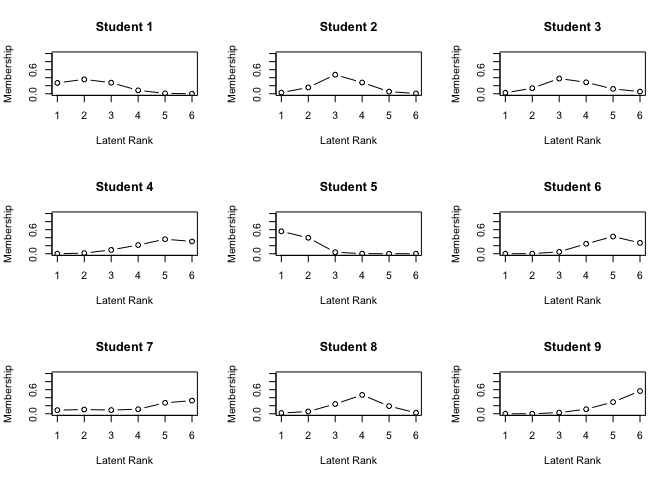
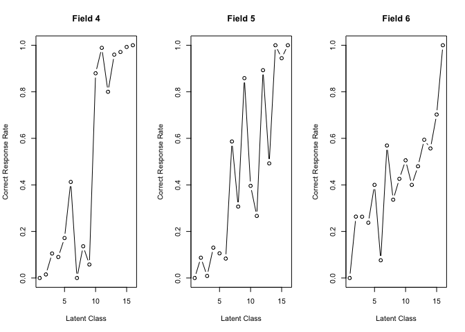
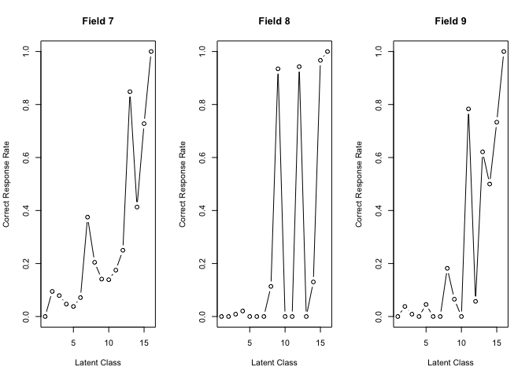

# Exametrika

The Exametrika package is designed for test data engineering and
corresponds to the text by Shojima (2022). Test data engineering
involves analyzing test response patterns to classify item difficulty
and respondent ranking. This analysis includes the following test theory
models.

- Classical Test Theory
- Item response theory: 2PL, 3PL, 4PL model
- Latent Class Analysis
- Latent Rnak Analysis
- Biclustering and Ranklustering
- Infinite Relational Model for optimal number of classes and fields
- Bayesian Network Analysis

The estimation of the optimal number of ranks using the Chinese
Restaurant Process algorithm has not yet been implemented. Additionally,
the following models are also planned to be implemented, but are not yet
available.

- Structure Learning for Bayesian Network Analysis
- Local Dependence Latent Rank Analysis
- Local Dependence Biclustering
- Biclister Network Model

Exametrika is originally implemented and published as a Mathematica and
Excel Add-in. Please refer to the following website for more
information.

[Accompanying Website for Test Data
Engineering](http://shojima.starfree.jp/tde/)

## Installation

You can install the development version of Exametrika from
[GitHub](https://github.com/) with:

``` r
# install.packages("devtools")
devtools::install_github("kosugitti/Exametrika")
```

## Example and Sample Data

This package includes the same sample data that is distributed on the
original site. The number of test-takers is represented by $S$, and the
number of test items is represented by $J$. The data is named in a
format like JxxSxxx.

### Exametrika Data Format

Exametrika conducts analysis on data matrices composed solely of 0 or 1.
In this matrix, 0 represents an incorrect answer, and 1 indicates a
correct answer.For more details, refer to Shojima (2022) regarding the
format.

### Data Matrix Format

- The data matrix must be in a matrix or data frame format.
- It’s permissible to include NA as missing values.
- Specific values (for instance, -99) can be designated as missing
  values.
- Along with the data, you may also provide a missing value index matrix
  that discerns the presence or absence of missing values.

### Examinee ID Column

It is possible to incorporate a column of examinee IDs into the data
matrix you provide. By default, the first column is presumed to be the
examinee ID column.

### Item Weight Vector

Item weights can be specified by the item weight vector, w. If not
given, all elements’ weights are set to 1.

### Item label Vector

Data column names (colnames) are available as item labels. If not
specified, a sequential number is assigned.

### Data Formatting Function

Before any analysis, the dataFormat function decomposes the provided
data into an ID vector,Item label vector, data matrix U, missing value
index matrix Z, and item weight vector w.

## CTT Example

``` r
library(Exametrika)
```

    ## Loading required package: mvtnorm

    ## Loading required package: igraph

    ## 
    ## Attaching package: 'igraph'

    ## The following objects are masked from 'package:stats':
    ## 
    ##     decompose, spectrum

    ## The following object is masked from 'package:base':
    ## 
    ##     union

``` r
CTT(J15S500)
```

    ## Realiability
    ##                 name value
    ## 1  Alpha(Covariance) 0.625
    ## 2         Alpha(Phi) 0.630
    ## 3 Alpha(Tetrachoric) 0.771
    ## 4  Omega(Covariance) 0.632
    ## 5         Omega(Phi) 0.637
    ## 6 Omega(Tetrachoric) 0.779
    ## 
    ## Reliability Excluding Item
    ##    IfDeleted Alpha.Covariance Alpha.Phi Alpha.Tetrachoric
    ## 1     Item01            0.613     0.618             0.762
    ## 2     Item02            0.609     0.615             0.759
    ## 3     Item03            0.622     0.628             0.770
    ## 4     Item04            0.590     0.595             0.742
    ## 5     Item05            0.617     0.624             0.766
    ## 6     Item06            0.608     0.613             0.754
    ## 7     Item07            0.594     0.600             0.748
    ## 8     Item08            0.611     0.616             0.762
    ## 9     Item09            0.642     0.645             0.785
    ## 10    Item10            0.626     0.630             0.773
    ## 11    Item11            0.599     0.606             0.751
    ## 12    Item12            0.597     0.603             0.748
    ## 13    Item13            0.597     0.604             0.753
    ## 14    Item14            0.593     0.598             0.745
    ## 15    Item15            0.607     0.612             0.759

## IRT Example

The IRT function estimates the number of parameters using a logistic
model, which can be specified using the `model` option. It supports 2PL,
3PL, and 4PL models.

``` r
result.IRT <- IRT(J15S500, model = 3)
```

    ## iter 1 LogLik -3960.28101333472 iter 2 LogLik -3938.35083545226 iter 3 LogLik -3931.82412662175 iter 4 LogLik -3928.67952666072 iter 5 LogLik -3926.99335361872 iter 6 LogLik -3926.04824522672 iter 7 LogLik -3925.50635639298 iter 8 LogLik -3925.19191064308 iter 9 LogLik -3925.00749412998 iter 10 LogLik -3924.89898890608 iter 11 LogLik -3924.83503922381 iter 12 LogLik -3924.79710730773 iter 13 LogLik -3924.77480338094 

``` r
result.IRT
```

    ## Item Parameters
    ##        slope location lowerAsym PSD(slope) PSD(location) PSD(lowerAsym)
    ## Item01 0.818   -0.834    0.2804      0.182         0.628         0.1702
    ## Item02 0.860   -1.119    0.1852      0.157         0.471         0.1488
    ## Item03 0.657   -0.699    0.3048      0.162         0.798         0.1728
    ## Item04 1.550   -0.949    0.1442      0.227         0.216         0.1044
    ## Item05 0.721   -1.558    0.2584      0.148         0.700         0.1860
    ## Item06 1.022   -1.876    0.1827      0.171         0.423         0.1577
    ## Item07 1.255   -0.655    0.1793      0.214         0.289         0.1165
    ## Item08 0.748   -0.155    0.1308      0.148         0.394         0.1077
    ## Item09 1.178    2.287    0.2930      0.493         0.423         0.0440
    ## Item10 0.546   -0.505    0.2221      0.131         0.779         0.1562
    ## Item11 1.477    1.090    0.0628      0.263         0.120         0.0321
    ## Item12 1.479    1.085    0.0462      0.245         0.115         0.0276
    ## Item13 0.898   -0.502    0.0960      0.142         0.272         0.0858
    ## Item14 1.418   -0.788    0.2260      0.248         0.291         0.1252
    ## Item15 0.908   -0.812    0.1531      0.159         0.383         0.1254
    ## 
    ## Item Fit Indices
    ##        model_log_like bench_log_like null_log_like model_Chi_sq null_Chi_sq
    ## Item01       -262.979       -240.190      -283.343       45.578      86.307
    ## Item02       -253.405       -235.436      -278.949       35.937      87.025
    ## Item03       -280.640       -260.906      -293.598       39.468      65.383
    ## Item04       -204.884       -192.072      -265.962       25.623     147.780
    ## Item05       -232.135       -206.537      -247.403       51.196      81.732
    ## Item06       -173.669       -153.940      -198.817       39.459      89.755
    ## Item07       -250.905       -228.379      -298.345       45.053     139.933
    ## Item08       -314.781       -293.225      -338.789       43.111      91.127
    ## Item09       -321.920       -300.492      -327.842       42.856      54.700
    ## Item10       -309.318       -288.198      -319.850       42.240      63.303
    ## Item11       -248.409       -224.085      -299.265       48.647     150.360
    ## Item12       -238.877       -214.797      -293.598       48.161     157.603
    ## Item13       -293.472       -262.031      -328.396       62.882     132.730
    ## Item14       -223.473       -204.953      -273.212       37.040     136.519
    ## Item15       -271.903       -254.764      -302.847       34.279      96.166
    ##        model_df null_df   NFI   RFI   IFI   TLI   CFI RMSEA    AIC    CAIC
    ## Item01       11      13 0.472 0.376 0.541 0.443 0.528 0.079 23.578 -22.805
    ## Item02       11      13 0.587 0.512 0.672 0.602 0.663 0.067 13.937 -32.446
    ## Item03       11      13 0.396 0.287 0.477 0.358 0.457 0.072 17.468 -28.915
    ## Item04       11      13 0.827 0.795 0.893 0.872 0.892 0.052  3.623 -42.759
    ## Item05       11      13 0.374 0.260 0.432 0.309 0.415 0.085 29.196 -17.186
    ## Item06       11      13 0.560 0.480 0.639 0.562 0.629 0.072 17.459 -28.924
    ## Item07       11      13 0.678 0.620 0.736 0.683 0.732 0.079 23.053 -23.330
    ## Item08       11      13 0.527 0.441 0.599 0.514 0.589 0.076 21.111 -25.272
    ## Item09       11      13 0.217 0.074 0.271 0.097 0.236 0.076 20.856 -25.527
    ## Item10       11      13 0.333 0.211 0.403 0.266 0.379 0.075 20.240 -26.143
    ## Item11       11      13 0.676 0.618 0.730 0.676 0.726 0.083 26.647 -19.735
    ## Item12       11      13 0.694 0.639 0.747 0.696 0.743 0.082 26.161 -20.222
    ## Item13       11      13 0.526 0.440 0.574 0.488 0.567 0.097 40.882  -5.501
    ## Item14       11      13 0.729 0.679 0.793 0.751 0.789 0.069 15.040 -31.343
    ## Item15       11      13 0.644 0.579 0.727 0.669 0.720 0.065 12.279 -34.104
    ##            BIC
    ## Item01 -22.783
    ## Item02 -32.424
    ## Item03 -28.893
    ## Item04 -42.737
    ## Item05 -17.164
    ## Item06 -28.902
    ## Item07 -23.308
    ## Item08 -25.250
    ## Item09 -25.505
    ## Item10 -26.121
    ## Item11 -19.713
    ## Item12 -20.200
    ## Item13  -5.479
    ## Item14 -31.321
    ## Item15 -34.082
    ## 
    ## Model Fit Indices
    ##                    value
    ## model_log_like -3880.769
    ## bench_log_like -3560.005
    ## null_log_like  -4350.217
    ## model_Chi_sq     641.528
    ## null_Chi_sq     1580.424
    ## model_df         165.000
    ## null_df          195.000
    ## NFI                0.594
    ## RFI                0.520
    ## IFI                0.663
    ## TLI                0.594
    ## CFI                0.656
    ## RMSEA              0.076
    ## AIC              311.528
    ## CAIC            -384.212
    ## BIC             -383.882

The estimated population of subjects is included in the returned object.

``` r
head(result.IRT$ability)
```

    ##       tmp$ID         EAP       PSD
    ## 1 Student001 -0.75526884 0.5805699
    ## 2 Student002 -0.17398815 0.5473605
    ## 3 Student003  0.01382252 0.5530503
    ## 4 Student004  0.57628021 0.5749105
    ## 5 Student005 -0.97449604 0.5915605
    ## 6 Student006  0.85232982 0.5820551

The plots offer options for Item Characteristic Curves (ICC), Item
Information Curves (IIC), and Test Information Curves (TIC), which can
be specified through options. Items can be specified using the `items`
argument, and if not specified, plots will be drawn for all items. The
number of rows and columns for dividing the plotting area can be
specified using `nr` and `nc`, respectively.

``` r
plot(result.IRT, type = "ICC", items = 1:6, nc = 2, nr = 3)
```

<!-- -->

``` r
plot(result.IRT, type = "IIC", items = 1:6, nc = 2, nr = 3)
```

<!-- -->

``` r
plot(result.IRT, type = "TIC")
```

<!-- -->

## LCA Example

Latent Class Analysis requires specifying the dataset and the number of
classes.

``` r
LCA(J15S500, ncls = 5)
```

    ## iter 1 LogLik -3920.05938991817 iter 2 LogLik -3868.37661811019 iter 3 LogLik -3856.56533650371 iter 4 LogLik -3845.74374535885 iter 5 LogLik -3833.37488036104 iter 6 LogLik -3820.22763769163 iter 7 LogLik -3806.72242954504 iter 8 LogLik -3792.97266067684 iter 9 LogLik -3779.19228779869 iter 10 LogLik -3765.86175275679 iter 11 LogLik -3753.64229491417 iter 12 LogLik -3743.11740875918 iter 13 LogLik -3734.55698287939 iter 14 LogLik -3727.87850577009 iter 15 LogLik -3722.77367383051 iter 16 LogLik -3718.86333574826 iter 17 LogLik -3715.79886302873 iter 18 LogLik -3713.30370700684 iter 19 LogLik -3711.17800056923 iter 20 LogLik -3709.2871434378 iter 21 LogLik -3707.54624077186 iter 22 LogLik -3705.9055437362 iter 23 LogLik -3704.3385857789 iter 24 LogLik -3702.83324913391 iter 25 LogLik -3701.38544872111 iter 26 LogLik -3699.99493697585 iter 27 LogLik -3698.66270413262 iter 28 LogLik -3697.38949986492 iter 29 LogLik -3696.17509406942 iter 30 LogLik -3695.01799595627 iter 31 LogLik -3693.91544050945 iter 32 LogLik -3692.86352069041 iter 33 LogLik -3691.85739232407 iter 34 LogLik -3690.8915105805 iter 35 LogLik -3689.95987716842 iter 36 LogLik -3689.05628952239 iter 37 LogLik -3688.17458971934 iter 38 LogLik -3687.30891285716 iter 39 LogLik -3686.4539329118 iter 40 LogLik -3685.6050994199 iter 41 LogLik -3684.75885191584 iter 42 LogLik -3683.9127927315 iter 43 LogLik -3683.06579489228 iter 44 LogLik -3682.21802271694 iter 45 LogLik -3681.37084974863 iter 46 LogLik -3680.52667146122 iter 47 LogLik -3679.68862638019 iter 48 LogLik -3678.86025487609 iter 49 LogLik -3678.04513577125 iter 50 LogLik -3677.24654421759 iter 51 LogLik -3676.46716955478 iter 52 LogLik -3675.7089208471 iter 53 LogLik -3674.97283370103 iter 54 LogLik -3674.25907805439 iter 55 LogLik -3673.56705526261 iter 56 LogLik -3672.89556505061 iter 57 LogLik -3672.24301869492 iter 58 LogLik -3671.60767347594 iter 59 LogLik -3670.98786420649 iter 60 LogLik -3670.38220992904 iter 61 LogLik -3669.7897774075 iter 62 LogLik -3669.21018774092 iter 63 LogLik -3668.64365821443 iter 64 LogLik -3668.09097812537 iter 65 LogLik -3667.55342427127 iter 66 LogLik -3667.03262829751 iter 67 LogLik -3666.53041325237 iter 68 LogLik -3666.04861958528 iter 69 LogLik -3665.58894082747 iter 70 LogLik -3665.15278622792 iter 71 LogLik -3664.741182256 iter 72 LogLik -3664.35471825958 iter 73 LogLik -3663.99353505337 

    ## Item Reference Profile
    ##          IRP1   IRP2    IRP3  IRP4  IRP5
    ## Item01 0.5185 0.6996 0.76358 0.856 0.860
    ## Item02 0.5529 0.6276 0.81161 0.888 0.855
    ## Item03 0.7959 0.3205 0.93735 0.706 0.849
    ## Item04 0.5069 0.5814 0.86940 0.873 1.000
    ## Item05 0.6154 0.7523 0.94673 0.789 0.886
    ## Item06 0.6840 0.7501 0.94822 1.000 0.907
    ## Item07 0.4832 0.4395 0.83377 0.874 0.900
    ## Item08 0.3767 0.3982 0.62563 0.912 0.590
    ## Item09 0.3107 0.3980 0.26616 0.165 0.673
    ## Item10 0.5290 0.5341 0.76134 0.677 0.781
    ## Item11 0.1007 0.0497 0.00132 0.621 0.623
    ## Item12 0.0355 0.1673 0.15911 0.296 0.673
    ## Item13 0.2048 0.5490 0.89445 0.672 0.784
    ## Item14 0.3508 0.7384 0.77159 0.904 1.000
    ## Item15 0.3883 0.6077 0.82517 0.838 0.823
    ## 
    ## Test Profile
    ##                               Class 1 Class 2 Class 3 Class 4 Class 5
    ## Test Reference Profile          6.453   7.613  10.415  11.072  12.205
    ## Latent Class Ditribution       87.000  97.000 125.000  91.000 100.000
    ## Class Membership Distribuiton  90.372  97.105 105.238 102.800 104.484
    ## 
    ## Item Fit Indices
    ##        model_log_like bench_log_like null_log_like model_Chi_sq null_Chi_sq
    ## Item01       -264.179       -240.190      -283.343       47.978      86.307
    ## Item02       -256.363       -235.436      -278.949       41.853      87.025
    ## Item03       -237.888       -260.906      -293.598      -46.037      65.383
    ## Item04       -208.536       -192.072      -265.962       32.928     147.780
    ## Item05       -226.447       -206.537      -247.403       39.819      81.732
    ## Item06       -164.762       -153.940      -198.817       21.644      89.755
    ## Item07       -249.377       -228.379      -298.345       41.997     139.933
    ## Item08       -295.967       -293.225      -338.789        5.483      91.127
    ## Item09       -294.250       -300.492      -327.842      -12.484      54.700
    ## Item10       -306.985       -288.198      -319.850       37.574      63.303
    ## Item11       -187.202       -224.085      -299.265      -73.767     150.360
    ## Item12       -232.307       -214.797      -293.598       35.020     157.603
    ## Item13       -267.647       -262.031      -328.396       11.232     132.730
    ## Item14       -203.468       -204.953      -273.212       -2.969     136.519
    ## Item15       -268.616       -254.764      -302.847       27.705      96.166
    ##        model_df null_df   NFI   RFI   IFI   TLI   CFI RMSEA     AIC     CAIC
    ## Item01        9      13 0.444 0.197 0.496 0.232 0.468 0.093  29.978   -7.972
    ## Item02        9      13 0.519 0.305 0.579 0.359 0.556 0.085  23.853  -14.097
    ## Item03        9      13 1.000 1.000 1.000 1.000 1.000 0.000 -64.037 -101.987
    ## Item04        9      13 0.777 0.678 0.828 0.744 0.822 0.073  14.928  -23.022
    ## Item05        9      13 0.513 0.296 0.576 0.352 0.552 0.083  21.819  -16.130
    ## Item06        9      13 0.759 0.652 0.843 0.762 0.835 0.053   3.644  -34.305
    ## Item07        9      13 0.700 0.566 0.748 0.625 0.740 0.086  23.997  -13.952
    ## Item08        9      13 0.940 0.913 1.000 1.000 1.000 0.000 -12.517  -50.466
    ## Item09        9      13 1.000 1.000 1.000 1.000 1.000 0.000 -30.484  -68.433
    ## Item10        9      13 0.406 0.143 0.474 0.179 0.432 0.080  19.574  -18.375
    ## Item11        9      13 1.000 1.000 1.000 1.000 1.000 0.000 -91.767 -129.716
    ## Item12        9      13 0.778 0.679 0.825 0.740 0.820 0.076  17.020  -20.930
    ## Item13        9      13 0.915 0.878 0.982 0.973 0.981 0.022  -6.768  -44.717
    ## Item14        9      13 1.000 1.000 1.000 1.000 1.000 0.000 -20.969  -58.919
    ## Item15        9      13 0.712 0.584 0.785 0.675 0.775 0.064   9.705  -28.244
    ##             BIC
    ## Item01   -7.954
    ## Item02  -14.079
    ## Item03 -101.969
    ## Item04  -23.004
    ## Item05  -16.112
    ## Item06  -34.287
    ## Item07  -13.934
    ## Item08  -50.448
    ## Item09  -68.415
    ## Item10  -18.357
    ## Item11 -129.698
    ## Item12  -20.912
    ## Item13  -44.699
    ## Item14  -58.901
    ## Item15  -28.226
    ## 
    ## Model Fit Indices
    ## Number of Latent class: 5
    ## Number of EM cycle: 73 
    ##                    value
    ## model_log_like -3663.994
    ## bench_log_like -3560.005
    ## null_log_like  -4350.217
    ## model_Chi_sq     207.977
    ## null_Chi_sq     1580.424
    ## model_df         135.000
    ## null_df          195.000
    ## NFI                0.868
    ## RFI                0.810
    ## IFI                0.950
    ## TLI                0.924
    ## CFI                0.947
    ## RMSEA              0.033
    ## AIC              -62.023
    ## CAIC            -631.265
    ## BIC             -630.995

The returned object contains the Class Membership Matrix, which
indicates which latent class each subject belongs to. The Estimate
includes the one with the highest membership probability.

``` r
result.LCA <- LCA(J15S500, ncls = 5)
```

    ## iter 1 LogLik -3920.05938991817 iter 2 LogLik -3868.37661811019 iter 3 LogLik -3856.56533650371 iter 4 LogLik -3845.74374535885 iter 5 LogLik -3833.37488036104 iter 6 LogLik -3820.22763769163 iter 7 LogLik -3806.72242954504 iter 8 LogLik -3792.97266067684 iter 9 LogLik -3779.19228779869 iter 10 LogLik -3765.86175275679 iter 11 LogLik -3753.64229491417 iter 12 LogLik -3743.11740875918 iter 13 LogLik -3734.55698287939 iter 14 LogLik -3727.87850577009 iter 15 LogLik -3722.77367383051 iter 16 LogLik -3718.86333574826 iter 17 LogLik -3715.79886302873 iter 18 LogLik -3713.30370700684 iter 19 LogLik -3711.17800056923 iter 20 LogLik -3709.2871434378 iter 21 LogLik -3707.54624077186 iter 22 LogLik -3705.9055437362 iter 23 LogLik -3704.3385857789 iter 24 LogLik -3702.83324913391 iter 25 LogLik -3701.38544872111 iter 26 LogLik -3699.99493697585 iter 27 LogLik -3698.66270413262 iter 28 LogLik -3697.38949986492 iter 29 LogLik -3696.17509406942 iter 30 LogLik -3695.01799595627 iter 31 LogLik -3693.91544050945 iter 32 LogLik -3692.86352069041 iter 33 LogLik -3691.85739232407 iter 34 LogLik -3690.8915105805 iter 35 LogLik -3689.95987716842 iter 36 LogLik -3689.05628952239 iter 37 LogLik -3688.17458971934 iter 38 LogLik -3687.30891285716 iter 39 LogLik -3686.4539329118 iter 40 LogLik -3685.6050994199 iter 41 LogLik -3684.75885191584 iter 42 LogLik -3683.9127927315 iter 43 LogLik -3683.06579489228 iter 44 LogLik -3682.21802271694 iter 45 LogLik -3681.37084974863 iter 46 LogLik -3680.52667146122 iter 47 LogLik -3679.68862638019 iter 48 LogLik -3678.86025487609 iter 49 LogLik -3678.04513577125 iter 50 LogLik -3677.24654421759 iter 51 LogLik -3676.46716955478 iter 52 LogLik -3675.7089208471 iter 53 LogLik -3674.97283370103 iter 54 LogLik -3674.25907805439 iter 55 LogLik -3673.56705526261 iter 56 LogLik -3672.89556505061 iter 57 LogLik -3672.24301869492 iter 58 LogLik -3671.60767347594 iter 59 LogLik -3670.98786420649 iter 60 LogLik -3670.38220992904 iter 61 LogLik -3669.7897774075 iter 62 LogLik -3669.21018774092 iter 63 LogLik -3668.64365821443 iter 64 LogLik -3668.09097812537 iter 65 LogLik -3667.55342427127 iter 66 LogLik -3667.03262829751 iter 67 LogLik -3666.53041325237 iter 68 LogLik -3666.04861958528 iter 69 LogLik -3665.58894082747 iter 70 LogLik -3665.15278622792 iter 71 LogLik -3664.741182256 iter 72 LogLik -3664.35471825958 iter 73 LogLik -3663.99353505337 

``` r
head(result.LCA$Students)
```

    ##      Membership 1 Membership 2 Membership 3 Membership 4 Membership 5 Estimate
    ## [1,] 0.7839477684  0.171152798  0.004141844 4.075759e-02 3.744590e-12        1
    ## [2,] 0.0347378747  0.051502214  0.836022799 7.773694e-02 1.698776e-07        3
    ## [3,] 0.0146307878  0.105488644  0.801853496 3.343026e-02 4.459682e-02        3
    ## [4,] 0.0017251650  0.023436459  0.329648386 3.656488e-01 2.795412e-01        4
    ## [5,] 0.2133830569  0.784162066  0.001484616 2.492073e-08 9.702355e-04        2
    ## [6,] 0.0003846482  0.001141448  0.001288901 8.733869e-01 1.237981e-01        4

The plots offer options for IRP, CMP, TRP, and LCD. For more details on
each, please refer to Shojima (2022).

``` r
plot(result.LCA, type = "IRP", items = 1:6, nc = 2, nr = 3)
```

<!-- -->

``` r
plot(result.LCA, type = "CMP", students = 1:9, nc = 3, nr = 3)
```

<!-- -->

``` r
plot(result.LCA, type = "TRP")
```

<!-- -->

``` r
plot(result.LCA, type = "LCD")
```

<!-- -->

## LRA Example

Latent Class Analysis requires specifying the dataset and the number of
classes.

``` r
LRA(J15S500, ncls = 6)
```

    ## iter 1 LogLik -3982.27445335889 iter 2 LogLik -3927.07005774656 iter 3 LogLik -3922.40197135815 iter 4 LogLik -3919.69903968516 iter 5 LogLik -3916.42810796353 iter 6 LogLik -3913.27494697435 iter 7 LogLik -3910.59202177173 iter 8 LogLik -3908.42026389217 iter 9 LogLik -3906.68968631657 iter 10 LogLik -3905.31196507895 iter 11 LogLik -3904.20944005701 iter 12 LogLik -3903.32045938675 iter 13 LogLik -3902.59778018107 iter 14 LogLik -3902.00559129333 iter 15 LogLik -3901.51674838724 iter 16 LogLik -3901.11056353708 iter 17 LogLik -3900.77113361626 

    ## estimating method is  GTMItem Reference Profile
    ##          IRP1   IRP2  IRP3  IRP4  IRP5  IRP6
    ## Item01 0.5851 0.6319 0.708 0.787 0.853 0.898
    ## Item02 0.5247 0.6290 0.755 0.845 0.883 0.875
    ## Item03 0.6134 0.6095 0.708 0.773 0.801 0.839
    ## Item04 0.4406 0.6073 0.794 0.882 0.939 0.976
    ## Item05 0.6465 0.7452 0.821 0.837 0.862 0.905
    ## Item06 0.6471 0.7748 0.911 0.967 0.963 0.915
    ## Item07 0.4090 0.5177 0.720 0.840 0.890 0.900
    ## Item08 0.3375 0.4292 0.602 0.713 0.735 0.698
    ## Item09 0.3523 0.3199 0.298 0.282 0.377 0.542
    ## Item10 0.4996 0.5793 0.686 0.729 0.717 0.753
    ## Item11 0.0958 0.0793 0.136 0.286 0.472 0.617
    ## Item12 0.0648 0.0982 0.156 0.239 0.421 0.636
    ## Item13 0.2908 0.4842 0.715 0.773 0.750 0.778
    ## Item14 0.4835 0.5949 0.729 0.849 0.933 0.977
    ## Item15 0.3981 0.5745 0.756 0.827 0.835 0.834
    ## 
    ## Item Reference Profile Indices
    ##        Alpha      A Beta     B Gamma        C
    ## Item01     3 0.0786    1 0.585   0.0  0.00000
    ## Item02     2 0.1264    1 0.525   0.2 -0.00787
    ## Item03     2 0.0987    2 0.610   0.2 -0.00391
    ## Item04     2 0.1864    1 0.441   0.0  0.00000
    ## Item05     1 0.0987    1 0.647   0.0  0.00000
    ## Item06     2 0.1362    1 0.647   0.4 -0.05198
    ## Item07     2 0.2028    2 0.518   0.0  0.00000
    ## Item08     2 0.1731    2 0.429   0.2 -0.03676
    ## Item09     5 0.1646    6 0.542   0.6 -0.07002
    ## Item10     2 0.1069    1 0.500   0.2 -0.01244
    ## Item11     4 0.1867    5 0.472   0.2 -0.01650
    ## Item12     5 0.2146    5 0.421   0.0  0.00000
    ## Item13     2 0.2310    2 0.484   0.2 -0.02341
    ## Item14     2 0.1336    1 0.484   0.0  0.00000
    ## Item15     2 0.1817    2 0.574   0.2 -0.00123
    ## 
    ## Test Profile
    ##                               Class 1 Class 2 Class 3 Class 4 Class 5 Class 6
    ## Test Reference Profile          6.389   7.675   9.496  10.631  11.432  12.144
    ## Latent Class Ditribution       96.000  60.000  91.000  77.000  73.000 103.000
    ## Class Membership Distribuiton  83.755  78.691  81.853  84.918  84.238  86.545
    ## 
    ## Item Fit Indices
    ##        model_log_like bench_log_like null_log_like model_Chi_sq null_Chi_sq
    ## Item01       -264.495       -240.190      -283.343       48.611      86.307
    ## Item02       -253.141       -235.436      -278.949       35.409      87.025
    ## Item03       -282.785       -260.906      -293.598       43.758      65.383
    ## Item04       -207.082       -192.072      -265.962       30.021     147.780
    ## Item05       -234.902       -206.537      -247.403       56.730      81.732
    ## Item06       -168.218       -153.940      -198.817       28.556      89.755
    ## Item07       -250.864       -228.379      -298.345       44.970     139.933
    ## Item08       -312.621       -293.225      -338.789       38.791      91.127
    ## Item09       -317.600       -300.492      -327.842       34.216      54.700
    ## Item10       -309.654       -288.198      -319.850       42.910      63.303
    ## Item11       -242.821       -224.085      -299.265       37.472     150.360
    ## Item12       -236.522       -214.797      -293.598       43.451     157.603
    ## Item13       -287.782       -262.031      -328.396       51.502     132.730
    ## Item14       -221.702       -204.953      -273.212       33.499     136.519
    ## Item15       -267.793       -254.764      -302.847       26.059      96.166
    ##        model_df null_df   NFI   RFI   IFI   TLI   CFI RMSEA    AIC    CAIC
    ## Item01    9.233      13 0.437 0.207 0.489 0.244 0.463 0.092 30.146  -8.785
    ## Item02    9.233      13 0.593 0.427 0.664 0.502 0.646 0.075 16.944 -21.987
    ## Item03    9.233      13 0.331 0.058 0.385 0.072 0.341 0.086 25.293 -13.638
    ## Item04    9.233      13 0.797 0.714 0.850 0.783 0.846 0.067 11.555 -27.375
    ## Item05    9.233      13 0.306 0.023 0.345 0.027 0.309 0.101 38.264  -0.667
    ## Item06    9.233      13 0.682 0.552 0.760 0.646 0.748 0.065 10.091 -28.840
    ## Item07    9.233      13 0.679 0.548 0.727 0.604 0.718 0.088 26.504 -12.427
    ## Item08    9.233      13 0.574 0.401 0.639 0.467 0.622 0.080 20.326 -18.605
    ## Item09    9.233      13 0.374 0.119 0.451 0.156 0.401 0.074 15.751 -23.180
    ## Item10    9.233      13 0.322 0.046 0.377 0.057 0.330 0.085 24.445 -14.486
    ## Item11    9.233      13 0.751 0.649 0.800 0.711 0.794 0.078 19.006 -19.925
    ## Item12    9.233      13 0.724 0.612 0.769 0.667 0.763 0.086 24.985 -13.946
    ## Item13    9.233      13 0.612 0.454 0.658 0.503 0.647 0.096 33.037  -5.894
    ## Item14    9.233      13 0.755 0.654 0.809 0.723 0.804 0.073 15.034 -23.897
    ## Item15    9.233      13 0.729 0.618 0.806 0.715 0.798 0.060  7.593 -31.338
    ##            BIC
    ## Item01  -8.767
    ## Item02 -21.969
    ## Item03 -13.620
    ## Item04 -27.357
    ## Item05  -0.648
    ## Item06 -28.822
    ## Item07 -12.408
    ## Item08 -18.587
    ## Item09 -23.162
    ## Item10 -14.467
    ## Item11 -19.906
    ## Item12 -13.927
    ## Item13  -5.875
    ## Item14 -23.879
    ## Item15 -31.319
    ## 
    ## Model Fit Indices
    ## Number of Latent class: 6
    ## Number of EM cycle: 17 
    ##                    value
    ## model_log_like -3857.982
    ## bench_log_like -3560.005
    ## null_log_like  -4350.217
    ## model_Chi_sq     595.954
    ## null_Chi_sq     1580.424
    ## model_df         138.491
    ## null_df          195.000
    ## NFI                0.623
    ## RFI                0.469
    ## IFI                0.683
    ## TLI                0.535
    ## CFI                0.670
    ## RMSEA              0.081
    ## AIC              318.973
    ## CAIC            -264.989
    ## BIC             -264.712

The estimated subject rank membership probabilities and plots are almost
the same as those in LCA (Latent Class Analysis). Since a ranking is
assumed for the latent classes, rank-up odds and rank-down odds are
calculated.

``` r
result.LRA <- LRA(J15S500, ncls = 6)
```

    ## iter 1 LogLik -3982.27445335889 iter 2 LogLik -3927.07005774656 iter 3 LogLik -3922.40197135815 iter 4 LogLik -3919.69903968516 iter 5 LogLik -3916.42810796353 iter 6 LogLik -3913.27494697435 iter 7 LogLik -3910.59202177173 iter 8 LogLik -3908.42026389217 iter 9 LogLik -3906.68968631657 iter 10 LogLik -3905.31196507895 iter 11 LogLik -3904.20944005701 iter 12 LogLik -3903.32045938675 iter 13 LogLik -3902.59778018107 iter 14 LogLik -3902.00559129333 iter 15 LogLik -3901.51674838724 iter 16 LogLik -3901.11056353708 iter 17 LogLik -3900.77113361626 

``` r
head(result.LRA$Students)
```

    ##            Membership 1 Membership 2 Membership 3 Membership 4 Membership 5
    ## Student001 0.2704649921  0.357479353   0.27632327  0.084988078  0.010069050
    ## Student002 0.0276546965  0.157616072   0.47438958  0.279914853  0.053715813
    ## Student003 0.0228189795  0.138860955   0.37884545  0.284817610  0.120794858
    ## Student004 0.0020140858  0.015608542   0.09629429  0.216973334  0.362406292
    ## Student005 0.5582996437  0.397431414   0.03841668  0.003365601  0.001443909
    ## Student006 0.0003866603  0.003168853   0.04801344  0.248329964  0.428747502
    ##            Membership 6 Estimate Rank-Up Odds Rank-Down Odds
    ## Student001 0.0006752546        2    0.7729769      0.7565891
    ## Student002 0.0067089816        3    0.5900527      0.3322503
    ## Student003 0.0538621490        3    0.7518042      0.3665372
    ## Student004 0.3067034562        5    0.8462973      0.5987019
    ## Student005 0.0010427491        1    0.7118604             NA
    ## Student006 0.2713535842        5    0.6328983      0.5791986

``` r
plot(result.LRA, type = "IRP", items = 1:6, nc = 2, nr = 3)
```

<!-- -->

``` r
plot(result.LRA, type = "CMP", students = 1:9, nc = 3, nr = 3)
```

<!-- -->

``` r
plot(result.LRA, type = "TRP")
```

<!-- -->

``` r
plot(result.LRA, type = "LCD")
```

<!-- -->

## Biclustering Example

Biclustering and Ranklustering algorithms are almost the same, differing
only in whether they include a filtering matrix or not. The difference
is specified using the `method` option in the `Biclustering()` function.
For more details, please refer to the help documentation.

``` r
Biclustering(J35S515, nfld = 5, ncls = 6, method = "B")
```

    ## [1] "Biclustering is chosen."
    ## iter 1  logLik -7966.6631921428 iter 2  logLik -7442.38104439743 iter 3  logLik -7266.35013687047 iter 4  logLik -7151.01420978008 iter 5  logLik -7023.9362796307 iter 6  logLik -6984.82397730586 iter 7  logLik -6950.26733682219 iter 8  logLik -6939.33989302755 iter 9  logLik -6930.88678651642 iter 10  logLik -6923.50251603444 iter 11  logLik -6914.5605776238 iter 12  logLik -6908.8870867073 iter 13  logLik -6906.83729270017 iter 14  logLik -6905.38526744311 iter 15  logLik -6904.24110722217 iter 16  logLik -6903.27777230254 iter 17  logLik -6902.41093338714 iter 18  logLik -6901.58106348213 iter 19  logLik -6900.74296870095 iter 20  logLik -6899.85978618253 iter 21  logLik -6898.90023900742 iter 22  logLik -6897.8385382822 iter 23  logLik -6896.65653670301 iter 24  logLik -6895.34754434517 iter 25  logLik -6893.92074256499 iter 26  logLik -6892.40474396852 iter 27  logLik -6890.8488157661 iter 28  logLik -6889.32044803481 iter 29  logLik -6887.89829063523 iter 30  logLik -6886.66074997202 iter 31  logLik -6885.67287118413 iter 32  logLik -6884.97572106318 iter 33  logLik -6884.58159158907 iter 33  logLik -6884.58159158907

    ## Bicluster Matrix Profile
    ##        Class1 Class2 Class3 Class4 Class5 Class6
    ## Field1 0.6236 0.8636 0.8718  0.898  0.952  1.000
    ## Field2 0.0627 0.3332 0.4255  0.919  0.990  1.000
    ## Field3 0.2008 0.5431 0.2281  0.475  0.706  1.000
    ## Field4 0.0495 0.2455 0.0782  0.233  0.648  0.983
    ## Field5 0.0225 0.0545 0.0284  0.043  0.160  0.983
    ## 
    ## Field Reference Profile Indices
    ##        Alpha     A Beta     B Gamma       C
    ## Field1     1 0.240    1 0.624   0.0  0.0000
    ## Field2     3 0.493    3 0.426   0.0  0.0000
    ## Field3     1 0.342    4 0.475   0.2 -0.3149
    ## Field4     4 0.415    5 0.648   0.2 -0.1673
    ## Field5     5 0.823    5 0.160   0.2 -0.0261
    ## 
    ##                               Class 1 Class 2 Class 3 Class 4 Class 5 Class 6
    ## Test Reference Profile          4.431  11.894   8.598  16.002  23.326  34.713
    ## Latent Class Ditribution      157.000  64.000  82.000 106.000  89.000  17.000
    ## Class Membership Distribuiton 146.105  73.232  85.753 106.414  86.529  16.968
    ## Latent Field Distribution
    ##            Field 1 Field 2 Field 3 Field 4 Field 5
    ## N of Items       3       8       7      10       7
    ## 
    ## Model Fit Indices
    ## Number of Latent Class : 6
    ## Number of Latent Field: 5
    ## Number of EM cycle: 33 
    ##                    value
    ## model_log_like -6884.582
    ## bench_log_like -5891.314
    ## null_log_like  -9862.114
    ## model_Chi_sq    1986.535
    ## null_Chi_sq     7941.601
    ## model_df        1160.000
    ## null_df         1155.000
    ## NFI                0.750
    ## RFI                0.751
    ## IFI                0.878
    ## TLI                0.879
    ## CFI                0.878
    ## RMSEA              0.037
    ## AIC             -333.465
    ## CAIC           -5258.949
    ## BIC            -5256.699

``` r
result.Ranklusteing <- Biclustering(J35S515, nfld = 5, ncls = 6, method = "R")
```

    ## [1] "Ranklustering is chosen."
    ## iter 1  logLik -8097.55606557394 iter 2  logLik -7669.20751377403 iter 3  logLik -7586.71866378648 iter 4  logLik -7568.24016256446 iter 5  logLik -7561.0203340238 iter 6  logLik -7557.33736484562 iter 7  logLik -7557.36431883905 iter 7  logLik -7557.36431883905

    ## Strongly ordinal alignment condition was satisfied.

``` r
plot(result.Ranklusteing, type = "Array")
```

<!-- -->

``` r
plot(result.Ranklusteing, type = "FRP", nc = 2, nr = 3)
plot(result.Ranklusteing, type = "RMP", students = 1:9, nc = 3, nr = 3)
```

<!-- --><!-- -->

``` r
plot(result.Ranklusteing, type = "LRD")
```

<!-- -->

To find the optimal number of classes and the optimal number of fields,
the Infinite Relational Model is available.

``` r
result.IRM <- IRM(J35S515, gamma_c = 1, gamma_f = 1, verbose = TRUE)
```

    ## [1] "iter 1 Exact match count of field elements. 0 nfld 15 ncls 30"
    ## [1] "iter 2 Exact match count of field elements. 0 nfld 12 ncls 27"
    ## [1] "iter 3 Exact match count of field elements. 1 nfld 12 ncls 24"
    ## [1] "iter 4 Exact match count of field elements. 2 nfld 12 ncls 23"
    ## [1] "iter 5 Exact match count of field elements. 3 nfld 12 ncls 23"
    ## [1] "iter 6 Exact match count of field elements. 0 nfld 12 ncls 23"
    ## [1] "iter 7 Exact match count of field elements. 1 nfld 12 ncls 23"
    ## [1] "iter 8 Exact match count of field elements. 2 nfld 12 ncls 23"
    ## [1] "iter 9 Exact match count of field elements. 3 nfld 12 ncls 21"
    ## [1] "iter 10 Exact match count of field elements. 4 nfld 12 ncls 21"
    ## [1] "iter 11 Exact match count of field elements. 5 nfld 12 ncls 21"
    ## [1] "The minimum class member count is under the setting value."
    ## [1] "bic -99592.45876564 nclass 21"
    ## [1] "The minimum class member count is under the setting value."
    ## [1] "bic -99980.427297907 nclass 20"
    ## [1] "The minimum class member count is under the setting value."
    ## [1] "bic -99959.6519185989 nclass 19"
    ## [1] "The minimum class member count is under the setting value."
    ## [1] "bic -99988.3449139464 nclass 18"
    ## [1] "The minimum class member count is under the setting value."
    ## [1] "bic -100001.30198745 nclass 17"

``` r
plot(result.IRM, type = "Array")
```

<!-- -->

``` r
plot(result.IRM, type = "FRP", nc = 3)
```

<!-- --><!-- --><!-- --><!-- -->

``` r
plot(result.IRM, type = "TRP")
```

<!-- -->

``` r
plot(result.IRM, type = "LCD")
```

<!-- -->

## Bayesian Network Model

The Bayesian network model is a model that represents the conditional
probabilities between items in a network format based on the pass rates
of the items. By providing a Directed Acyclic Graph (DAG) between items
externally, it calculates the conditional probabilities based on the
specified graph. The igraph package is used for the analysis and
representation of the network.

For example, by using igraph package, you can create DAG object as
follows:

``` r
library(igraph)
DAG <-
  matrix(
    c(
      "Item01", "Item02",
      "Item02", "Item03",
      "Item02", "Item04",
      "Item03", "Item05",
      "Item04", "Item05"
    ),
    ncol = 2, byrow = T
  )
g <- igraph::graph_from_data_frame(DAG)
```

It is also possible to provide the graph in a CSV file. The labels
attached to the nodes of the graph must be included in the item labels
of the dataset.

``` r
result.BNM <- BNM(J5S10, DAG = g)
result.BNM
```

    ## Adjacency Matrix
    ##        Item01 Item02 Item03 Item04 Item05
    ## Item01      0      1      0      0      0
    ## Item02      0      0      1      1      0
    ## Item03      0      0      0      0      1
    ## Item04      0      0      0      0      1
    ## Item05      0      0      0      0      0
    ## [1] "Your graph is an acyclic graph."
    ## [1] "Your graph is connected DAG."

<!-- -->

    ## 
    ## Parameter Learning
    ##        PIRP 1 PIRP 2 PIRP 3 PIRP 4
    ## Item01  0.600                     
    ## Item02  0.250    0.5              
    ## Item03  0.833    1.0              
    ## Item04  0.167    0.5              
    ## Item05  0.000    NaN  0.333  0.667
    ## 
    ## Conditional Correct Response Rate
    ##    Child Item N of Parents   Parent Items       PIRP Conditional CRR
    ## 1      Item01            0     No Parents No Pattern       0.6000000
    ## 2      Item02            1         Item01          0       0.2500000
    ## 3      Item02            1         Item01          1       0.5000000
    ## 4      Item03            1         Item02          0       0.8333333
    ## 5      Item03            1         Item02          1       1.0000000
    ## 6      Item04            1         Item02          0       0.1666667
    ## 7      Item04            1         Item02          1       0.5000000
    ## 8      Item05            2 Item03, Item04         00       0.0000000
    ## 9      Item05            2 Item03, Item04         01        NaN(0/0)
    ## 10     Item05            2 Item03, Item04         10       0.3333333
    ## 11     Item05            2 Item03, Item04         11       0.6666667
    ## 
    ## Model Fit Indices
    ##                  value
    ## model_log_like -26.411
    ## bench_log_like  -8.935
    ## null_log_like  -28.882
    ## model_Chi_sq    34.953
    ## null_Chi_sq     39.894
    ## model_df        20.000
    ## null_df         25.000
    ## NFI              0.124
    ## RFI              0.000
    ## IFI              0.248
    ## TLI              0.000
    ## CFI              0.000
    ## RMSEA            0.274
    ## AIC             -5.047
    ## CAIC           -13.005
    ## BIC            -11.099

## Reference

Shojima, Kojiro (2022) Test Data Engineering: Latent Rank Analysis,
Biclustering, and Bayesian Network (Behaviormetrics: Quantitative
Approaches to Human Behavior, 13),Springer, <https://amzn.to/42eNArd>
