# Exametrika

The Exametrika package is designed for test data engineering and
corresponds to the text by Shojima (2022). Test data engineering
involves analyzing test response patterns to classify item difficulty
and respondent ranking. This analysis includes the following test theory
models.

- Classical Test Theory
- Item response theory: 2PL, 3PL, 4PL model
- Latent Class Analysis
- Latent Rnak Analysis
- Biclustering and Ranklustering
- Infinite Relational Model for optimal number of classes and fields
- Bayesian Network Analysis
- Structure Learning for Bayesian Network Analysis by Genetic Algorithm
- Local Dependence Latent Rank Analysis
- Structure Learning for LDLRA by PBIL
- Local Dependence Biclustering
- Biclister Network Model

Exametrika is originally implemented and published as a Mathematica and
Excel Add-in. Please refer to the following website for more
information.

[Accompanying Website for Test Data
Engineering](http://shojima.starfree.jp/tde/)

## Installation

You can install the development version of Exametrika from
[GitHub](https://github.com/) with:

``` r
# install.packages("devtools")
devtools::install_github("kosugitti/Exametrika")
```

## Usage

``` r
library(Exametrika)
```

    ## Loading required package: mvtnorm

    ## Loading required package: igraph

    ## 
    ## Attaching package: 'igraph'

    ## The following objects are masked from 'package:stats':
    ## 
    ##     decompose, spectrum

    ## The following object is masked from 'package:base':
    ## 
    ##     union

## Example and Sample Data

This package includes the same sample data that is distributed on the
original site. The number of test-takers is represented by $S$, and the
number of test items is represented by $J$. The data is named in a
format like JxxSxxx.

#### Exametrika Data Format

Exametrika conducts analysis on data matrices composed solely of 0 or 1.
In this matrix, 0 represents an incorrect answer, and 1 indicates a
correct answer.For more details, refer to Shojima (2022) regarding the
format.

#### Data Matrix Format

- The data matrix must be in a matrix or data frame format.
- It’s permissible to include NA as missing values.
- Specific values (for instance, -99) can be designated as missing
  values.
- Along with the data, you may also provide a missing value index matrix
  that discerns the presence or absence of missing values.

#### Examinee ID Column

It is possible to incorporate a column of examinee IDs into the data
matrix you provide. By default, the first column is presumed to be the
examinee ID column.

#### Item Weight Vector

Item weights can be specified by the item weight vector, w. If not
given, all elements’ weights are set to 1.

#### Item label Vector

Data column names (colnames) are available as item labels. If not
specified, a sequential number is assigned.

#### Data Formatting Function

Before any analysis, the dataFormat function decomposes the provided
data into an ID vector,Item label vector, data matrix U, missing value
index matrix Z, and item weight vector w.

## CTT Example

``` r
CTT(J15S500)
```

    ## Realiability
    ##                 name value
    ## 1  Alpha(Covariance) 0.625
    ## 2         Alpha(Phi) 0.630
    ## 3 Alpha(Tetrachoric) 0.771
    ## 4  Omega(Covariance) 0.632
    ## 5         Omega(Phi) 0.637
    ## 6 Omega(Tetrachoric) 0.779
    ## 
    ## Reliability Excluding Item
    ##    IfDeleted Alpha.Covariance Alpha.Phi Alpha.Tetrachoric
    ## 1     Item01            0.613     0.618             0.762
    ## 2     Item02            0.609     0.615             0.759
    ## 3     Item03            0.622     0.628             0.770
    ## 4     Item04            0.590     0.595             0.742
    ## 5     Item05            0.617     0.624             0.766
    ## 6     Item06            0.608     0.613             0.754
    ## 7     Item07            0.594     0.600             0.748
    ## 8     Item08            0.611     0.616             0.762
    ## 9     Item09            0.642     0.645             0.785
    ## 10    Item10            0.626     0.630             0.773
    ## 11    Item11            0.599     0.606             0.751
    ## 12    Item12            0.597     0.603             0.748
    ## 13    Item13            0.597     0.604             0.753
    ## 14    Item14            0.593     0.598             0.745
    ## 15    Item15            0.607     0.612             0.759

## IRT Example

The IRT function estimates the number of parameters using a logistic
model, which can be specified using the `model` option. It supports 2PL,
3PL, and 4PL models.

``` r
result.IRT <- IRT(J15S500, model = 3)
```

    ## iter 1 LogLik -3960.2810133382 iter 2 LogLik -3938.35086548093 iter 3 LogLik -3931.82426587368 iter 4 LogLik -3928.67997507651 iter 5 LogLik -3926.99347122849 iter 6 LogLik -3926.0483773557 iter 7 LogLik -3925.50626968241 iter 8 LogLik -3925.19163689198 iter 9 LogLik -3925.00738020734 iter 10 LogLik -3924.89897545827 iter 11 LogLik -3924.83500732004 iter 12 LogLik -3924.79717664529 iter 13 LogLik -3924.77452775533 

``` r
result.IRT
```

    ## Item Parameters
    ##        slope location lowerAsym PSD(slope) PSD(location) PSD(lowerAsym)
    ## Item01 0.818   -0.834    0.2804      0.182         0.628         0.1702
    ## Item02 0.860   -1.119    0.1852      0.157         0.471         0.1488
    ## Item03 0.657   -0.699    0.3048      0.162         0.798         0.1728
    ## Item04 1.550   -0.949    0.1442      0.227         0.216         0.1044
    ## Item05 0.721   -1.558    0.2584      0.148         0.700         0.1860
    ## Item06 1.022   -1.876    0.1827      0.171         0.423         0.1577
    ## Item07 1.255   -0.655    0.1793      0.214         0.289         0.1165
    ## Item08 0.748   -0.155    0.1308      0.148         0.394         0.1077
    ## Item09 1.178    2.287    0.2930      0.493         0.423         0.0440
    ## Item10 0.546   -0.505    0.2221      0.131         0.779         0.1562
    ## Item11 1.477    1.090    0.0628      0.263         0.120         0.0321
    ## Item12 1.479    1.085    0.0462      0.245         0.115         0.0276
    ## Item13 0.898   -0.502    0.0960      0.142         0.272         0.0858
    ## Item14 1.418   -0.788    0.2260      0.248         0.291         0.1252
    ## Item15 0.908   -0.812    0.1531      0.159         0.383         0.1254
    ## 
    ## Item Fit Indices
    ##        model_log_like bench_log_like null_log_like model_Chi_sq null_Chi_sq
    ## Item01       -262.979       -240.190      -283.343       45.578      86.307
    ## Item02       -253.405       -235.436      -278.949       35.937      87.025
    ## Item03       -280.640       -260.906      -293.598       39.468      65.383
    ## Item04       -204.884       -192.072      -265.962       25.623     147.780
    ## Item05       -232.135       -206.537      -247.403       51.196      81.732
    ## Item06       -173.669       -153.940      -198.817       39.459      89.755
    ## Item07       -250.905       -228.379      -298.345       45.053     139.933
    ## Item08       -314.781       -293.225      -338.789       43.111      91.127
    ## Item09       -321.920       -300.492      -327.842       42.856      54.700
    ## Item10       -309.318       -288.198      -319.850       42.240      63.303
    ## Item11       -248.409       -224.085      -299.265       48.647     150.360
    ## Item12       -238.877       -214.797      -293.598       48.160     157.603
    ## Item13       -293.472       -262.031      -328.396       62.882     132.730
    ## Item14       -223.473       -204.953      -273.212       37.040     136.519
    ## Item15       -271.903       -254.764      -302.847       34.279      96.166
    ##        model_df null_df   NFI   RFI   IFI   TLI   CFI RMSEA    AIC    CAIC
    ## Item01       11      13 0.472 0.376 0.541 0.443 0.528 0.079 23.578 -22.805
    ## Item02       11      13 0.587 0.512 0.672 0.602 0.663 0.067 13.937 -32.446
    ## Item03       11      13 0.396 0.287 0.477 0.358 0.457 0.072 17.468 -28.915
    ## Item04       11      13 0.827 0.795 0.893 0.872 0.892 0.052  3.623 -42.759
    ## Item05       11      13 0.374 0.260 0.432 0.309 0.415 0.086 29.196 -17.186
    ## Item06       11      13 0.560 0.480 0.639 0.562 0.629 0.072 17.459 -28.924
    ## Item07       11      13 0.678 0.620 0.736 0.683 0.732 0.079 23.053 -23.330
    ## Item08       11      13 0.527 0.441 0.599 0.514 0.589 0.076 21.111 -25.272
    ## Item09       11      13 0.217 0.074 0.271 0.097 0.236 0.076 20.856 -25.527
    ## Item10       11      13 0.333 0.211 0.403 0.266 0.379 0.075 20.240 -26.143
    ## Item11       11      13 0.676 0.618 0.730 0.676 0.726 0.083 26.647 -19.735
    ## Item12       11      13 0.694 0.639 0.747 0.696 0.743 0.082 26.160 -20.223
    ## Item13       11      13 0.526 0.440 0.574 0.488 0.567 0.097 40.882  -5.501
    ## Item14       11      13 0.729 0.679 0.793 0.751 0.789 0.069 15.040 -31.343
    ## Item15       11      13 0.644 0.579 0.727 0.669 0.720 0.065 12.279 -34.104
    ##            BIC
    ## Item01 -22.783
    ## Item02 -32.424
    ## Item03 -28.893
    ## Item04 -42.737
    ## Item05 -17.164
    ## Item06 -28.902
    ## Item07 -23.308
    ## Item08 -25.250
    ## Item09 -25.505
    ## Item10 -26.121
    ## Item11 -19.713
    ## Item12 -20.201
    ## Item13  -5.479
    ## Item14 -31.321
    ## Item15 -34.082
    ## 
    ## Model Fit Indices
    ##                    value
    ## model_log_like -3880.769
    ## bench_log_like -3560.005
    ## null_log_like  -4350.217
    ## model_Chi_sq     641.528
    ## null_Chi_sq     1580.424
    ## model_df         165.000
    ## null_df          195.000
    ## NFI                0.594
    ## RFI                0.520
    ## IFI                0.663
    ## TLI                0.594
    ## CFI                0.656
    ## RMSEA              0.076
    ## AIC              311.528
    ## CAIC            -384.212
    ## BIC             -383.883

The estimated population of subjects is included in the returned object.

``` r
head(result.IRT$ability)
```

    ##       tmp$ID         EAP       PSD
    ## 1 Student001 -0.75526315 0.5805691
    ## 2 Student002 -0.17398783 0.5473605
    ## 3 Student003  0.01382274 0.5530502
    ## 4 Student004  0.57628308 0.5749114
    ## 5 Student005 -0.97449552 0.5915604
    ## 6 Student006  0.85232857 0.5820536

The plots offer options for Item Characteristic Curves (ICC), Item
Information Curves (IIC), and Test Information Curves (TIC), which can
be specified through options. Items can be specified using the `items`
argument, and if not specified, plots will be drawn for all items. The
number of rows and columns for dividing the plotting area can be
specified using `nr` and `nc`, respectively.

``` r
plot(result.IRT, type = "ICC", items = 1:6, nc = 2, nr = 3)
```

<!-- -->

``` r
plot(result.IRT, type = "IIC", items = 1:6, nc = 2, nr = 3)
```

<!-- -->

``` r
plot(result.IRT, type = "TIC")
```

<!-- -->

## LCA Example

Latent Class Analysis requires specifying the dataset and the number of
classes.

``` r
LCA(J15S500, ncls = 5)
```

    ## 
    ## Item Reference Profile
    ##          IRP1   IRP2    IRP3  IRP4  IRP5
    ## Item01 0.5185 0.6996 0.76358 0.856 0.860
    ## Item02 0.5529 0.6276 0.81161 0.888 0.855
    ## Item03 0.7959 0.3205 0.93735 0.706 0.849
    ## Item04 0.5069 0.5814 0.86940 0.873 1.000
    ## Item05 0.6154 0.7523 0.94673 0.789 0.886
    ## Item06 0.6840 0.7501 0.94822 1.000 0.907
    ## Item07 0.4832 0.4395 0.83377 0.874 0.900
    ## Item08 0.3767 0.3982 0.62563 0.912 0.590
    ## Item09 0.3107 0.3980 0.26616 0.165 0.673
    ## Item10 0.5290 0.5341 0.76134 0.677 0.781
    ## Item11 0.1007 0.0497 0.00132 0.621 0.623
    ## Item12 0.0355 0.1673 0.15911 0.296 0.673
    ## Item13 0.2048 0.5490 0.89445 0.672 0.784
    ## Item14 0.3508 0.7384 0.77159 0.904 1.000
    ## Item15 0.3883 0.6077 0.82517 0.838 0.823
    ## 
    ## Test Profile
    ##                               Class 1 Class 2 Class 3 Class 4 Class 5
    ## Test Reference Profile          6.453   7.613  10.415  11.072  12.205
    ## Latent Class Ditribution       87.000  97.000 125.000  91.000 100.000
    ## Class Membership Distribuiton  90.372  97.105 105.238 102.800 104.484
    ## 
    ## Item Fit Indices
    ##        model_log_like bench_log_like null_log_like model_Chi_sq null_Chi_sq
    ## Item01       -264.179       -240.190      -283.343       47.978      86.307
    ## Item02       -256.363       -235.436      -278.949       41.853      87.025
    ## Item03       -237.888       -260.906      -293.598      -46.037      65.383
    ## Item04       -208.536       -192.072      -265.962       32.928     147.780
    ## Item05       -226.447       -206.537      -247.403       39.819      81.732
    ## Item06       -164.762       -153.940      -198.817       21.644      89.755
    ## Item07       -249.377       -228.379      -298.345       41.997     139.933
    ## Item08       -295.967       -293.225      -338.789        5.483      91.127
    ## Item09       -294.250       -300.492      -327.842      -12.484      54.700
    ## Item10       -306.985       -288.198      -319.850       37.574      63.303
    ## Item11       -187.202       -224.085      -299.265      -73.767     150.360
    ## Item12       -232.307       -214.797      -293.598       35.020     157.603
    ## Item13       -267.647       -262.031      -328.396       11.232     132.730
    ## Item14       -203.468       -204.953      -273.212       -2.969     136.519
    ## Item15       -268.616       -254.764      -302.847       27.705      96.166
    ##        model_df null_df   NFI   RFI   IFI   TLI   CFI RMSEA     AIC     CAIC
    ## Item01        9      13 0.444 0.197 0.496 0.232 0.468 0.093  29.978   -7.972
    ## Item02        9      13 0.519 0.305 0.579 0.359 0.556 0.086  23.853  -14.097
    ## Item03        9      13 1.000 1.000 1.000 1.000 1.000 0.000 -64.037 -101.987
    ## Item04        9      13 0.777 0.678 0.828 0.744 0.822 0.073  14.928  -23.022
    ## Item05        9      13 0.513 0.296 0.576 0.352 0.552 0.083  21.819  -16.130
    ## Item06        9      13 0.759 0.652 0.843 0.762 0.835 0.053   3.644  -34.305
    ## Item07        9      13 0.700 0.566 0.748 0.625 0.740 0.086  23.997  -13.952
    ## Item08        9      13 0.940 0.913 1.000 1.000 1.000 0.000 -12.517  -50.466
    ## Item09        9      13 1.000 1.000 1.000 1.000 1.000 0.000 -30.484  -68.433
    ## Item10        9      13 0.406 0.143 0.474 0.179 0.432 0.080  19.574  -18.375
    ## Item11        9      13 1.000 1.000 1.000 1.000 1.000 0.000 -91.767 -129.716
    ## Item12        9      13 0.778 0.679 0.825 0.740 0.820 0.076  17.020  -20.930
    ## Item13        9      13 0.915 0.878 0.982 0.973 0.981 0.022  -6.768  -44.717
    ## Item14        9      13 1.000 1.000 1.000 1.000 1.000 0.000 -20.969  -58.919
    ## Item15        9      13 0.712 0.584 0.785 0.675 0.775 0.065   9.705  -28.244
    ##             BIC
    ## Item01   -7.954
    ## Item02  -14.079
    ## Item03 -101.969
    ## Item04  -23.004
    ## Item05  -16.112
    ## Item06  -34.287
    ## Item07  -13.934
    ## Item08  -50.448
    ## Item09  -68.415
    ## Item10  -18.357
    ## Item11 -129.698
    ## Item12  -20.912
    ## Item13  -44.699
    ## Item14  -58.901
    ## Item15  -28.226
    ## 
    ## Model Fit Indices
    ## Number of Latent class: 5
    ## Number of EM cycle: 73 
    ##                    value
    ## model_log_like -3663.994
    ## bench_log_like -3560.005
    ## null_log_like  -4350.217
    ## model_Chi_sq     207.977
    ## null_Chi_sq     1580.424
    ## model_df         135.000
    ## null_df          195.000
    ## NFI                0.868
    ## RFI                0.810
    ## IFI                0.950
    ## TLI                0.924
    ## CFI                0.947
    ## RMSEA              0.033
    ## AIC              -62.023
    ## CAIC            -631.265
    ## BIC             -630.995

The returned object contains the Class Membership Matrix, which
indicates which latent class each subject belongs to. The Estimate
includes the one with the highest membership probability.

``` r
result.LCA <- LCA(J15S500, ncls = 5)
head(result.LCA$Students)
```

    ##      Membership 1 Membership 2 Membership 3 Membership 4 Membership 5 Estimate
    ## [1,] 0.7839477684  0.171152798  0.004141844 4.075759e-02 3.744590e-12        1
    ## [2,] 0.0347378747  0.051502214  0.836022799 7.773694e-02 1.698776e-07        3
    ## [3,] 0.0146307878  0.105488644  0.801853496 3.343026e-02 4.459682e-02        3
    ## [4,] 0.0017251650  0.023436459  0.329648386 3.656488e-01 2.795412e-01        4
    ## [5,] 0.2133830569  0.784162066  0.001484616 2.492073e-08 9.702355e-04        2
    ## [6,] 0.0003846482  0.001141448  0.001288901 8.733869e-01 1.237981e-01        4

The plots offer options for IRP, CMP, TRP, and LCD. For more details on
each, please refer to Shojima (2022).

``` r
plot(result.LCA, type = "IRP", items = 1:6, nc = 2, nr = 3)
```

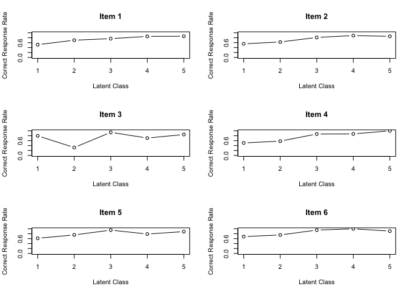<!-- -->

``` r
plot(result.LCA, type = "CMP", students = 1:9, nc = 3, nr = 3)
```

<!-- -->

``` r
plot(result.LCA, type = "TRP")
```

<!-- -->

``` r
plot(result.LCA, type = "LCD")
```

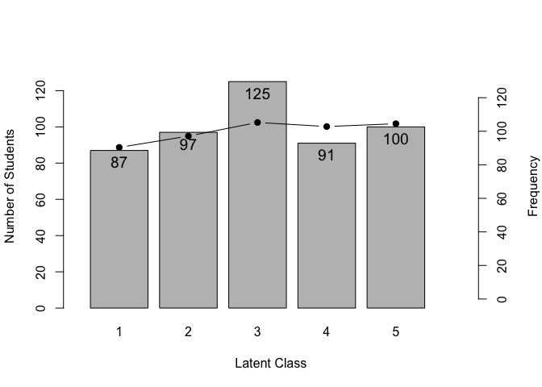<!-- -->

## LRA Example

Latent Class Analysis requires specifying the dataset and the number of
classes.

``` r
LRA(J15S500, ncls = 6)
```

    ## estimating method is  GTMItem Reference Profile
    ##          IRP1   IRP2  IRP3  IRP4  IRP5  IRP6
    ## Item01 0.5851 0.6319 0.708 0.787 0.853 0.898
    ## Item02 0.5247 0.6290 0.755 0.845 0.883 0.875
    ## Item03 0.6134 0.6095 0.708 0.773 0.801 0.839
    ## Item04 0.4406 0.6073 0.794 0.882 0.939 0.976
    ## Item05 0.6465 0.7452 0.821 0.837 0.862 0.905
    ## Item06 0.6471 0.7748 0.911 0.967 0.963 0.915
    ## Item07 0.4090 0.5177 0.720 0.840 0.890 0.900
    ## Item08 0.3375 0.4292 0.602 0.713 0.735 0.698
    ## Item09 0.3523 0.3199 0.298 0.282 0.377 0.542
    ## Item10 0.4996 0.5793 0.686 0.729 0.717 0.753
    ## Item11 0.0958 0.0793 0.136 0.286 0.472 0.617
    ## Item12 0.0648 0.0982 0.156 0.239 0.421 0.636
    ## Item13 0.2908 0.4842 0.715 0.773 0.750 0.778
    ## Item14 0.4835 0.5949 0.729 0.849 0.933 0.977
    ## Item15 0.3981 0.5745 0.756 0.827 0.835 0.834
    ## 
    ## Item Reference Profile Indices
    ##        Alpha      A Beta     B Gamma        C
    ## Item01     3 0.0786    1 0.585   0.0  0.00000
    ## Item02     2 0.1264    1 0.525   0.2 -0.00787
    ## Item03     2 0.0987    2 0.610   0.2 -0.00391
    ## Item04     2 0.1864    1 0.441   0.0  0.00000
    ## Item05     1 0.0987    1 0.647   0.0  0.00000
    ## Item06     2 0.1362    1 0.647   0.4 -0.05198
    ## Item07     2 0.2028    2 0.518   0.0  0.00000
    ## Item08     2 0.1731    2 0.429   0.2 -0.03676
    ## Item09     5 0.1646    6 0.542   0.6 -0.07002
    ## Item10     2 0.1069    1 0.500   0.2 -0.01244
    ## Item11     4 0.1867    5 0.472   0.2 -0.01650
    ## Item12     5 0.2146    5 0.421   0.0  0.00000
    ## Item13     2 0.2310    2 0.484   0.2 -0.02341
    ## Item14     2 0.1336    1 0.484   0.0  0.00000
    ## Item15     2 0.1817    2 0.574   0.2 -0.00123
    ## 
    ## Test Profile
    ##                               Class 1 Class 2 Class 3 Class 4 Class 5 Class 6
    ## Test Reference Profile          6.389   7.675   9.496  10.631  11.432  12.144
    ## Latent Class Ditribution       96.000  60.000  91.000  77.000  73.000 103.000
    ## Class Membership Distribuiton  83.755  78.691  81.853  84.918  84.238  86.545
    ## 
    ## Item Fit Indices
    ##        model_log_like bench_log_like null_log_like model_Chi_sq null_Chi_sq
    ## Item01       -264.495       -240.190      -283.343       48.611      86.307
    ## Item02       -253.141       -235.436      -278.949       35.409      87.025
    ## Item03       -282.785       -260.906      -293.598       43.758      65.383
    ## Item04       -207.082       -192.072      -265.962       30.021     147.780
    ## Item05       -234.902       -206.537      -247.403       56.730      81.732
    ## Item06       -168.218       -153.940      -198.817       28.556      89.755
    ## Item07       -250.864       -228.379      -298.345       44.970     139.933
    ## Item08       -312.621       -293.225      -338.789       38.791      91.127
    ## Item09       -317.600       -300.492      -327.842       34.216      54.700
    ## Item10       -309.654       -288.198      -319.850       42.910      63.303
    ## Item11       -242.821       -224.085      -299.265       37.472     150.360
    ## Item12       -236.522       -214.797      -293.598       43.451     157.603
    ## Item13       -287.782       -262.031      -328.396       51.502     132.730
    ## Item14       -221.702       -204.953      -273.212       33.499     136.519
    ## Item15       -267.793       -254.764      -302.847       26.059      96.166
    ##        model_df null_df   NFI   RFI   IFI   TLI   CFI RMSEA    AIC    CAIC
    ## Item01    9.233      13 0.437 0.207 0.489 0.244 0.463 0.092 30.146  -8.785
    ## Item02    9.233      13 0.593 0.427 0.664 0.502 0.646 0.075 16.944 -21.987
    ## Item03    9.233      13 0.331 0.058 0.385 0.072 0.341 0.087 25.293 -13.638
    ## Item04    9.233      13 0.797 0.714 0.850 0.783 0.846 0.067 11.555 -27.375
    ## Item05    9.233      13 0.306 0.023 0.345 0.027 0.309 0.102 38.264  -0.667
    ## Item06    9.233      13 0.682 0.552 0.760 0.646 0.748 0.065 10.091 -28.840
    ## Item07    9.233      13 0.679 0.548 0.727 0.604 0.718 0.088 26.504 -12.427
    ## Item08    9.233      13 0.574 0.401 0.639 0.467 0.622 0.080 20.326 -18.605
    ## Item09    9.233      13 0.374 0.119 0.451 0.156 0.401 0.074 15.751 -23.180
    ## Item10    9.233      13 0.322 0.046 0.377 0.057 0.330 0.085 24.445 -14.486
    ## Item11    9.233      13 0.751 0.649 0.800 0.711 0.794 0.078 19.006 -19.925
    ## Item12    9.233      13 0.724 0.612 0.769 0.667 0.763 0.086 24.985 -13.946
    ## Item13    9.233      13 0.612 0.454 0.658 0.503 0.647 0.096 33.037  -5.894
    ## Item14    9.233      13 0.755 0.654 0.809 0.723 0.804 0.073 15.034 -23.897
    ## Item15    9.233      13 0.729 0.618 0.806 0.715 0.798 0.060  7.593 -31.338
    ##            BIC
    ## Item01  -8.767
    ## Item02 -21.969
    ## Item03 -13.620
    ## Item04 -27.357
    ## Item05  -0.648
    ## Item06 -28.822
    ## Item07 -12.408
    ## Item08 -18.587
    ## Item09 -23.162
    ## Item10 -14.467
    ## Item11 -19.906
    ## Item12 -13.927
    ## Item13  -5.875
    ## Item14 -23.879
    ## Item15 -31.319
    ## 
    ## Model Fit Indices
    ## Number of Latent class: 6
    ## Number of EM cycle: 17 
    ##                    value
    ## model_log_like -3857.982
    ## bench_log_like -3560.005
    ## null_log_like  -4350.217
    ## model_Chi_sq     595.954
    ## null_Chi_sq     1580.424
    ## model_df         138.491
    ## null_df          195.000
    ## NFI                0.623
    ## RFI                0.469
    ## IFI                0.683
    ## TLI                0.535
    ## CFI                0.670
    ## RMSEA              0.081
    ## AIC              318.973
    ## CAIC            -264.989
    ## BIC             -264.712

The estimated subject rank membership probabilities and plots are almost
the same as those in LCA (Latent Class Analysis). Since a ranking is
assumed for the latent classes, rank-up odds and rank-down odds are
calculated.

``` r
result.LRA <- LRA(J15S500, ncls = 6)
head(result.LRA$Students)
```

    ##            Membership 1 Membership 2 Membership 3 Membership 4 Membership 5
    ## Student001 0.2704649921  0.357479353   0.27632327  0.084988078  0.010069050
    ## Student002 0.0276546965  0.157616072   0.47438958  0.279914853  0.053715813
    ## Student003 0.0228189795  0.138860955   0.37884545  0.284817610  0.120794858
    ## Student004 0.0020140858  0.015608542   0.09629429  0.216973334  0.362406292
    ## Student005 0.5582996437  0.397431414   0.03841668  0.003365601  0.001443909
    ## Student006 0.0003866603  0.003168853   0.04801344  0.248329964  0.428747502
    ##            Membership 6 Estimate Rank-Up Odds Rank-Down Odds
    ## Student001 0.0006752546        2    0.7729769      0.7565891
    ## Student002 0.0067089816        3    0.5900527      0.3322503
    ## Student003 0.0538621490        3    0.7518042      0.3665372
    ## Student004 0.3067034562        5    0.8462973      0.5987019
    ## Student005 0.0010427491        1    0.7118604             NA
    ## Student006 0.2713535842        5    0.6328983      0.5791986

``` r
plot(result.LRA, type = "IRP", items = 1:6, nc = 2, nr = 3)
```

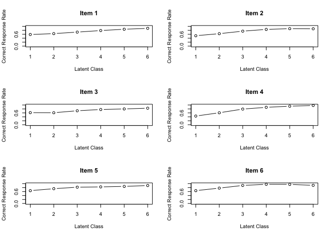<!-- -->

``` r
plot(result.LRA, type = "CMP", students = 1:9, nc = 3, nr = 3)
```

<!-- -->

``` r
plot(result.LRA, type = "TRP")
```

<!-- -->

``` r
plot(result.LRA, type = "LCD")
```

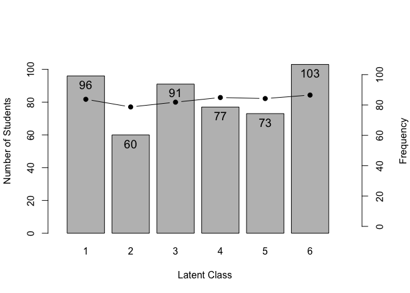<!-- -->

## Biclustering Example

Biclustering and Ranklustering algorithms are almost the same, differing
only in whether they include a filtering matrix or not. The difference
is specified using the `method` option in the `Biclustering()` function.
For more details, please refer to the help documentation.

``` r
Biclustering(J35S515, nfld = 5, ncls = 6, method = "B")
```

    ## [1] "Biclustering is chosen."
    ## iter 1  logLik -7966.6631921428 iter 2  logLik -7442.38104439743 iter 3  logLik -7266.35013687047 iter 4  logLik -7151.01420978007 iter 5  logLik -7023.9362796307 iter 6  logLik -6984.82397730586 iter 7  logLik -6950.26733682219 iter 8  logLik -6939.33989302755 iter 9  logLik -6930.88678651642 iter 10  logLik -6923.50251603444 iter 11  logLik -6914.5605776238 iter 12  logLik -6908.8870867073 iter 13  logLik -6906.83729270017 iter 14  logLik -6905.38526744311 iter 15  logLik -6904.24110722217 iter 16  logLik -6903.27777230254 iter 17  logLik -6902.41093338714 iter 18  logLik -6901.58106348213 iter 19  logLik -6900.74296870095 iter 20  logLik -6899.85978618253 iter 21  logLik -6898.90023900742 iter 22  logLik -6897.8385382822 iter 23  logLik -6896.65653670301 iter 24  logLik -6895.34754434516 iter 25  logLik -6893.92074256499 iter 26  logLik -6892.40474396852 iter 27  logLik -6890.8488157661 iter 28  logLik -6889.32044803481 iter 29  logLik -6887.89829063523 iter 30  logLik -6886.66074997203 iter 31  logLik -6885.67287118412 iter 32  logLik -6884.97572106318 iter 33  logLik -6884.58159158907 iter 33  logLik -6884.58159158907

    ## Bicluster Matrix Profile
    ##        Class1 Class2 Class3 Class4 Class5 Class6
    ## Field1 0.6236 0.8636 0.8718  0.898  0.952  1.000
    ## Field2 0.0627 0.3332 0.4255  0.919  0.990  1.000
    ## Field3 0.2008 0.5431 0.2281  0.475  0.706  1.000
    ## Field4 0.0495 0.2455 0.0782  0.233  0.648  0.983
    ## Field5 0.0225 0.0545 0.0284  0.043  0.160  0.983
    ## 
    ## Field Reference Profile Indices
    ##        Alpha     A Beta     B Gamma       C
    ## Field1     1 0.240    1 0.624   0.0  0.0000
    ## Field2     3 0.493    3 0.426   0.0  0.0000
    ## Field3     1 0.342    4 0.475   0.2 -0.3149
    ## Field4     4 0.415    5 0.648   0.2 -0.1673
    ## Field5     5 0.823    5 0.160   0.2 -0.0261
    ## 
    ##                               Class 1 Class 2 Class 3 Class 4 Class 5 Class 6
    ## Test Reference Profile          4.431  11.894   8.598  16.002  23.326  34.713
    ## Latent Class Ditribution      157.000  64.000  82.000 106.000  89.000  17.000
    ## Class Membership Distribuiton 146.105  73.232  85.753 106.414  86.529  16.968
    ## Latent Field Distribution
    ##            Field 1 Field 2 Field 3 Field 4 Field 5
    ## N of Items       3       8       7      10       7
    ## 
    ## Model Fit Indices
    ## Number of Latent Class : 6
    ## Number of Latent Field: 5
    ## Number of EM cycle: 33 
    ##                    value
    ## model_log_like -6884.582
    ## bench_log_like -5891.314
    ## null_log_like  -9862.114
    ## model_Chi_sq    1986.535
    ## null_Chi_sq     7941.601
    ## model_df        1160.000
    ## null_df         1155.000
    ## NFI                0.750
    ## RFI                0.751
    ## IFI                0.878
    ## TLI                0.879
    ## CFI                0.878
    ## RMSEA              0.037
    ## AIC             -333.465
    ## CAIC           -5258.949
    ## BIC            -5256.699

``` r
result.Ranklusteing <- Biclustering(J35S515, nfld = 5, ncls = 6, method = "R")
```

    ## [1] "Ranklustering is chosen."
    ## iter 1  logLik -8097.55606557394 iter 2  logLik -7669.20751377403 iter 3  logLik -7586.71866378648 iter 4  logLik -7568.24016256446 iter 5  logLik -7561.0203340238 iter 6  logLik -7557.33736484562 iter 7  logLik -7557.36431883905 iter 7  logLik -7557.36431883905

    ## Strongly ordinal alignment condition was satisfied.

``` r
plot(result.Ranklusteing, type = "Array")
```

<!-- -->

``` r
plot(result.Ranklusteing, type = "FRP", nc = 2, nr = 3)
plot(result.Ranklusteing, type = "RMP", students = 1:9, nc = 3, nr = 3)
```

<!-- --><!-- -->

``` r
plot(result.Ranklusteing, type = "LRD")
```

<!-- -->

To find the optimal number of classes and the optimal number of fields,
the Infinite Relational Model is available.

``` r
result.IRM <- IRM(J35S515, gamma_c = 1, gamma_f = 1, verbose = TRUE)
```

    ## [1] "iter 1 Exact match count of field elements. 0 nfld 15 ncls 30"
    ## [1] "iter 2 Exact match count of field elements. 0 nfld 12 ncls 27"
    ## [1] "iter 3 Exact match count of field elements. 1 nfld 12 ncls 24"
    ## [1] "iter 4 Exact match count of field elements. 2 nfld 12 ncls 23"
    ## [1] "iter 5 Exact match count of field elements. 3 nfld 12 ncls 23"
    ## [1] "iter 6 Exact match count of field elements. 0 nfld 12 ncls 23"
    ## [1] "iter 7 Exact match count of field elements. 1 nfld 12 ncls 23"
    ## [1] "iter 8 Exact match count of field elements. 2 nfld 12 ncls 23"
    ## [1] "iter 9 Exact match count of field elements. 3 nfld 12 ncls 21"
    ## [1] "iter 10 Exact match count of field elements. 4 nfld 12 ncls 21"
    ## [1] "iter 11 Exact match count of field elements. 5 nfld 12 ncls 21"
    ## [1] "The minimum class member count is under the setting value."
    ## [1] "bic -99592.45876564 nclass 21"
    ## [1] "The minimum class member count is under the setting value."
    ## [1] "bic -99980.427297907 nclass 20"
    ## [1] "The minimum class member count is under the setting value."
    ## [1] "bic -99959.6519185989 nclass 19"
    ## [1] "The minimum class member count is under the setting value."
    ## [1] "bic -99988.3449139464 nclass 18"
    ## [1] "The minimum class member count is under the setting value."
    ## [1] "bic -100001.30198745 nclass 17"

``` r
plot(result.IRM, type = "Array")
```

<!-- -->

``` r
plot(result.IRM, type = "FRP", nc = 3)
```

<!-- --><!-- --><!-- --><!-- -->

``` r
plot(result.IRM, type = "TRP")
```

<!-- -->

``` r
plot(result.IRM, type = "LCD")
```

<!-- -->

## Bayesian Network Model

The Bayesian network model is a model that represents the conditional
probabilities between items in a network format based on the pass rates
of the items. By providing a Directed Acyclic Graph (DAG) between items
externally, it calculates the conditional probabilities based on the
specified graph. The igraph package is used for the analysis and
representation of the network.

There are three ways to specify the graph. You can either pass a
matrix-type DAG to the argument adj_matrix, pass a DAG described in a
CSV file to the argument adj_file, or pass a graph-type object g used in
the igraph package to the argument g.

The methods to create the matrix-type adj_matrix and the graph object g
are as follows:

``` r
library(igraph)
DAG <-
  matrix(
    c(
      "Item01", "Item02",
      "Item02", "Item03",
      "Item02", "Item04",
      "Item03", "Item05",
      "Item04", "Item05"
    ),
    ncol = 2, byrow = T
  )
## graph object
g <- igraph::graph_from_data_frame(DAG)
g
```

    ## IGRAPH 52b6e10 DN-- 5 5 -- 
    ## + attr: name (v/c)
    ## + edges from 52b6e10 (vertex names):
    ## [1] Item01->Item02 Item02->Item03 Item02->Item04 Item03->Item05 Item04->Item05

``` r
## Adj mmatrix
adj_mat <- as.matrix(igraph::get.adjacency(g))
adj_mat
```

    ##        Item01 Item02 Item03 Item04 Item05
    ## Item01      0      1      0      0      0
    ## Item02      0      0      1      1      0
    ## Item03      0      0      0      0      1
    ## Item04      0      0      0      0      1
    ## Item05      0      0      0      0      0

A CSV file with the same information as the graph above in the following
format. The first line contains column names (headers) and will not be
read as data.

    ## "V1","V2"
    ## "Item01","Item02"
    ## "Item02","Item03"
    ## "Item02","Item04"
    ## "Item03","Item05"
    ## "Item04","Item05"

While only one specification is sufficient, if multiple specifications
are provided, they will be prioritized in the order of file, matrix, and
graph object.

An example of executing BNM by providing a graph structure (DAG) is as
follows:

``` r
result.BNM <- BNM(J5S10, adj_matrix = adj_mat)
result.BNM
```

    ## Adjacency Matrix
    ##        Item01 Item02 Item03 Item04 Item05
    ## Item01      0      1      0      0      0
    ## Item02      0      0      1      1      0
    ## Item03      0      0      0      0      1
    ## Item04      0      0      0      0      1
    ## Item05      0      0      0      0      0
    ## [1] "Your graph is an acyclic graph."
    ## [1] "Your graph is connected DAG."

<!-- -->

    ## 
    ## Parameter Learning
    ##        PIRP 1 PIRP 2 PIRP 3 PIRP 4
    ## Item01  0.600                     
    ## Item02  0.250    0.5              
    ## Item03  0.833    1.0              
    ## Item04  0.167    0.5              
    ## Item05  0.000    NaN  0.333  0.667
    ## 
    ## Conditional Correct Response Rate
    ##    Child Item N of Parents   Parent Items       PIRP Conditional CRR
    ## 1      Item01            0     No Parents No Pattern       0.6000000
    ## 2      Item02            1         Item01          0       0.2500000
    ## 3      Item02            1         Item01          1       0.5000000
    ## 4      Item03            1         Item02          0       0.8333333
    ## 5      Item03            1         Item02          1       1.0000000
    ## 6      Item04            1         Item02          0       0.1666667
    ## 7      Item04            1         Item02          1       0.5000000
    ## 8      Item05            2 Item03, Item04         00       0.0000000
    ## 9      Item05            2 Item03, Item04         01        NaN(0/0)
    ## 10     Item05            2 Item03, Item04         10       0.3333333
    ## 11     Item05            2 Item03, Item04         11       0.6666667
    ## 
    ## Model Fit Indices
    ##                  value
    ## model_log_like -26.411
    ## bench_log_like  -8.935
    ## null_log_like  -28.882
    ## model_Chi_sq    34.953
    ## null_Chi_sq     39.894
    ## model_df        20.000
    ## null_df         25.000
    ## NFI              0.124
    ## RFI              0.000
    ## IFI              0.248
    ## TLI              0.000
    ## CFI              0.000
    ## RMSEA            0.288
    ## AIC             -5.047
    ## CAIC           -13.005
    ## BIC            -11.099

### Structure Larning for Bayesian network with GA

The function searches for a DAG suitable for the data using a genetic
algorithm. A best DAG is not necessarily identified. Instead of
exploring all combinations of nodes and edges, only the space
topologically sorted by the pass rate, namely the upper triangular
matrix of the adjacency matrix, is explored. For interpretability, the
number of parent nodes should be limited. A null model is not proposed.
Utilize the content of the items and the experience of the questioner to
aid in interpreting the results. For more details, please refer to
Section 8.5 of the text(Shojima,2022).

Please note that the GA may take a considerable amount of time,
depending on the number of items and the size of the population.

``` r
StrLearningGA_BNM(J5S10,
  population = 20, Rs = 0.5, Rm = 0.002, maxParents = 2,
  maxGeneration = 100, crossover = 2, elitism = 2
)
```

    ## [1] "gen. 1 best BIC 1e+100 limit count 0"
    ## [1] "gen. 2 best BIC -17.680200178634 limit count 0"
    ## [1] "gen. 3 best BIC -17.680200178634 limit count 1"
    ## [1] "gen. 4 best BIC -18.9011476889596 limit count 0"
    ## [1] "gen. 5 best BIC -19.2142204292151 limit count 0"
    ## [1] "gen. 6 best BIC -19.2142204292151 limit count 1"
    ## [1] "gen. 7 best BIC -19.2142204292151 limit count 2"
    ## [1] "gen. 8 best BIC -19.2142204292151 limit count 3"
    ## [1] "gen. 9 best BIC -19.2142204292151 limit count 4"
    ## [1] "The BIC has not changed for 5  times."

    ## Adjacency Matrix
    ##        Item01 Item02 Item03 Item04 Item05
    ## Item01      0      0      0      1      0
    ## Item02      0      0      0      0      0
    ## Item03      0      0      0      0      0
    ## Item04      0      0      0      0      0
    ## Item05      0      0      0      0      0
    ## [1] "Your graph is an acyclic graph."
    ## [1] "Your graph is connected DAG."

<!-- -->

    ## 
    ## Parameter Learning
    ##        PIRP 1 PIRP 2
    ## Item01    0.6       
    ## Item02    0.4       
    ## Item03    0.9       
    ## Item04    0.0    0.5
    ## Item05    0.4       
    ## 
    ## Conditional Correct Response Rate
    ##   Child Item N of Parents Parent Items       PIRP Conditional CRR
    ## 1     Item01            0   No Parents No Pattern       0.6000000
    ## 2     Item02            0   No Parents No Pattern       0.4000000
    ## 3     Item03            0   No Parents No Pattern       0.9000000
    ## 4     Item04            1       Item01          0       0.0000000
    ## 5     Item04            1       Item01          1       0.5000000
    ## 6     Item05            0   No Parents No Pattern       0.4000000
    ## 
    ## Model Fit Indices
    ##                  value
    ## model_log_like -26.959
    ## bench_log_like  -8.935
    ## null_log_like  -28.882
    ## model_Chi_sq    36.048
    ## null_Chi_sq     39.894
    ## model_df        24.000
    ## null_df         25.000
    ## NFI              0.096
    ## RFI              0.059
    ## IFI              0.242
    ## TLI              0.157
    ## CFI              0.191
    ## RMSEA            0.236
    ## AIC            -11.952
    ## CAIC           -21.502
    ## BIC            -19.214

The method of Population-based incremental learning proposed by Fukuda
(2014) can also be used for learning. This method has several variations
for estimating the optimal adjacency matrix at the end, which can be
specified as options. See help or text Section 8.5.2.

``` r
StrLearningPBIL_BNM(J5S10,
  population = 20, Rs = 0.5, Rm = 0.005, maxParents = 2,
  alpha = 0.05, estimate = 4
)
```

    ## [1] "Too many survivers. Limit to  5"
    ## [1] "gen. 1 best BIC 1e+100 limit count 0"
    ## [1] "gen. 2 best BIC -16.3195294684954 limit count 0"
    ## [1] "gen. 3 best BIC -18.4012186805156 limit count 0"
    ## [1] "gen. 4 best BIC -16.3195294684954 limit count 0"
    ## [1] "gen. 5 best BIC -16.8753897755474 limit count 0"
    ## [1] "gen. 6 best BIC -17.680200178634 limit count 0"
    ## [1] "gen. 7 best BIC -18.0881459402601 limit count 0"
    ## [1] "gen. 8 best BIC -16.7422588580787 limit count 0"
    ## [1] "gen. 9 best BIC -16.8753897755474 limit count 0"
    ## [1] "gen. 10 best BIC -18.4012186805156 limit count 0"
    ## [1] "gen. 11 best BIC -16.8671984299345 limit count 0"
    ## [1] "gen. 12 best BIC -19.2142204292151 limit count 0"
    ## [1] "gen. 13 best BIC -17.1884625158029 limit count 0"
    ## [1] "gen. 14 best BIC -19.2142204292151 limit count 0"
    ## [1] "gen. 15 best BIC -18.4012186805156 limit count 0"
    ## [1] "gen. 16 best BIC -18.9011476889596 limit count 0"
    ## [1] "gen. 17 best BIC -16.8671984299345 limit count 0"
    ## [1] "gen. 18 best BIC -18.4012186805156 limit count 0"
    ## [1] "gen. 19 best BIC -19.2142204292151 limit count 0"
    ## [1] "gen. 20 best BIC -19.2142204292151 limit count 1"
    ## [1] "gen. 21 best BIC -18.9011476889596 limit count 0"
    ## [1] "gen. 22 best BIC -19.2142204292151 limit count 0"
    ## [1] "gen. 23 best BIC -19.2142204292151 limit count 1"
    ## [1] "gen. 24 best BIC -19.2142204292151 limit count 2"
    ## [1] "gen. 25 best BIC -19.2142204292151 limit count 3"
    ## [1] "gen. 26 best BIC -19.2142204292151 limit count 4"
    ## [1] "gen. 27 best BIC -18.9011476889596 limit count 0"
    ## [1] "gen. 28 best BIC -19.2142204292151 limit count 0"
    ## [1] "gen. 29 best BIC -19.2142204292151 limit count 1"
    ## [1] "gen. 30 best BIC -19.2142204292151 limit count 2"
    ## [1] "gen. 31 best BIC -18.9011476889596 limit count 0"
    ## [1] "gen. 32 best BIC -19.2142204292151 limit count 0"
    ## [1] "gen. 33 best BIC -19.2142204292151 limit count 1"
    ## [1] "gen. 34 best BIC -19.2142204292151 limit count 2"
    ## [1] "gen. 35 best BIC -19.2142204292151 limit count 3"
    ## [1] "gen. 36 best BIC -19.2142204292151 limit count 4"
    ## [1] "The BIC has not changed for 5  times."

    ## Adjacency Matrix
    ##        Item01 Item02 Item03 Item04 Item05
    ## Item01      0      0      0      1      0
    ## Item02      0      0      0      0      0
    ## Item03      0      0      0      0      0
    ## Item04      0      0      0      0      0
    ## Item05      0      0      0      0      0
    ## [1] "Your graph is an acyclic graph."
    ## [1] "Your graph is connected DAG."

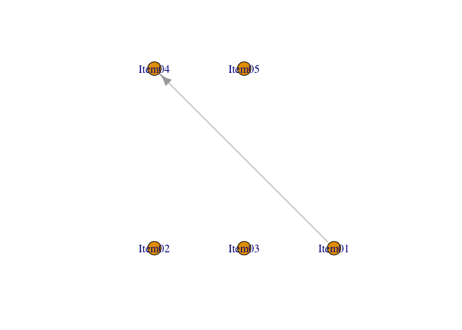<!-- -->

    ## 
    ## Parameter Learning
    ##        PIRP 1 PIRP 2
    ## Item01    0.6       
    ## Item02    0.4       
    ## Item03    0.9       
    ## Item04    0.0    0.5
    ## Item05    0.4       
    ## 
    ## Conditional Correct Response Rate
    ##   Child Item N of Parents Parent Items       PIRP Conditional CRR
    ## 1     Item01            0   No Parents No Pattern       0.6000000
    ## 2     Item02            0   No Parents No Pattern       0.4000000
    ## 3     Item03            0   No Parents No Pattern       0.9000000
    ## 4     Item04            1       Item01          0       0.0000000
    ## 5     Item04            1       Item01          1       0.5000000
    ## 6     Item05            0   No Parents No Pattern       0.4000000
    ## 
    ## Model Fit Indices
    ##                  value
    ## model_log_like -26.959
    ## bench_log_like  -8.935
    ## null_log_like  -28.882
    ## model_Chi_sq    36.048
    ## null_Chi_sq     39.894
    ## model_df        24.000
    ## null_df         25.000
    ## NFI              0.096
    ## RFI              0.059
    ## IFI              0.242
    ## TLI              0.157
    ## CFI              0.191
    ## RMSEA            0.236
    ## AIC            -11.952
    ## CAIC           -21.502
    ## BIC            -19.214

## Local Dependent Latent Rank Analysis

LD-LRA is an analysis that combines LRA and BNM, and it is used to
analyze the network structure among items in the latent rank. In this
function, structural learning is not performed, so you need to provide
item graphs for each rank as separate files.

For each class, it is necessary to specify a graph, and there are three
ways to do so. You can either pass a matrix-type DAG for each class or a
list of graph-type objects used in the igraph package to the arguments
adj_list or g_list, respectively, or you can provide a DAG described in
a CSV file. The way to specify it in a CSV file is as follows.

``` r
DAG_dat <- matrix(c(
  "From", "To", "Rank",
  "Item01", "Item02", 1,
  "Item04", "Item05", 1,
  "Item01", "Item02", 2,
  "Item02", "Item03", 2,
  "Item04", "Item05", 2,
  "Item08", "Item09", 2,
  "Item08", "Item10", 2,
  "Item09", "Item10", 2,
  "Item08", "Item11", 2,
  "Item01", "Item02", 3,
  "Item02", "Item03", 3,
  "Item04", "Item05", 3,
  "Item08", "Item09", 3,
  "Item08", "Item10", 3,
  "Item09", "Item10", 3,
  "Item08", "Item11", 3,
  "Item02", "Item03", 4,
  "Item04", "Item06", 4,
  "Item04", "Item07", 4,
  "Item05", "Item06", 4,
  "Item05", "Item07", 4,
  "Item08", "Item10", 4,
  "Item08", "Item11", 4,
  "Item09", "Item11", 4,
  "Item02", "Item03", 5,
  "Item04", "Item06", 5,
  "Item04", "Item07", 5,
  "Item05", "Item06", 5,
  "Item05", "Item07", 5,
  "Item09", "Item11", 5,
  "Item10", "Item11", 5,
  "Item10", "Item12", 5
), ncol = 3, byrow = TRUE)

# save csv file
write.csv(DAG_dat, "develop/DAG_file.csv", row.names = FALSE, quote = TRUE)
```

Here, it is shown an example of specifying with matrix-type and graph
objects using the aforementioned CSV file. While only one specification
is sufficient, if multiple specifications are provided, they will be
prioritized in the order of file, matrix, and graph object.

``` r
g_csv <- read.csv("develop/DAG_file.csv")
colnames(g_csv) <- c("From", "To", "Rank")
adj_list <- list()
g_list <- list()
for (i in 1:5) {
  adj_R <- g_csv[g_csv$Rank == i, 1:2]
  g_tmp <- igraph::graph_from_data_frame(adj_R)
  adj_tmp <- igraph::get.adjacency(g_tmp)
  g_list[[i]] <- g_tmp
  adj_list[[i]] <- adj_tmp
}
## Example of graph list
g_list
```

    ## [[1]]
    ## IGRAPH cec6c58 DN-- 4 2 -- 
    ## + attr: name (v/c)
    ## + edges from cec6c58 (vertex names):
    ## [1] Item01->Item02 Item04->Item05
    ## 
    ## [[2]]
    ## IGRAPH 1d21d2d DN-- 9 7 -- 
    ## + attr: name (v/c)
    ## + edges from 1d21d2d (vertex names):
    ## [1] Item01->Item02 Item02->Item03 Item04->Item05 Item08->Item09 Item08->Item10
    ## [6] Item09->Item10 Item08->Item11
    ## 
    ## [[3]]
    ## IGRAPH 3752435 DN-- 9 7 -- 
    ## + attr: name (v/c)
    ## + edges from 3752435 (vertex names):
    ## [1] Item01->Item02 Item02->Item03 Item04->Item05 Item08->Item09 Item08->Item10
    ## [6] Item09->Item10 Item08->Item11
    ## 
    ## [[4]]
    ## IGRAPH 323e622 DN-- 10 8 -- 
    ## + attr: name (v/c)
    ## + edges from 323e622 (vertex names):
    ## [1] Item02->Item03 Item04->Item06 Item04->Item07 Item05->Item06 Item05->Item07
    ## [6] Item08->Item10 Item08->Item11 Item09->Item11
    ## 
    ## [[5]]
    ## IGRAPH 22ea905 DN-- 10 8 -- 
    ## + attr: name (v/c)
    ## + edges from 22ea905 (vertex names):
    ## [1] Item02->Item03 Item04->Item06 Item04->Item07 Item05->Item06 Item05->Item07
    ## [6] Item09->Item11 Item10->Item11 Item10->Item12

``` r
### Example of adj list
adj_list
```

    ## [[1]]
    ## 4 x 4 sparse Matrix of class "dgCMatrix"
    ##        Item01 Item04 Item02 Item05
    ## Item01      .      .      1      .
    ## Item04      .      .      .      1
    ## Item02      .      .      .      .
    ## Item05      .      .      .      .
    ## 
    ## [[2]]
    ## 9 x 9 sparse Matrix of class "dgCMatrix"
    ##        Item01 Item02 Item04 Item08 Item09 Item03 Item05 Item10 Item11
    ## Item01      .      1      .      .      .      .      .      .      .
    ## Item02      .      .      .      .      .      1      .      .      .
    ## Item04      .      .      .      .      .      .      1      .      .
    ## Item08      .      .      .      .      1      .      .      1      1
    ## Item09      .      .      .      .      .      .      .      1      .
    ## Item03      .      .      .      .      .      .      .      .      .
    ## Item05      .      .      .      .      .      .      .      .      .
    ## Item10      .      .      .      .      .      .      .      .      .
    ## Item11      .      .      .      .      .      .      .      .      .
    ## 
    ## [[3]]
    ## 9 x 9 sparse Matrix of class "dgCMatrix"
    ##        Item01 Item02 Item04 Item08 Item09 Item03 Item05 Item10 Item11
    ## Item01      .      1      .      .      .      .      .      .      .
    ## Item02      .      .      .      .      .      1      .      .      .
    ## Item04      .      .      .      .      .      .      1      .      .
    ## Item08      .      .      .      .      1      .      .      1      1
    ## Item09      .      .      .      .      .      .      .      1      .
    ## Item03      .      .      .      .      .      .      .      .      .
    ## Item05      .      .      .      .      .      .      .      .      .
    ## Item10      .      .      .      .      .      .      .      .      .
    ## Item11      .      .      .      .      .      .      .      .      .
    ## 
    ## [[4]]
    ## 10 x 10 sparse Matrix of class "dgCMatrix"

    ##   [[ suppressing 10 column names 'Item02', 'Item04', 'Item05' ... ]]

    ##                           
    ## Item02 . . . . . 1 . . . .
    ## Item04 . . . . . . 1 1 . .
    ## Item05 . . . . . . 1 1 . .
    ## Item08 . . . . . . . . 1 1
    ## Item09 . . . . . . . . . 1
    ## Item03 . . . . . . . . . .
    ## Item06 . . . . . . . . . .
    ## Item07 . . . . . . . . . .
    ## Item10 . . . . . . . . . .
    ## Item11 . . . . . . . . . .
    ## 
    ## [[5]]
    ## 10 x 10 sparse Matrix of class "dgCMatrix"

    ##   [[ suppressing 10 column names 'Item02', 'Item04', 'Item05' ... ]]

    ##                           
    ## Item02 . . . . . 1 . . . .
    ## Item04 . . . . . . 1 1 . .
    ## Item05 . . . . . . 1 1 . .
    ## Item09 . . . . . . . . 1 .
    ## Item10 . . . . . . . . 1 1
    ## Item03 . . . . . . . . . .
    ## Item06 . . . . . . . . . .
    ## Item07 . . . . . . . . . .
    ## Item11 . . . . . . . . . .
    ## Item12 . . . . . . . . . .

The example of running the LDLRA function using this CSV file would look
like this.

``` r
result.LDLRA <- LDLRA(J12S5000,
  ncls = 5,
  adj_file = "develop/DAG_file.csv"
)
result.LDLRA
```

    ## Adjacency Matrix
    ## [[1]]
    ##        Item01 Item02 Item03 Item04 Item05 Item06 Item07 Item08 Item09 Item10
    ## Item01      0      1      0      0      0      0      0      0      0      0
    ## Item02      0      0      0      0      0      0      0      0      0      0
    ## Item03      0      0      0      0      0      0      0      0      0      0
    ## Item04      0      0      0      0      1      0      0      0      0      0
    ## Item05      0      0      0      0      0      0      0      0      0      0
    ## Item06      0      0      0      0      0      0      0      0      0      0
    ## Item07      0      0      0      0      0      0      0      0      0      0
    ## Item08      0      0      0      0      0      0      0      0      0      0
    ## Item09      0      0      0      0      0      0      0      0      0      0
    ## Item10      0      0      0      0      0      0      0      0      0      0
    ## Item11      0      0      0      0      0      0      0      0      0      0
    ## Item12      0      0      0      0      0      0      0      0      0      0
    ##        Item11 Item12
    ## Item01      0      0
    ## Item02      0      0
    ## Item03      0      0
    ## Item04      0      0
    ## Item05      0      0
    ## Item06      0      0
    ## Item07      0      0
    ## Item08      0      0
    ## Item09      0      0
    ## Item10      0      0
    ## Item11      0      0
    ## Item12      0      0
    ## 
    ## [[2]]
    ##        Item01 Item02 Item03 Item04 Item05 Item06 Item07 Item08 Item09 Item10
    ## Item01      0      1      0      0      0      0      0      0      0      0
    ## Item02      0      0      1      0      0      0      0      0      0      0
    ## Item03      0      0      0      0      0      0      0      0      0      0
    ## Item04      0      0      0      0      1      0      0      0      0      0
    ## Item05      0      0      0      0      0      0      0      0      0      0
    ## Item06      0      0      0      0      0      0      0      0      0      0
    ## Item07      0      0      0      0      0      0      0      0      0      0
    ## Item08      0      0      0      0      0      0      0      0      1      1
    ## Item09      0      0      0      0      0      0      0      0      0      1
    ## Item10      0      0      0      0      0      0      0      0      0      0
    ## Item11      0      0      0      0      0      0      0      0      0      0
    ## Item12      0      0      0      0      0      0      0      0      0      0
    ##        Item11 Item12
    ## Item01      0      0
    ## Item02      0      0
    ## Item03      0      0
    ## Item04      0      0
    ## Item05      0      0
    ## Item06      0      0
    ## Item07      0      0
    ## Item08      1      0
    ## Item09      0      0
    ## Item10      0      0
    ## Item11      0      0
    ## Item12      0      0
    ## 
    ## [[3]]
    ##        Item01 Item02 Item03 Item04 Item05 Item06 Item07 Item08 Item09 Item10
    ## Item01      0      1      0      0      0      0      0      0      0      0
    ## Item02      0      0      1      0      0      0      0      0      0      0
    ## Item03      0      0      0      0      0      0      0      0      0      0
    ## Item04      0      0      0      0      1      0      0      0      0      0
    ## Item05      0      0      0      0      0      0      0      0      0      0
    ## Item06      0      0      0      0      0      0      0      0      0      0
    ## Item07      0      0      0      0      0      0      0      0      0      0
    ## Item08      0      0      0      0      0      0      0      0      1      1
    ## Item09      0      0      0      0      0      0      0      0      0      1
    ## Item10      0      0      0      0      0      0      0      0      0      0
    ## Item11      0      0      0      0      0      0      0      0      0      0
    ## Item12      0      0      0      0      0      0      0      0      0      0
    ##        Item11 Item12
    ## Item01      0      0
    ## Item02      0      0
    ## Item03      0      0
    ## Item04      0      0
    ## Item05      0      0
    ## Item06      0      0
    ## Item07      0      0
    ## Item08      1      0
    ## Item09      0      0
    ## Item10      0      0
    ## Item11      0      0
    ## Item12      0      0
    ## 
    ## [[4]]
    ##        Item01 Item02 Item03 Item04 Item05 Item06 Item07 Item08 Item09 Item10
    ## Item01      0      0      0      0      0      0      0      0      0      0
    ## Item02      0      0      1      0      0      0      0      0      0      0
    ## Item03      0      0      0      0      0      0      0      0      0      0
    ## Item04      0      0      0      0      0      1      1      0      0      0
    ## Item05      0      0      0      0      0      1      1      0      0      0
    ## Item06      0      0      0      0      0      0      0      0      0      0
    ## Item07      0      0      0      0      0      0      0      0      0      0
    ## Item08      0      0      0      0      0      0      0      0      0      1
    ## Item09      0      0      0      0      0      0      0      0      0      0
    ## Item10      0      0      0      0      0      0      0      0      0      0
    ## Item11      0      0      0      0      0      0      0      0      0      0
    ## Item12      0      0      0      0      0      0      0      0      0      0
    ##        Item11 Item12
    ## Item01      0      0
    ## Item02      0      0
    ## Item03      0      0
    ## Item04      0      0
    ## Item05      0      0
    ## Item06      0      0
    ## Item07      0      0
    ## Item08      1      0
    ## Item09      1      0
    ## Item10      0      0
    ## Item11      0      0
    ## Item12      0      0
    ## 
    ## [[5]]
    ##        Item01 Item02 Item03 Item04 Item05 Item06 Item07 Item08 Item09 Item10
    ## Item01      0      0      0      0      0      0      0      0      0      0
    ## Item02      0      0      1      0      0      0      0      0      0      0
    ## Item03      0      0      0      0      0      0      0      0      0      0
    ## Item04      0      0      0      0      0      1      1      0      0      0
    ## Item05      0      0      0      0      0      1      1      0      0      0
    ## Item06      0      0      0      0      0      0      0      0      0      0
    ## Item07      0      0      0      0      0      0      0      0      0      0
    ## Item08      0      0      0      0      0      0      0      0      0      0
    ## Item09      0      0      0      0      0      0      0      0      0      0
    ## Item10      0      0      0      0      0      0      0      0      0      0
    ## Item11      0      0      0      0      0      0      0      0      0      0
    ## Item12      0      0      0      0      0      0      0      0      0      0
    ##        Item11 Item12
    ## Item01      0      0
    ## Item02      0      0
    ## Item03      0      0
    ## Item04      0      0
    ## Item05      0      0
    ## Item06      0      0
    ## Item07      0      0
    ## Item08      0      0
    ## Item09      1      0
    ## Item10      1      1
    ## Item11      0      0
    ## Item12      0      0

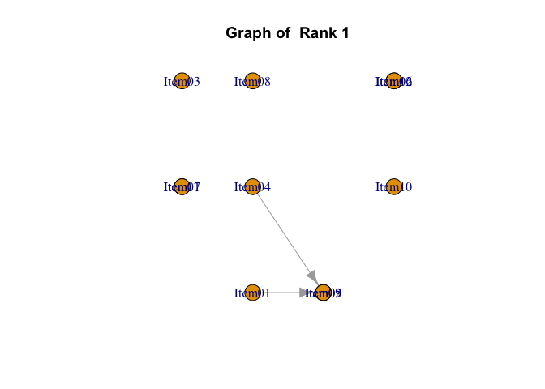<!-- -->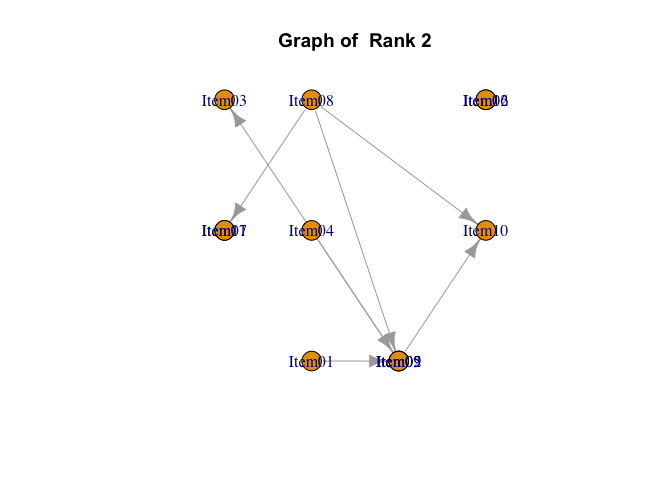<!-- --><!-- -->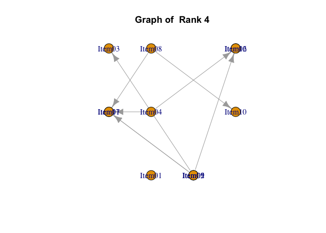<!-- -->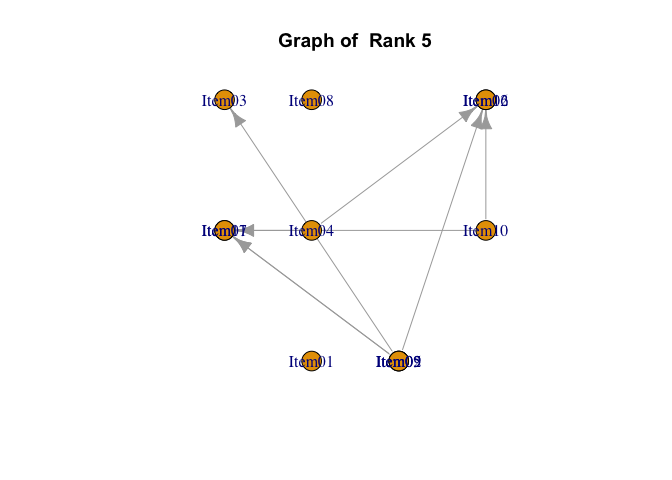<!-- -->

    ## 
    ## Parameter Learning
    ##      Item Rank PIRP 1 PIRP 2 PIRP 3 PIRP 4
    ## 1  Item01    1  0.456                     
    ## 2  Item02    1  0.030  0.444              
    ## 3  Item03    1  0.083                     
    ## 4  Item04    1  0.421                     
    ## 5  Item05    1  0.101  0.240              
    ## 6  Item06    1  0.025                     
    ## 7  Item07    1  0.016                     
    ## 8  Item08    1  0.286                     
    ## 9  Item09    1  0.326                     
    ## 10 Item10    1  0.181                     
    ## 11 Item11    1  0.106                     
    ## 12 Item12    1  0.055                     
    ## 13 Item01    2  0.549                     
    ## 14 Item02    2  0.035  0.568              
    ## 15 Item03    2  0.020  0.459              
    ## 16 Item04    2  0.495                     
    ## 17 Item05    2  0.148  0.351              
    ## 18 Item06    2  0.066                     
    ## 19 Item07    2  0.045                     
    ## 20 Item08    2  0.407                     
    ## 21 Item09    2  0.264  0.734              
    ## 22 Item10    2  0.081  0.133  0.159  0.745
    ## 23 Item11    2  0.041  0.445              
    ## 24 Item12    2  0.086                     
    ## 25 Item01    3  0.683                     
    ## 26 Item02    3  0.040  0.728              
    ## 27 Item03    3  0.032  0.617              
    ## 28 Item04    3  0.612                     
    ## 29 Item05    3  0.227  0.556              
    ## 30 Item06    3  0.205                     
    ## 31 Item07    3  0.156                     
    ## 32 Item08    3  0.581                     
    ## 33 Item09    3  0.330  0.845              
    ## 34 Item10    3  0.092  0.160  0.211  0.843
    ## 35 Item11    3  0.056  0.636              
    ## 36 Item12    3  0.152                     
    ## 37 Item01    4  0.836                     
    ## 38 Item02    4  0.720                     
    ## 39 Item03    4  0.058  0.713              
    ## 40 Item04    4  0.740                     
    ## 41 Item05    4  0.635                     
    ## 42 Item06    4  0.008  0.105  0.023  0.684
    ## 43 Item07    4  0.010  0.031  0.039  0.542
    ## 44 Item08    4  0.760                     
    ## 45 Item09    4  0.805                     
    ## 46 Item10    4  0.150  0.844              
    ## 47 Item11    4  0.064  0.124  0.105  0.825
    ## 48 Item12    4  0.227                     
    ## 49 Item01    5  0.931                     
    ## 50 Item02    5  0.869                     
    ## 51 Item03    5  0.099  0.789              
    ## 52 Item04    5  0.846                     
    ## 53 Item05    5  0.811                     
    ## 54 Item06    5  0.015  0.125  0.040  0.788
    ## 55 Item07    5  0.016  0.034  0.064  0.650
    ## 56 Item08    5  0.880                     
    ## 57 Item09    5  0.912                     
    ## 58 Item10    5  0.825                     
    ## 59 Item11    5  0.082  0.190  0.216  0.915
    ## 60 Item12    5  0.153  0.341              
    ## 
    ## Conditional Correct Response Rate
    ##     Child Item Rank N of Parents   Parent Items       PIRP Conditional CRR
    ## 1       Item01    1            0     No Parents No Pattern         0.45558
    ## 2       Item02    1            1         Item01          0         0.03025
    ## 3       Item02    1            1         Item01          1         0.44394
    ## 4       Item03    1            0     No Parents No Pattern         0.08278
    ## 5       Item04    1            0     No Parents No Pattern         0.42148
    ## 6       Item05    1            1         Item04          0         0.10127
    ## 7       Item05    1            1         Item04          1         0.24025
    ## 8       Item06    1            0     No Parents No Pattern         0.02499
    ## 9       Item07    1            0     No Parents No Pattern         0.01574
    ## 10      Item08    1            0     No Parents No Pattern         0.28642
    ## 11      Item09    1            0     No Parents No Pattern         0.32630
    ## 12      Item10    1            0     No Parents No Pattern         0.18092
    ## 13      Item11    1            0     No Parents No Pattern         0.10575
    ## 14      Item12    1            0     No Parents No Pattern         0.05523
    ## 15      Item01    2            0     No Parents No Pattern         0.54940
    ## 16      Item02    2            1         Item01          0         0.03471
    ## 17      Item02    2            1         Item01          1         0.56821
    ## 18      Item03    2            1         Item02          0         0.02016
    ## 19      Item03    2            1         Item02          1         0.45853
    ## 20      Item04    2            0     No Parents No Pattern         0.49508
    ## 21      Item05    2            1         Item04          0         0.14771
    ## 22      Item05    2            1         Item04          1         0.35073
    ## 23      Item06    2            0     No Parents No Pattern         0.06647
    ## 24      Item07    2            0     No Parents No Pattern         0.04491
    ## 25      Item08    2            0     No Parents No Pattern         0.40721
    ## 26      Item09    2            1         Item08          0         0.26431
    ## 27      Item09    2            1         Item08          1         0.73427
    ## 28      Item10    2            2 Item08, Item09         00         0.08098
    ## 29      Item10    2            2 Item08, Item09         01         0.13279
    ## 30      Item10    2            2 Item08, Item09         10         0.15937
    ## 31      Item10    2            2 Item08, Item09         11         0.74499
    ## 32      Item11    2            1         Item08          0         0.04094
    ## 33      Item11    2            1         Item08          1         0.44457
    ## 34      Item12    2            0     No Parents No Pattern         0.08574
    ## 35      Item01    3            0     No Parents No Pattern         0.68342
    ## 36      Item02    3            1         Item01          0         0.04020
    ## 37      Item02    3            1         Item01          1         0.72757
    ## 38      Item03    3            1         Item02          0         0.03175
    ## 39      Item03    3            1         Item02          1         0.61691
    ## 40      Item04    3            0     No Parents No Pattern         0.61195
    ## 41      Item05    3            1         Item04          0         0.22705
    ## 42      Item05    3            1         Item04          1         0.55588
    ## 43      Item06    3            0     No Parents No Pattern         0.20488
    ## 44      Item07    3            0     No Parents No Pattern         0.15633
    ## 45      Item08    3            0     No Parents No Pattern         0.58065
    ## 46      Item09    3            1         Item08          0         0.32967
    ## 47      Item09    3            1         Item08          1         0.84549
    ## 48      Item10    3            2 Item08, Item09         00         0.09192
    ## 49      Item10    3            2 Item08, Item09         01         0.15977
    ## 50      Item10    3            2 Item08, Item09         10         0.21087
    ## 51      Item10    3            2 Item08, Item09         11         0.84330
    ## 52      Item11    3            1         Item08          0         0.05581
    ## 53      Item11    3            1         Item08          1         0.63598
    ## 54      Item12    3            0     No Parents No Pattern         0.15169
    ## 55      Item01    4            0     No Parents No Pattern         0.83557
    ## 56      Item02    4            0     No Parents No Pattern         0.71950
    ## 57      Item03    4            1         Item02          0         0.05808
    ## 58      Item03    4            1         Item02          1         0.71297
    ## 59      Item04    4            0     No Parents No Pattern         0.73957
    ## 60      Item05    4            0     No Parents No Pattern         0.63526
    ## 61      Item06    4            2 Item04, Item05         00         0.00816
    ## 62      Item06    4            2 Item04, Item05         01         0.10474
    ## 63      Item06    4            2 Item04, Item05         10         0.02265
    ## 64      Item06    4            2 Item04, Item05         11         0.68419
    ## 65      Item07    4            2 Item04, Item05         00         0.00984
    ## 66      Item07    4            2 Item04, Item05         01         0.03091
    ## 67      Item07    4            2 Item04, Item05         10         0.03850
    ## 68      Item07    4            2 Item04, Item05         11         0.54195
    ## 69      Item08    4            0     No Parents No Pattern         0.75976
    ## 70      Item09    4            0     No Parents No Pattern         0.80490
    ## 71      Item10    4            1         Item08          0         0.14956
    ## 72      Item10    4            1         Item08          1         0.84430
    ## 73      Item11    4            2 Item08, Item09         00         0.06376
    ## 74      Item11    4            2 Item08, Item09         01         0.12384
    ## 75      Item11    4            2 Item08, Item09         10         0.10494
    ## 76      Item11    4            2 Item08, Item09         11         0.82451
    ## 77      Item12    4            0     No Parents No Pattern         0.22688
    ## 78      Item01    5            0     No Parents No Pattern         0.93131
    ## 79      Item02    5            0     No Parents No Pattern         0.86923
    ## 80      Item03    5            1         Item02          0         0.09865
    ## 81      Item03    5            1         Item02          1         0.78854
    ## 82      Item04    5            0     No Parents No Pattern         0.84621
    ## 83      Item05    5            0     No Parents No Pattern         0.81118
    ## 84      Item06    5            2 Item04, Item05         00         0.01452
    ## 85      Item06    5            2 Item04, Item05         01         0.12528
    ## 86      Item06    5            2 Item04, Item05         10         0.04000
    ## 87      Item06    5            2 Item04, Item05         11         0.78805
    ## 88      Item07    5            2 Item04, Item05         00         0.01570
    ## 89      Item07    5            2 Item04, Item05         01         0.03361
    ## 90      Item07    5            2 Item04, Item05         10         0.06363
    ## 91      Item07    5            2 Item04, Item05         11         0.65039
    ## 92      Item08    5            0     No Parents No Pattern         0.88028
    ## 93      Item09    5            0     No Parents No Pattern         0.91209
    ## 94      Item10    5            0     No Parents No Pattern         0.82476
    ## 95      Item11    5            2 Item09, Item10         00         0.08248
    ## 96      Item11    5            2 Item09, Item10         01         0.18951
    ## 97      Item11    5            2 Item09, Item10         10         0.21590
    ## 98      Item11    5            2 Item09, Item10         11         0.91466
    ## 99      Item12    5            1         Item10          0         0.15301
    ## 100     Item12    5            1         Item10          1         0.34114
    ## 
    ## Marginal Item Reference Profile
    ##        Rank 1 Rank 2 Rank 3 Rank 4 Rank 5
    ## Item01 0.4556 0.5494  0.683  0.836  0.931
    ## Item02 0.2099 0.2964  0.474  0.720  0.869
    ## Item03 0.0828 0.1397  0.316  0.554  0.741
    ## Item04 0.4215 0.4951  0.612  0.740  0.846
    ## Item05 0.1555 0.2393  0.432  0.635  0.811
    ## Item06 0.0250 0.0665  0.205  0.385  0.631
    ## Item07 0.0157 0.0449  0.156  0.304  0.517
    ## Item08 0.2864 0.4072  0.581  0.760  0.880
    ## Item09 0.3263 0.4409  0.624  0.805  0.912
    ## Item10 0.1809 0.2977  0.498  0.650  0.825
    ## Item11 0.1057 0.1926  0.387  0.565  0.808
    ## Item12 0.0552 0.0857  0.152  0.227  0.317
    ## 
    ## IRP Indices
    ##        Alpha          A Beta         B Gamma C
    ## Item01     3 0.15215133    1 0.4555806     0 0
    ## Item02     3 0.24578705    3 0.4737140     0 0
    ## Item03     3 0.23808314    4 0.5544465     0 0
    ## Item04     3 0.12762155    2 0.4950757     0 0
    ## Item05     3 0.20322441    3 0.4320364     0 0
    ## Item06     4 0.24595102    4 0.3851075     0 0
    ## Item07     4 0.21361675    5 0.5173874     0 0
    ## Item08     3 0.17910918    3 0.5806476     0 0
    ## Item09     2 0.18320368    2 0.4408936     0 0
    ## Item10     2 0.20070396    3 0.4984108     0 0
    ## Item11     4 0.24332189    4 0.5650492     0 0
    ## Item12     4 0.09047482    5 0.3173548     0 0
    ## [1] "Strongly ordinal alignment condition was satisfied."
    ## 
    ## Test reference Profile and Latent Rank Distribution
    ##                                Rank 1   Rank 2  Rank 3  Rank 4   Rank 5
    ## Test Reference Profile          2.321    3.255   5.121   7.179    9.090
    ## Latent Rank Ditribution      1829.000  593.000 759.000 569.000 1250.000
    ## Rank Membership Distribuiton 1121.838 1087.855 873.796 835.528 1080.983
    ## [1] "Weakly ordinal alignment condition was satisfied."
    ## 
    ## Model Fit Indices
    ##                     value
    ## model_log_like -26657.783
    ## bench_log_like -21318.465
    ## null_log_like  -37736.228
    ## model_Chi_sq    10678.636
    ## null_Chi_sq     32835.527
    ## model_df           56.000
    ## null_df           144.000
    ## NFI                 0.675
    ## RFI                 0.164
    ## IFI                 0.676
    ## TLI                 0.164
    ## CFI                 0.675
    ## RMSEA               0.195
    ## AIC             10566.636
    ## CAIC            10201.662
    ## BIC             10201.673

Of course, it also supports various types of plots.

``` r
plot(result.LDLRA, type = "IRP", nc = 4, nr = 3)
```

<!-- -->

``` r
plot(result.LDLRA, type = "TRP")
```

<!-- -->

``` r
plot(result.LDLRA, type = "LRD")
```

<!-- -->

### Structure Larning for LDLRA with GA(PBIL)

You can learn item-interaction graphs for each rank using the PBIL
algorithm. In addition to various options, the learning process requires
a very long computation time. It’s also important to note that the
result is merely one of the feasible solutions, and it’s not necessarily
the optimal solution.

``` r
result.LDLRA.PBIL <- StrLearningPBIL_LDLRA(J35S515,
  seed = 123,
  ncls = 5,
  method = "R",
  elitism = 1,
  successiveLimit = 15
)
```

    ## [1] "local dependence latent Rank model is chosen."
    ## [1] "Too many survivers. Limit to  5"
    ## Gen 1 ID. 2 BIC -422.327 BEST -709.604 limit count 0 Gen 1 ID. 3 BIC -526.255 BEST -709.604 limit count 0 Gen 1 ID. 4 BIC -419.884 BEST -709.604 limit count 0 Gen 1 ID. 5 BIC -427.353 BEST -709.604 limit count 0 Gen 1 ID. 6 BIC -545.166 BEST -709.604 limit count 0 Gen 1 ID. 7 BIC -569.055 BEST -709.604 limit count 0 Gen 1 ID. 8 BIC -320.897 BEST -709.604 limit count 0 Gen 1 ID. 9 BIC -468.407 BEST -709.604 limit count 0 Gen 1 ID. 10 BIC -273.71 BEST -709.604 limit count 0 Gen 1 ID. 11 BIC -520.677 BEST -709.604 limit count 0 Gen 1 ID. 12 BIC -277.125 BEST -709.604 limit count 0 Gen 1 ID. 13 BIC -449.793 BEST -709.604 limit count 0 Gen 1 ID. 14 BIC -513.19 BEST -709.604 limit count 0 Gen 1 ID. 15 BIC -316.163 BEST -709.604 limit count 0 Gen 1 ID. 16 BIC -455.311 BEST -709.604 limit count 0 Gen 1 ID. 17 BIC -308.502 BEST -709.604 limit count 0 Gen 1 ID. 18 BIC -302.723 BEST -709.604 limit count 0 Gen 1 ID. 19 BIC -377.327 BEST -709.604 limit count 0 Gen 1 ID. 20 BIC -656.913 BEST -709.604 limit count 0 Gen 2 ID. 2 BIC -453.639 BEST -709.604 limit count 1 Gen 2 ID. 3 BIC -515.942 BEST -709.604 limit count 1 Gen 2 ID. 4 BIC -640.801 BEST -709.604 limit count 1 Gen 2 ID. 5 BIC -523.601 BEST -709.604 limit count 1 Gen 2 ID. 6 BIC -546.148 BEST -709.604 limit count 1 Gen 2 ID. 7 BIC -467.266 BEST -709.604 limit count 1 Gen 2 ID. 8 BIC -717.15 BEST -709.604 limit count 1 Gen 2 ID. 9 BIC -306.418 BEST -709.604 limit count 1 Gen 2 ID. 10 BIC -468.441 BEST -709.604 limit count 1 Gen 2 ID. 11 BIC -673.189 BEST -709.604 limit count 1 Gen 2 ID. 12 BIC -321.404 BEST -709.604 limit count 1 Gen 2 ID. 13 BIC -495.686 BEST -709.604 limit count 1 Gen 2 ID. 14 BIC -600.35 BEST -709.604 limit count 1 Gen 2 ID. 15 BIC -364.983 BEST -709.604 limit count 1 Gen 2 ID. 16 BIC -343.162 BEST -709.604 limit count 1 Gen 2 ID. 17 BIC -386.411 BEST -709.604 limit count 1 Gen 2 ID. 18 BIC -449.807 BEST -709.604 limit count 1 Gen 2 ID. 19 BIC -452.18 BEST -709.604 limit count 1 Gen 2 ID. 20 BIC -467.237 BEST -709.604 limit count 1 Gen 3 ID. 2 BIC -414.726 BEST -717.15 limit count 0 Gen 3 ID. 3 BIC -434.751 BEST -717.15 limit count 0 Gen 3 ID. 4 BIC -524.95 BEST -717.15 limit count 0 Gen 3 ID. 5 BIC -502.991 BEST -717.15 limit count 0 Gen 3 ID. 6 BIC -539.057 BEST -717.15 limit count 0 Gen 3 ID. 7 BIC -302.488 BEST -717.15 limit count 0 Gen 3 ID. 8 BIC -280.548 BEST -717.15 limit count 0 Gen 3 ID. 9 BIC -560.465 BEST -717.15 limit count 0 Gen 3 ID. 10 BIC -513.876 BEST -717.15 limit count 0 Gen 3 ID. 11 BIC -486.99 BEST -717.15 limit count 0 Gen 3 ID. 12 BIC -405.836 BEST -717.15 limit count 0 Gen 3 ID. 13 BIC -411.44 BEST -717.15 limit count 0 Gen 3 ID. 14 BIC -540.975 BEST -717.15 limit count 0 Gen 3 ID. 15 BIC -400.949 BEST -717.15 limit count 0 Gen 3 ID. 16 BIC -567.635 BEST -717.15 limit count 0 Gen 3 ID. 17 BIC -456.976 BEST -717.15 limit count 0 Gen 3 ID. 18 BIC -256.588 BEST -717.15 limit count 0 Gen 3 ID. 19 BIC -500.122 BEST -717.15 limit count 0 Gen 3 ID. 20 BIC -570.932 BEST -717.15 limit count 0 Gen 4 ID. 2 BIC -547.669 BEST -717.15 limit count 1 Gen 4 ID. 3 BIC -356.111 BEST -717.15 limit count 1 Gen 4 ID. 4 BIC -423.911 BEST -717.15 limit count 1 Gen 4 ID. 5 BIC -484.318 BEST -717.15 limit count 1 Gen 4 ID. 6 BIC -501.737 BEST -717.15 limit count 1 Gen 4 ID. 7 BIC -418.426 BEST -717.15 limit count 1 Gen 4 ID. 8 BIC -661.804 BEST -717.15 limit count 1 Gen 4 ID. 9 BIC -408.163 BEST -717.15 limit count 1 Gen 4 ID. 10 BIC -392.889 BEST -717.15 limit count 1 Gen 4 ID. 11 BIC -272.223 BEST -717.15 limit count 1 Gen 4 ID. 12 BIC -370.923 BEST -717.15 limit count 1 Gen 4 ID. 13 BIC -391.89 BEST -717.15 limit count 1 Gen 4 ID. 14 BIC -306.415 BEST -717.15 limit count 1 Gen 4 ID. 15 BIC -589.41 BEST -717.15 limit count 1 Gen 4 ID. 16 BIC -328.944 BEST -717.15 limit count 1 Gen 4 ID. 17 BIC -449.927 BEST -717.15 limit count 1 Gen 4 ID. 18 BIC -307.293 BEST -717.15 limit count 1 Gen 4 ID. 19 BIC -383.285 BEST -717.15 limit count 1 Gen 4 ID. 20 BIC -501.448 BEST -717.15 limit count 1 Gen 5 ID. 2 BIC -483.929 BEST -717.15 limit count 2 Gen 5 ID. 3 BIC -486.842 BEST -717.15 limit count 2 Gen 5 ID. 4 BIC -461.94 BEST -717.15 limit count 2 Gen 5 ID. 5 BIC -363.225 BEST -717.15 limit count 2 Gen 5 ID. 6 BIC -458.415 BEST -717.15 limit count 2 Gen 5 ID. 7 BIC -401.02 BEST -717.15 limit count 2 Gen 5 ID. 8 BIC -384.352 BEST -717.15 limit count 2 Gen 5 ID. 9 BIC -425.682 BEST -717.15 limit count 2 Gen 5 ID. 10 BIC -420.133 BEST -717.15 limit count 2 Gen 5 ID. 11 BIC -524.994 BEST -717.15 limit count 2 Gen 5 ID. 12 BIC -563.555 BEST -717.15 limit count 2 Gen 5 ID. 13 BIC -509.63 BEST -717.15 limit count 2 Gen 5 ID. 14 BIC -506.36 BEST -717.15 limit count 2 Gen 5 ID. 15 BIC -486.6 BEST -717.15 limit count 2 Gen 5 ID. 16 BIC -385.122 BEST -717.15 limit count 2 Gen 5 ID. 17 BIC -340.111 BEST -717.15 limit count 2 Gen 5 ID. 18 BIC -497.859 BEST -717.15 limit count 2 Gen 5 ID. 19 BIC -485.895 BEST -717.15 limit count 2 Gen 5 ID. 20 BIC -535.386 BEST -717.15 limit count 2 Gen 6 ID. 2 BIC -397.522 BEST -717.15 limit count 3 Gen 6 ID. 3 BIC -327.956 BEST -717.15 limit count 3 Gen 6 ID. 4 BIC -515.616 BEST -717.15 limit count 3 Gen 6 ID. 5 BIC -580.154 BEST -717.15 limit count 3 Gen 6 ID. 6 BIC -406.641 BEST -717.15 limit count 3 Gen 6 ID. 7 BIC -420.194 BEST -717.15 limit count 3 Gen 6 ID. 8 BIC -333.668 BEST -717.15 limit count 3 Gen 6 ID. 9 BIC -519.661 BEST -717.15 limit count 3 Gen 6 ID. 10 BIC -609.741 BEST -717.15 limit count 3 Gen 6 ID. 11 BIC -417.211 BEST -717.15 limit count 3 Gen 6 ID. 12 BIC -513.47 BEST -717.15 limit count 3 Gen 6 ID. 13 BIC -490.287 BEST -717.15 limit count 3 Gen 6 ID. 14 BIC -481.605 BEST -717.15 limit count 3 Gen 6 ID. 15 BIC -549.045 BEST -717.15 limit count 3 Gen 6 ID. 16 BIC -445.122 BEST -717.15 limit count 3 Gen 6 ID. 17 BIC -469.131 BEST -717.15 limit count 3 Gen 6 ID. 18 BIC -360.529 BEST -717.15 limit count 3 Gen 6 ID. 19 BIC -487.935 BEST -717.15 limit count 3 Gen 6 ID. 20 BIC -413.372 BEST -717.15 limit count 3 Gen 7 ID. 2 BIC -566.711 BEST -717.15 limit count 4 Gen 7 ID. 3 BIC -501.363 BEST -717.15 limit count 4 Gen 7 ID. 4 BIC -491.278 BEST -717.15 limit count 4 Gen 7 ID. 5 BIC -519.399 BEST -717.15 limit count 4 Gen 7 ID. 6 BIC -679.15 BEST -717.15 limit count 4 Gen 7 ID. 7 BIC -472.54 BEST -717.15 limit count 4 Gen 7 ID. 8 BIC -364.919 BEST -717.15 limit count 4 Gen 7 ID. 9 BIC -646.398 BEST -717.15 limit count 4 Gen 7 ID. 10 BIC -552.374 BEST -717.15 limit count 4 Gen 7 ID. 11 BIC -577.703 BEST -717.15 limit count 4 Gen 7 ID. 12 BIC -544.654 BEST -717.15 limit count 4 Gen 7 ID. 13 BIC -465.313 BEST -717.15 limit count 4 Gen 7 ID. 14 BIC -414.232 BEST -717.15 limit count 4 Gen 7 ID. 15 BIC -478.8 BEST -717.15 limit count 4 Gen 7 ID. 16 BIC -560.269 BEST -717.15 limit count 4 Gen 7 ID. 17 BIC -336.031 BEST -717.15 limit count 4 Gen 7 ID. 18 BIC -336.339 BEST -717.15 limit count 4 Gen 7 ID. 19 BIC -340.626 BEST -717.15 limit count 4 Gen 7 ID. 20 BIC -522.17 BEST -717.15 limit count 4 Gen 8 ID. 2 BIC -603.689 BEST -717.15 limit count 5 Gen 8 ID. 3 BIC -359.055 BEST -717.15 limit count 5 Gen 8 ID. 4 BIC -791.319 BEST -717.15 limit count 5 Gen 8 ID. 5 BIC -480.978 BEST -717.15 limit count 5 Gen 8 ID. 6 BIC -491.674 BEST -717.15 limit count 5 Gen 8 ID. 7 BIC -622.546 BEST -717.15 limit count 5 Gen 8 ID. 8 BIC -567.817 BEST -717.15 limit count 5 Gen 8 ID. 9 BIC -646.625 BEST -717.15 limit count 5 Gen 8 ID. 10 BIC -350.987 BEST -717.15 limit count 5 Gen 8 ID. 11 BIC -554.654 BEST -717.15 limit count 5 Gen 8 ID. 12 BIC -551.042 BEST -717.15 limit count 5 Gen 8 ID. 13 BIC -417.637 BEST -717.15 limit count 5 Gen 8 ID. 14 BIC -341.436 BEST -717.15 limit count 5 Gen 8 ID. 15 BIC -387.708 BEST -717.15 limit count 5 Gen 8 ID. 16 BIC -543.029 BEST -717.15 limit count 5 Gen 8 ID. 17 BIC -363.872 BEST -717.15 limit count 5 Gen 8 ID. 18 BIC -544.05 BEST -717.15 limit count 5 Gen 8 ID. 19 BIC -512.891 BEST -717.15 limit count 5 Gen 8 ID. 20 BIC -615.26 BEST -717.15 limit count 5 Gen 9 ID. 2 BIC -585.402 BEST -791.319 limit count 0 Gen 9 ID. 3 BIC -388.29 BEST -791.319 limit count 0 Gen 9 ID. 4 BIC -487.699 BEST -791.319 limit count 0 Gen 9 ID. 5 BIC -492.375 BEST -791.319 limit count 0 Gen 9 ID. 6 BIC -503.756 BEST -791.319 limit count 0 Gen 9 ID. 7 BIC -540.984 BEST -791.319 limit count 0 Gen 9 ID. 8 BIC -553.193 BEST -791.319 limit count 0 Gen 9 ID. 9 BIC -409.575 BEST -791.319 limit count 0 Gen 9 ID. 10 BIC -415.866 BEST -791.319 limit count 0 Gen 9 ID. 11 BIC -737.831 BEST -791.319 limit count 0 Gen 9 ID. 12 BIC -627.219 BEST -791.319 limit count 0 Gen 9 ID. 13 BIC -440.463 BEST -791.319 limit count 0 Gen 9 ID. 14 BIC -505.03 BEST -791.319 limit count 0 Gen 9 ID. 15 BIC -312.347 BEST -791.319 limit count 0 Gen 9 ID. 16 BIC -569.392 BEST -791.319 limit count 0 Gen 9 ID. 17 BIC -561.062 BEST -791.319 limit count 0 Gen 9 ID. 18 BIC -539.849 BEST -791.319 limit count 0 Gen 9 ID. 19 BIC -534.001 BEST -791.319 limit count 0 Gen 9 ID. 20 BIC -380.962 BEST -791.319 limit count 0 Gen 10 ID. 2 BIC -527.606 BEST -791.319 limit count 1 Gen 10 ID. 3 BIC -531.567 BEST -791.319 limit count 1 Gen 10 ID. 4 BIC -606.66 BEST -791.319 limit count 1 Gen 10 ID. 5 BIC -468.857 BEST -791.319 limit count 1 Gen 10 ID. 6 BIC -616.972 BEST -791.319 limit count 1 Gen 10 ID. 7 BIC -399.066 BEST -791.319 limit count 1 Gen 10 ID. 8 BIC -498.71 BEST -791.319 limit count 1 Gen 10 ID. 9 BIC -418.221 BEST -791.319 limit count 1 Gen 10 ID. 10 BIC -493.903 BEST -791.319 limit count 1 Gen 10 ID. 11 BIC -536.07 BEST -791.319 limit count 1 Gen 10 ID. 12 BIC -599.931 BEST -791.319 limit count 1 Gen 10 ID. 13 BIC -539.202 BEST -791.319 limit count 1 Gen 10 ID. 14 BIC -750.54 BEST -791.319 limit count 1 Gen 10 ID. 15 BIC -572.636 BEST -791.319 limit count 1 Gen 10 ID. 16 BIC -666.334 BEST -791.319 limit count 1 Gen 10 ID. 17 BIC -417.831 BEST -791.319 limit count 1 Gen 10 ID. 18 BIC -635.378 BEST -791.319 limit count 1 Gen 10 ID. 19 BIC -438.893 BEST -791.319 limit count 1 Gen 10 ID. 20 BIC -573.246 BEST -791.319 limit count 1 Gen 11 ID. 2 BIC -680.05 BEST -791.319 limit count 2 Gen 11 ID. 3 BIC -471.66 BEST -791.319 limit count 2 Gen 11 ID. 4 BIC -577.087 BEST -791.319 limit count 2 Gen 11 ID. 5 BIC -484.611 BEST -791.319 limit count 2 Gen 11 ID. 6 BIC -699.088 BEST -791.319 limit count 2 Gen 11 ID. 7 BIC -582.781 BEST -791.319 limit count 2 Gen 11 ID. 8 BIC -586.223 BEST -791.319 limit count 2 Gen 11 ID. 9 BIC -485.876 BEST -791.319 limit count 2 Gen 11 ID. 10 BIC -547.534 BEST -791.319 limit count 2 Gen 11 ID. 11 BIC -676.029 BEST -791.319 limit count 2 Gen 11 ID. 12 BIC -511.559 BEST -791.319 limit count 2 Gen 11 ID. 13 BIC -336.848 BEST -791.319 limit count 2 Gen 11 ID. 14 BIC -748.717 BEST -791.319 limit count 2 Gen 11 ID. 15 BIC -479.641 BEST -791.319 limit count 2 Gen 11 ID. 16 BIC -423.676 BEST -791.319 limit count 2 Gen 11 ID. 17 BIC -648.916 BEST -791.319 limit count 2 Gen 11 ID. 18 BIC -413.484 BEST -791.319 limit count 2 Gen 11 ID. 19 BIC -689.508 BEST -791.319 limit count 2 Gen 11 ID. 20 BIC -508.428 BEST -791.319 limit count 2 Gen 12 ID. 2 BIC -634.978 BEST -791.319 limit count 3 Gen 12 ID. 3 BIC -399.791 BEST -791.319 limit count 3 Gen 12 ID. 4 BIC -742.214 BEST -791.319 limit count 3 Gen 12 ID. 5 BIC -296.273 BEST -791.319 limit count 3 Gen 12 ID. 6 BIC -567.452 BEST -791.319 limit count 3 Gen 12 ID. 7 BIC -572.303 BEST -791.319 limit count 3 Gen 12 ID. 8 BIC -593.997 BEST -791.319 limit count 3 Gen 12 ID. 9 BIC -589.065 BEST -791.319 limit count 3 Gen 12 ID. 10 BIC -554.985 BEST -791.319 limit count 3 Gen 12 ID. 11 BIC -505.07 BEST -791.319 limit count 3 Gen 12 ID. 12 BIC -599.957 BEST -791.319 limit count 3 Gen 12 ID. 13 BIC -754.162 BEST -791.319 limit count 3 Gen 12 ID. 14 BIC -529.429 BEST -791.319 limit count 3 Gen 12 ID. 15 BIC -621.358 BEST -791.319 limit count 3 Gen 12 ID. 16 BIC -607.939 BEST -791.319 limit count 3 Gen 12 ID. 17 BIC -586.798 BEST -791.319 limit count 3 Gen 12 ID. 18 BIC -409.612 BEST -791.319 limit count 3 Gen 12 ID. 19 BIC -614.762 BEST -791.319 limit count 3 Gen 12 ID. 20 BIC -695.502 BEST -791.319 limit count 3 Gen 13 ID. 2 BIC -635.803 BEST -791.319 limit count 4 Gen 13 ID. 3 BIC -688.672 BEST -791.319 limit count 4 Gen 13 ID. 4 BIC -672.651 BEST -791.319 limit count 4 Gen 13 ID. 5 BIC -502.724 BEST -791.319 limit count 4 Gen 13 ID. 6 BIC -548.378 BEST -791.319 limit count 4 Gen 13 ID. 7 BIC -547.811 BEST -791.319 limit count 4 Gen 13 ID. 8 BIC -617.041 BEST -791.319 limit count 4 Gen 13 ID. 9 BIC -490.47 BEST -791.319 limit count 4 Gen 13 ID. 10 BIC -715.729 BEST -791.319 limit count 4 Gen 13 ID. 11 BIC -484.722 BEST -791.319 limit count 4 Gen 13 ID. 12 BIC -728.693 BEST -791.319 limit count 4 Gen 13 ID. 13 BIC -514.145 BEST -791.319 limit count 4 Gen 13 ID. 14 BIC -504.417 BEST -791.319 limit count 4 Gen 13 ID. 15 BIC -536.827 BEST -791.319 limit count 4 Gen 13 ID. 16 BIC -811.147 BEST -791.319 limit count 4 Gen 13 ID. 17 BIC -513.856 BEST -791.319 limit count 4 Gen 13 ID. 18 BIC -525.488 BEST -791.319 limit count 4 Gen 13 ID. 19 BIC -619.262 BEST -791.319 limit count 4 Gen 13 ID. 20 BIC -421.671 BEST -791.319 limit count 4 Gen 14 ID. 2 BIC -517.205 BEST -811.147 limit count 0 Gen 14 ID. 3 BIC -446.875 BEST -811.147 limit count 0 Gen 14 ID. 4 BIC -391.234 BEST -811.147 limit count 0 Gen 14 ID. 5 BIC -375.261 BEST -811.147 limit count 0 Gen 14 ID. 6 BIC -603.806 BEST -811.147 limit count 0 Gen 14 ID. 7 BIC -657.485 BEST -811.147 limit count 0 Gen 14 ID. 8 BIC -683.424 BEST -811.147 limit count 0 Gen 14 ID. 9 BIC -631.798 BEST -811.147 limit count 0 Gen 14 ID. 10 BIC -610.271 BEST -811.147 limit count 0 Gen 14 ID. 11 BIC -660.944 BEST -811.147 limit count 0 Gen 14 ID. 12 BIC -738.687 BEST -811.147 limit count 0 Gen 14 ID. 13 BIC -542.679 BEST -811.147 limit count 0 Gen 14 ID. 14 BIC -561.182 BEST -811.147 limit count 0 Gen 14 ID. 15 BIC -558.305 BEST -811.147 limit count 0 Gen 14 ID. 16 BIC -360.92 BEST -811.147 limit count 0 Gen 14 ID. 17 BIC -559.663 BEST -811.147 limit count 0 Gen 14 ID. 18 BIC -691.172 BEST -811.147 limit count 0 Gen 14 ID. 19 BIC -551.429 BEST -811.147 limit count 0 Gen 14 ID. 20 BIC -498.203 BEST -811.147 limit count 0 Gen 15 ID. 2 BIC -531.69 BEST -811.147 limit count 1 Gen 15 ID. 3 BIC -754.25 BEST -811.147 limit count 1 Gen 15 ID. 4 BIC -602.007 BEST -811.147 limit count 1 Gen 15 ID. 5 BIC -599.412 BEST -811.147 limit count 1 Gen 15 ID. 6 BIC -478.864 BEST -811.147 limit count 1 Gen 15 ID. 7 BIC -855.036 BEST -811.147 limit count 1 Gen 15 ID. 8 BIC -523.51 BEST -811.147 limit count 1 Gen 15 ID. 9 BIC -747.695 BEST -811.147 limit count 1 Gen 15 ID. 10 BIC -429.679 BEST -811.147 limit count 1 Gen 15 ID. 11 BIC -665.982 BEST -811.147 limit count 1 Gen 15 ID. 12 BIC -626.547 BEST -811.147 limit count 1 Gen 15 ID. 13 BIC -742.088 BEST -811.147 limit count 1 Gen 15 ID. 14 BIC -584.289 BEST -811.147 limit count 1 Gen 15 ID. 15 BIC -631.808 BEST -811.147 limit count 1 Gen 15 ID. 16 BIC -764.853 BEST -811.147 limit count 1 Gen 15 ID. 17 BIC -763.076 BEST -811.147 limit count 1 Gen 15 ID. 18 BIC -633.844 BEST -811.147 limit count 1 Gen 15 ID. 19 BIC -750.059 BEST -811.147 limit count 1 Gen 15 ID. 20 BIC -444.145 BEST -811.147 limit count 1 Gen 16 ID. 2 BIC -396.811 BEST -855.036 limit count 0 Gen 16 ID. 3 BIC -475.69 BEST -855.036 limit count 0 Gen 16 ID. 4 BIC -675.527 BEST -855.036 limit count 0 Gen 16 ID. 5 BIC -399.749 BEST -855.036 limit count 0 Gen 16 ID. 6 BIC -795.372 BEST -855.036 limit count 0 Gen 16 ID. 7 BIC -707.393 BEST -855.036 limit count 0 Gen 16 ID. 8 BIC -667.346 BEST -855.036 limit count 0 Gen 16 ID. 9 BIC -749.95 BEST -855.036 limit count 0 Gen 16 ID. 10 BIC -698.221 BEST -855.036 limit count 0 Gen 16 ID. 11 BIC -675.865 BEST -855.036 limit count 0 Gen 16 ID. 12 BIC -846.804 BEST -855.036 limit count 0 Gen 16 ID. 13 BIC -668.895 BEST -855.036 limit count 0 Gen 16 ID. 14 BIC -626.075 BEST -855.036 limit count 0 Gen 16 ID. 15 BIC -696.82 BEST -855.036 limit count 0 Gen 16 ID. 16 BIC -725.656 BEST -855.036 limit count 0 Gen 16 ID. 17 BIC -516.365 BEST -855.036 limit count 0 Gen 16 ID. 18 BIC -771.068 BEST -855.036 limit count 0 Gen 16 ID. 19 BIC -712.341 BEST -855.036 limit count 0 Gen 16 ID. 20 BIC -662.414 BEST -855.036 limit count 0 Gen 17 ID. 2 BIC -813.237 BEST -855.036 limit count 1 Gen 17 ID. 3 BIC -691.449 BEST -855.036 limit count 1 Gen 17 ID. 4 BIC -561.346 BEST -855.036 limit count 1 Gen 17 ID. 5 BIC -595.04 BEST -855.036 limit count 1 Gen 17 ID. 6 BIC -627.216 BEST -855.036 limit count 1 Gen 17 ID. 7 BIC -704.647 BEST -855.036 limit count 1 Gen 17 ID. 8 BIC -587.129 BEST -855.036 limit count 1 Gen 17 ID. 9 BIC -413.237 BEST -855.036 limit count 1 Gen 17 ID. 10 BIC -698.303 BEST -855.036 limit count 1 Gen 17 ID. 11 BIC -548.741 BEST -855.036 limit count 1 Gen 17 ID. 12 BIC -768.248 BEST -855.036 limit count 1 Gen 17 ID. 13 BIC -828.141 BEST -855.036 limit count 1 Gen 17 ID. 14 BIC -704.156 BEST -855.036 limit count 1 Gen 17 ID. 15 BIC -663.274 BEST -855.036 limit count 1 Gen 17 ID. 16 BIC -823.496 BEST -855.036 limit count 1 Gen 17 ID. 17 BIC -652.165 BEST -855.036 limit count 1 Gen 17 ID. 18 BIC -481.921 BEST -855.036 limit count 1 Gen 17 ID. 19 BIC -404.878 BEST -855.036 limit count 1 Gen 17 ID. 20 BIC -530.107 BEST -855.036 limit count 1 Gen 18 ID. 2 BIC -697.561 BEST -855.036 limit count 2 Gen 18 ID. 3 BIC -932.439 BEST -855.036 limit count 2 Gen 18 ID. 4 BIC -566.65 BEST -855.036 limit count 2 Gen 18 ID. 5 BIC -953.004 BEST -855.036 limit count 2 Gen 18 ID. 6 BIC -580.613 BEST -855.036 limit count 2 Gen 18 ID. 7 BIC -820.425 BEST -855.036 limit count 2 Gen 18 ID. 8 BIC -649.396 BEST -855.036 limit count 2 Gen 18 ID. 9 BIC -852.783 BEST -855.036 limit count 2 Gen 18 ID. 10 BIC -758.75 BEST -855.036 limit count 2 Gen 18 ID. 11 BIC -859.122 BEST -855.036 limit count 2 Gen 18 ID. 12 BIC -687.683 BEST -855.036 limit count 2 Gen 18 ID. 13 BIC -578.023 BEST -855.036 limit count 2 Gen 18 ID. 14 BIC -618.668 BEST -855.036 limit count 2 Gen 18 ID. 15 BIC -555.641 BEST -855.036 limit count 2 Gen 18 ID. 16 BIC -762.615 BEST -855.036 limit count 2 Gen 18 ID. 17 BIC -730.032 BEST -855.036 limit count 2 Gen 18 ID. 18 BIC -550.511 BEST -855.036 limit count 2 Gen 18 ID. 19 BIC -959.991 BEST -855.036 limit count 2 Gen 18 ID. 20 BIC -697.818 BEST -855.036 limit count 2 Gen 19 ID. 2 BIC -758.281 BEST -959.991 limit count 0 Gen 19 ID. 3 BIC -660.355 BEST -959.991 limit count 0 Gen 19 ID. 4 BIC -625.872 BEST -959.991 limit count 0 Gen 19 ID. 5 BIC -800.308 BEST -959.991 limit count 0 Gen 19 ID. 6 BIC -828.535 BEST -959.991 limit count 0 Gen 19 ID. 7 BIC -878.831 BEST -959.991 limit count 0 Gen 19 ID. 8 BIC -856.072 BEST -959.991 limit count 0 Gen 19 ID. 9 BIC -934.222 BEST -959.991 limit count 0 Gen 19 ID. 10 BIC -860.554 BEST -959.991 limit count 0 Gen 19 ID. 11 BIC -771.637 BEST -959.991 limit count 0 Gen 19 ID. 12 BIC -679.179 BEST -959.991 limit count 0 Gen 19 ID. 13 BIC -662.066 BEST -959.991 limit count 0 Gen 19 ID. 14 BIC -499.492 BEST -959.991 limit count 0 Gen 19 ID. 15 BIC -868.18 BEST -959.991 limit count 0 Gen 19 ID. 16 BIC -746.647 BEST -959.991 limit count 0 Gen 19 ID. 17 BIC -719.196 BEST -959.991 limit count 0 Gen 19 ID. 18 BIC -841.59 BEST -959.991 limit count 0 Gen 19 ID. 19 BIC -848.719 BEST -959.991 limit count 0 Gen 19 ID. 20 BIC -683.884 BEST -959.991 limit count 0 Gen 20 ID. 2 BIC -678.255 BEST -959.991 limit count 1 Gen 20 ID. 3 BIC -663.376 BEST -959.991 limit count 1 Gen 20 ID. 4 BIC -748.168 BEST -959.991 limit count 1 Gen 20 ID. 5 BIC -614.595 BEST -959.991 limit count 1 Gen 20 ID. 6 BIC -645.509 BEST -959.991 limit count 1 Gen 20 ID. 7 BIC -599.641 BEST -959.991 limit count 1 Gen 20 ID. 8 BIC -868.819 BEST -959.991 limit count 1 Gen 20 ID. 9 BIC -754.962 BEST -959.991 limit count 1 Gen 20 ID. 10 BIC -789.992 BEST -959.991 limit count 1 Gen 20 ID. 11 BIC -796.33 BEST -959.991 limit count 1 Gen 20 ID. 12 BIC -886.372 BEST -959.991 limit count 1 Gen 20 ID. 13 BIC -945.449 BEST -959.991 limit count 1 Gen 20 ID. 14 BIC -654.094 BEST -959.991 limit count 1 Gen 20 ID. 15 BIC -729.479 BEST -959.991 limit count 1 Gen 20 ID. 16 BIC -852.284 BEST -959.991 limit count 1 Gen 20 ID. 17 BIC -974.591 BEST -959.991 limit count 1 Gen 20 ID. 18 BIC -631.397 BEST -959.991 limit count 1 Gen 20 ID. 19 BIC -809.847 BEST -959.991 limit count 1 Gen 20 ID. 20 BIC -714.881 BEST -959.991 limit count 1 Gen 21 ID. 2 BIC -754.747 BEST -974.591 limit count 0 Gen 21 ID. 3 BIC -834.363 BEST -974.591 limit count 0 Gen 21 ID. 4 BIC -717.471 BEST -974.591 limit count 0 Gen 21 ID. 5 BIC -842.304 BEST -974.591 limit count 0 Gen 21 ID. 6 BIC -883.475 BEST -974.591 limit count 0 Gen 21 ID. 7 BIC -742.722 BEST -974.591 limit count 0 Gen 21 ID. 8 BIC -777.411 BEST -974.591 limit count 0 Gen 21 ID. 9 BIC -573.074 BEST -974.591 limit count 0 Gen 21 ID. 10 BIC -710.503 BEST -974.591 limit count 0 Gen 21 ID. 11 BIC -852.444 BEST -974.591 limit count 0 Gen 21 ID. 12 BIC -797.08 BEST -974.591 limit count 0 Gen 21 ID. 13 BIC -815.935 BEST -974.591 limit count 0 Gen 21 ID. 14 BIC -806.012 BEST -974.591 limit count 0 Gen 21 ID. 15 BIC -746.641 BEST -974.591 limit count 0 Gen 21 ID. 16 BIC -845.458 BEST -974.591 limit count 0 Gen 21 ID. 17 BIC -871.516 BEST -974.591 limit count 0 Gen 21 ID. 18 BIC -944.187 BEST -974.591 limit count 0 Gen 21 ID. 19 BIC -761.484 BEST -974.591 limit count 0 Gen 21 ID. 20 BIC -779.28 BEST -974.591 limit count 0 Gen 22 ID. 2 BIC -1027.738 BEST -974.591 limit count 1 Gen 22 ID. 3 BIC -844.163 BEST -974.591 limit count 1 Gen 22 ID. 4 BIC -743.165 BEST -974.591 limit count 1 Gen 22 ID. 5 BIC -722.036 BEST -974.591 limit count 1 Gen 22 ID. 6 BIC -760.296 BEST -974.591 limit count 1 Gen 22 ID. 7 BIC -749.797 BEST -974.591 limit count 1 Gen 22 ID. 8 BIC -848.563 BEST -974.591 limit count 1 Gen 22 ID. 9 BIC -688.508 BEST -974.591 limit count 1 Gen 22 ID. 10 BIC -868.265 BEST -974.591 limit count 1 Gen 22 ID. 11 BIC -763.648 BEST -974.591 limit count 1 Gen 22 ID. 12 BIC -785.285 BEST -974.591 limit count 1 Gen 22 ID. 13 BIC -879.818 BEST -974.591 limit count 1 Gen 22 ID. 14 BIC -823.899 BEST -974.591 limit count 1 Gen 22 ID. 15 BIC -847.929 BEST -974.591 limit count 1 Gen 22 ID. 16 BIC -893.906 BEST -974.591 limit count 1 Gen 22 ID. 17 BIC -1046.196 BEST -974.591 limit count 1 Gen 22 ID. 18 BIC -666.322 BEST -974.591 limit count 1 Gen 22 ID. 19 BIC -680.968 BEST -974.591 limit count 1 Gen 22 ID. 20 BIC -867.099 BEST -974.591 limit count 1 Gen 23 ID. 2 BIC -686.347 BEST -1046.196 limit count 0 Gen 23 ID. 3 BIC -1017.388 BEST -1046.196 limit count 0 Gen 23 ID. 4 BIC -876.867 BEST -1046.196 limit count 0 Gen 23 ID. 5 BIC -749.398 BEST -1046.196 limit count 0 Gen 23 ID. 6 BIC -821.809 BEST -1046.196 limit count 0 Gen 23 ID. 7 BIC -705.038 BEST -1046.196 limit count 0 Gen 23 ID. 8 BIC -716.229 BEST -1046.196 limit count 0 Gen 23 ID. 9 BIC -791.412 BEST -1046.196 limit count 0 Gen 23 ID. 10 BIC -758.85 BEST -1046.196 limit count 0 Gen 23 ID. 11 BIC -1036.851 BEST -1046.196 limit count 0 Gen 23 ID. 12 BIC -933.819 BEST -1046.196 limit count 0 Gen 23 ID. 13 BIC -739.814 BEST -1046.196 limit count 0 Gen 23 ID. 14 BIC -624.921 BEST -1046.196 limit count 0 Gen 23 ID. 15 BIC -764.504 BEST -1046.196 limit count 0 Gen 23 ID. 16 BIC -825.806 BEST -1046.196 limit count 0 Gen 23 ID. 17 BIC -648.045 BEST -1046.196 limit count 0 Gen 23 ID. 18 BIC -938.418 BEST -1046.196 limit count 0 Gen 23 ID. 19 BIC -908.432 BEST -1046.196 limit count 0 Gen 23 ID. 20 BIC -741.291 BEST -1046.196 limit count 0 Gen 24 ID. 2 BIC -984.64 BEST -1046.196 limit count 1 Gen 24 ID. 3 BIC -743.363 BEST -1046.196 limit count 1 Gen 24 ID. 4 BIC -830.575 BEST -1046.196 limit count 1 Gen 24 ID. 5 BIC -752.586 BEST -1046.196 limit count 1 Gen 24 ID. 6 BIC -982.313 BEST -1046.196 limit count 1 Gen 24 ID. 7 BIC -942.016 BEST -1046.196 limit count 1 Gen 24 ID. 8 BIC -951.003 BEST -1046.196 limit count 1 Gen 24 ID. 9 BIC -886.368 BEST -1046.196 limit count 1 Gen 24 ID. 10 BIC -914.285 BEST -1046.196 limit count 1 Gen 24 ID. 11 BIC -837.85 BEST -1046.196 limit count 1 Gen 24 ID. 12 BIC -763.092 BEST -1046.196 limit count 1 Gen 24 ID. 13 BIC -793.741 BEST -1046.196 limit count 1 Gen 24 ID. 14 BIC -871.094 BEST -1046.196 limit count 1 Gen 24 ID. 15 BIC -837.045 BEST -1046.196 limit count 1 Gen 24 ID. 16 BIC -799.801 BEST -1046.196 limit count 1 Gen 24 ID. 17 BIC -724.095 BEST -1046.196 limit count 1 Gen 24 ID. 18 BIC -848.329 BEST -1046.196 limit count 1 Gen 24 ID. 19 BIC -973.091 BEST -1046.196 limit count 1 Gen 24 ID. 20 BIC -835.365 BEST -1046.196 limit count 1 Gen 25 ID. 2 BIC -1146.781 BEST -1046.196 limit count 2 Gen 25 ID. 3 BIC -954.167 BEST -1046.196 limit count 2 Gen 25 ID. 4 BIC -786.994 BEST -1046.196 limit count 2 Gen 25 ID. 5 BIC -693.702 BEST -1046.196 limit count 2 Gen 25 ID. 6 BIC -1066.311 BEST -1046.196 limit count 2 Gen 25 ID. 7 BIC -944.653 BEST -1046.196 limit count 2 Gen 25 ID. 8 BIC -771.417 BEST -1046.196 limit count 2 Gen 25 ID. 9 BIC -957.87 BEST -1046.196 limit count 2 Gen 25 ID. 10 BIC -715.959 BEST -1046.196 limit count 2 Gen 25 ID. 11 BIC -971.452 BEST -1046.196 limit count 2 Gen 25 ID. 12 BIC -875.428 BEST -1046.196 limit count 2 Gen 25 ID. 13 BIC -927.14 BEST -1046.196 limit count 2 Gen 25 ID. 14 BIC -1099.664 BEST -1046.196 limit count 2 Gen 25 ID. 15 BIC -908.564 BEST -1046.196 limit count 2 Gen 25 ID. 16 BIC -913.207 BEST -1046.196 limit count 2 Gen 25 ID. 17 BIC -797.793 BEST -1046.196 limit count 2 Gen 25 ID. 18 BIC -910.829 BEST -1046.196 limit count 2 Gen 25 ID. 19 BIC -1019.377 BEST -1046.196 limit count 2 Gen 25 ID. 20 BIC -974.232 BEST -1046.196 limit count 2 Gen 26 ID. 2 BIC -926.647 BEST -1146.781 limit count 0 Gen 26 ID. 3 BIC -832.264 BEST -1146.781 limit count 0 Gen 26 ID. 4 BIC -818.631 BEST -1146.781 limit count 0 Gen 26 ID. 5 BIC -951.296 BEST -1146.781 limit count 0 Gen 26 ID. 6 BIC -956.265 BEST -1146.781 limit count 0 Gen 26 ID. 7 BIC -933.397 BEST -1146.781 limit count 0 Gen 26 ID. 8 BIC -826.109 BEST -1146.781 limit count 0 Gen 26 ID. 9 BIC -934.695 BEST -1146.781 limit count 0 Gen 26 ID. 10 BIC -886.4 BEST -1146.781 limit count 0 Gen 26 ID. 11 BIC -1075.806 BEST -1146.781 limit count 0 Gen 26 ID. 12 BIC -959.082 BEST -1146.781 limit count 0 Gen 26 ID. 13 BIC -1004.601 BEST -1146.781 limit count 0 Gen 26 ID. 14 BIC -827.902 BEST -1146.781 limit count 0 Gen 26 ID. 15 BIC -892.6 BEST -1146.781 limit count 0 Gen 26 ID. 16 BIC -922.077 BEST -1146.781 limit count 0 Gen 26 ID. 17 BIC -882.298 BEST -1146.781 limit count 0 Gen 26 ID. 18 BIC -880.607 BEST -1146.781 limit count 0 Gen 26 ID. 19 BIC -848.924 BEST -1146.781 limit count 0 Gen 26 ID. 20 BIC -845.087 BEST -1146.781 limit count 0 Gen 27 ID. 2 BIC -850.376 BEST -1146.781 limit count 1 Gen 27 ID. 3 BIC -1126.236 BEST -1146.781 limit count 1 Gen 27 ID. 4 BIC -996.916 BEST -1146.781 limit count 1 Gen 27 ID. 5 BIC -1022.846 BEST -1146.781 limit count 1 Gen 27 ID. 6 BIC -919.344 BEST -1146.781 limit count 1 Gen 27 ID. 7 BIC -866.81 BEST -1146.781 limit count 1 Gen 27 ID. 8 BIC -927.093 BEST -1146.781 limit count 1 Gen 27 ID. 9 BIC -988.973 BEST -1146.781 limit count 1 Gen 27 ID. 10 BIC -1096.763 BEST -1146.781 limit count 1 Gen 27 ID. 11 BIC -899.461 BEST -1146.781 limit count 1 Gen 27 ID. 12 BIC -955.526 BEST -1146.781 limit count 1 Gen 27 ID. 13 BIC -1035.918 BEST -1146.781 limit count 1 Gen 27 ID. 14 BIC -1000.749 BEST -1146.781 limit count 1 Gen 27 ID. 15 BIC -950.363 BEST -1146.781 limit count 1 Gen 27 ID. 16 BIC -987.148 BEST -1146.781 limit count 1 Gen 27 ID. 17 BIC -920.04 BEST -1146.781 limit count 1 Gen 27 ID. 18 BIC -1029.413 BEST -1146.781 limit count 1 Gen 27 ID. 19 BIC -848.78 BEST -1146.781 limit count 1 Gen 27 ID. 20 BIC -1045.821 BEST -1146.781 limit count 1 Gen 28 ID. 2 BIC -1085.881 BEST -1146.781 limit count 2 Gen 28 ID. 3 BIC -1000.231 BEST -1146.781 limit count 2 Gen 28 ID. 4 BIC -1205.941 BEST -1146.781 limit count 2 Gen 28 ID. 5 BIC -1164.856 BEST -1146.781 limit count 2 Gen 28 ID. 6 BIC -1088.029 BEST -1146.781 limit count 2 Gen 28 ID. 7 BIC -1037.557 BEST -1146.781 limit count 2 Gen 28 ID. 8 BIC -915.426 BEST -1146.781 limit count 2 Gen 28 ID. 9 BIC -946.647 BEST -1146.781 limit count 2 Gen 28 ID. 10 BIC -919.997 BEST -1146.781 limit count 2 Gen 28 ID. 11 BIC -1104.113 BEST -1146.781 limit count 2 Gen 28 ID. 12 BIC -892.34 BEST -1146.781 limit count 2 Gen 28 ID. 13 BIC -1020.489 BEST -1146.781 limit count 2 Gen 28 ID. 14 BIC -763.7 BEST -1146.781 limit count 2 Gen 28 ID. 15 BIC -925.516 BEST -1146.781 limit count 2 Gen 28 ID. 16 BIC -811.135 BEST -1146.781 limit count 2 Gen 28 ID. 17 BIC -963.152 BEST -1146.781 limit count 2 Gen 28 ID. 18 BIC -1040.894 BEST -1146.781 limit count 2 Gen 28 ID. 19 BIC -956.598 BEST -1146.781 limit count 2 Gen 28 ID. 20 BIC -913.679 BEST -1146.781 limit count 2 Gen 29 ID. 2 BIC -968.841 BEST -1205.941 limit count 0 Gen 29 ID. 3 BIC -950.207 BEST -1205.941 limit count 0 Gen 29 ID. 4 BIC -1029.306 BEST -1205.941 limit count 0 Gen 29 ID. 5 BIC -1054.749 BEST -1205.941 limit count 0 Gen 29 ID. 6 BIC -963.24 BEST -1205.941 limit count 0 Gen 29 ID. 7 BIC -944.779 BEST -1205.941 limit count 0 Gen 29 ID. 8 BIC -868.149 BEST -1205.941 limit count 0 Gen 29 ID. 9 BIC -1009.553 BEST -1205.941 limit count 0 Gen 29 ID. 10 BIC -1142.782 BEST -1205.941 limit count 0 Gen 29 ID. 11 BIC -972.865 BEST -1205.941 limit count 0 Gen 29 ID. 12 BIC -1032.174 BEST -1205.941 limit count 0 Gen 29 ID. 13 BIC -856.445 BEST -1205.941 limit count 0 Gen 29 ID. 14 BIC -1017.436 BEST -1205.941 limit count 0 Gen 29 ID. 15 BIC -1076.298 BEST -1205.941 limit count 0 Gen 29 ID. 16 BIC -1052.168 BEST -1205.941 limit count 0 Gen 29 ID. 17 BIC -1132.639 BEST -1205.941 limit count 0 Gen 29 ID. 18 BIC -1239.166 BEST -1205.941 limit count 0 Gen 29 ID. 19 BIC -1013.021 BEST -1205.941 limit count 0 Gen 29 ID. 20 BIC -1043.828 BEST -1205.941 limit count 0 Gen 30 ID. 2 BIC -927.135 BEST -1239.166 limit count 0 Gen 30 ID. 3 BIC -1011.755 BEST -1239.166 limit count 0 Gen 30 ID. 4 BIC -1244.542 BEST -1239.166 limit count 0 Gen 30 ID. 5 BIC -968.675 BEST -1239.166 limit count 0 Gen 30 ID. 6 BIC -1185.506 BEST -1239.166 limit count 0 Gen 30 ID. 7 BIC -1135.825 BEST -1239.166 limit count 0 Gen 30 ID. 8 BIC -836.521 BEST -1239.166 limit count 0 Gen 30 ID. 9 BIC -1087.01 BEST -1239.166 limit count 0 Gen 30 ID. 10 BIC -1073.588 BEST -1239.166 limit count 0 Gen 30 ID. 11 BIC -1210.185 BEST -1239.166 limit count 0 Gen 30 ID. 12 BIC -1013.658 BEST -1239.166 limit count 0 Gen 30 ID. 13 BIC -1292.141 BEST -1239.166 limit count 0 Gen 30 ID. 14 BIC -1062.173 BEST -1239.166 limit count 0 Gen 30 ID. 15 BIC -1068.675 BEST -1239.166 limit count 0 Gen 30 ID. 16 BIC -1144.608 BEST -1239.166 limit count 0 Gen 30 ID. 17 BIC -976.637 BEST -1239.166 limit count 0 Gen 30 ID. 18 BIC -959.611 BEST -1239.166 limit count 0 Gen 30 ID. 19 BIC -1299.094 BEST -1239.166 limit count 0 Gen 30 ID. 20 BIC -1271.408 BEST -1239.166 limit count 0 Gen 31 ID. 2 BIC -1121.316 BEST -1299.094 limit count 0 Gen 31 ID. 3 BIC -1134.335 BEST -1299.094 limit count 0 Gen 31 ID. 4 BIC -1271.762 BEST -1299.094 limit count 0 Gen 31 ID. 5 BIC -982.057 BEST -1299.094 limit count 0 Gen 31 ID. 6 BIC -1118.493 BEST -1299.094 limit count 0 Gen 31 ID. 7 BIC -1204.017 BEST -1299.094 limit count 0 Gen 31 ID. 8 BIC -1047.79 BEST -1299.094 limit count 0 Gen 31 ID. 9 BIC -1189.186 BEST -1299.094 limit count 0 Gen 31 ID. 10 BIC -1090.046 BEST -1299.094 limit count 0 Gen 31 ID. 11 BIC -901.452 BEST -1299.094 limit count 0 Gen 31 ID. 12 BIC -1318.305 BEST -1299.094 limit count 0 Gen 31 ID. 13 BIC -1214.856 BEST -1299.094 limit count 0 Gen 31 ID. 14 BIC -1227.759 BEST -1299.094 limit count 0 Gen 31 ID. 15 BIC -1174.387 BEST -1299.094 limit count 0 Gen 31 ID. 16 BIC -1121.721 BEST -1299.094 limit count 0 Gen 31 ID. 17 BIC -1241.455 BEST -1299.094 limit count 0 Gen 31 ID. 18 BIC -983.879 BEST -1299.094 limit count 0 Gen 31 ID. 19 BIC -945.565 BEST -1299.094 limit count 0 Gen 31 ID. 20 BIC -1139.37 BEST -1299.094 limit count 0 Gen 32 ID. 2 BIC -1142.675 BEST -1318.305 limit count 0 Gen 32 ID. 3 BIC -1267.957 BEST -1318.305 limit count 0 Gen 32 ID. 4 BIC -1233.821 BEST -1318.305 limit count 0 Gen 32 ID. 5 BIC -1370.147 BEST -1318.305 limit count 0 Gen 32 ID. 6 BIC -1350.352 BEST -1318.305 limit count 0 Gen 32 ID. 7 BIC -1029.628 BEST -1318.305 limit count 0 Gen 32 ID. 8 BIC -1062.301 BEST -1318.305 limit count 0 Gen 32 ID. 9 BIC -1141.826 BEST -1318.305 limit count 0 Gen 32 ID. 10 BIC -1098.918 BEST -1318.305 limit count 0 Gen 32 ID. 11 BIC -1052.798 BEST -1318.305 limit count 0 Gen 32 ID. 12 BIC -1139.035 BEST -1318.305 limit count 0 Gen 32 ID. 13 BIC -1240.613 BEST -1318.305 limit count 0 Gen 32 ID. 14 BIC -1405.288 BEST -1318.305 limit count 0 Gen 32 ID. 15 BIC -1173.483 BEST -1318.305 limit count 0 Gen 32 ID. 16 BIC -1160.475 BEST -1318.305 limit count 0 Gen 32 ID. 17 BIC -1175.911 BEST -1318.305 limit count 0 Gen 32 ID. 18 BIC -1190.831 BEST -1318.305 limit count 0 Gen 32 ID. 19 BIC -1085.919 BEST -1318.305 limit count 0 Gen 32 ID. 20 BIC -1209.605 BEST -1318.305 limit count 0 Gen 33 ID. 2 BIC -1179.185 BEST -1405.288 limit count 0 Gen 33 ID. 3 BIC -1155.209 BEST -1405.288 limit count 0 Gen 33 ID. 4 BIC -1341.507 BEST -1405.288 limit count 0 Gen 33 ID. 5 BIC -1249.88 BEST -1405.288 limit count 0 Gen 33 ID. 6 BIC -1210.632 BEST -1405.288 limit count 0 Gen 33 ID. 7 BIC -1190.01 BEST -1405.288 limit count 0 Gen 33 ID. 8 BIC -1109.183 BEST -1405.288 limit count 0 Gen 33 ID. 9 BIC -1261.032 BEST -1405.288 limit count 0 Gen 33 ID. 10 BIC -1510.187 BEST -1405.288 limit count 0 Gen 33 ID. 11 BIC -1080.091 BEST -1405.288 limit count 0 Gen 33 ID. 12 BIC -1130.34 BEST -1405.288 limit count 0 Gen 33 ID. 13 BIC -1052.414 BEST -1405.288 limit count 0 Gen 33 ID. 14 BIC -1104.637 BEST -1405.288 limit count 0 Gen 33 ID. 15 BIC -1300.057 BEST -1405.288 limit count 0 Gen 33 ID. 16 BIC -1277.819 BEST -1405.288 limit count 0 Gen 33 ID. 17 BIC -1346.627 BEST -1405.288 limit count 0 Gen 33 ID. 18 BIC -1141.034 BEST -1405.288 limit count 0 Gen 33 ID. 19 BIC -1348.548 BEST -1405.288 limit count 0 Gen 33 ID. 20 BIC -1264.105 BEST -1405.288 limit count 0 Gen 34 ID. 2 BIC -1373.778 BEST -1510.187 limit count 0 Gen 34 ID. 3 BIC -1394.589 BEST -1510.187 limit count 0 Gen 34 ID. 4 BIC -1495.901 BEST -1510.187 limit count 0 Gen 34 ID. 5 BIC -1127.366 BEST -1510.187 limit count 0 Gen 34 ID. 6 BIC -1051.119 BEST -1510.187 limit count 0 Gen 34 ID. 7 BIC -1312.42 BEST -1510.187 limit count 0 Gen 34 ID. 8 BIC -1219.791 BEST -1510.187 limit count 0 Gen 34 ID. 9 BIC -1065.134 BEST -1510.187 limit count 0 Gen 34 ID. 10 BIC -1279.683 BEST -1510.187 limit count 0 Gen 34 ID. 11 BIC -1303.259 BEST -1510.187 limit count 0 Gen 34 ID. 12 BIC -1214.946 BEST -1510.187 limit count 0 Gen 34 ID. 13 BIC -1296.674 BEST -1510.187 limit count 0 Gen 34 ID. 14 BIC -1251.141 BEST -1510.187 limit count 0 Gen 34 ID. 15 BIC -1230.356 BEST -1510.187 limit count 0 Gen 34 ID. 16 BIC -1144.459 BEST -1510.187 limit count 0 Gen 34 ID. 17 BIC -1110.882 BEST -1510.187 limit count 0 Gen 34 ID. 18 BIC -1133.889 BEST -1510.187 limit count 0 Gen 34 ID. 19 BIC -1129.36 BEST -1510.187 limit count 0 Gen 34 ID. 20 BIC -1130.542 BEST -1510.187 limit count 0 Gen 35 ID. 2 BIC -1436.35 BEST -1510.187 limit count 1 Gen 35 ID. 3 BIC -1174.159 BEST -1510.187 limit count 1 Gen 35 ID. 4 BIC -1335.802 BEST -1510.187 limit count 1 Gen 35 ID. 5 BIC -1233.438 BEST -1510.187 limit count 1 Gen 35 ID. 6 BIC -1378.122 BEST -1510.187 limit count 1 Gen 35 ID. 7 BIC -1097.845 BEST -1510.187 limit count 1 Gen 35 ID. 8 BIC -1268.12 BEST -1510.187 limit count 1 Gen 35 ID. 9 BIC -1332.38 BEST -1510.187 limit count 1 Gen 35 ID. 10 BIC -1288.417 BEST -1510.187 limit count 1 Gen 35 ID. 11 BIC -1147.321 BEST -1510.187 limit count 1 Gen 35 ID. 12 BIC -1262.396 BEST -1510.187 limit count 1 Gen 35 ID. 13 BIC -1304.111 BEST -1510.187 limit count 1 Gen 35 ID. 14 BIC -1353.961 BEST -1510.187 limit count 1 Gen 35 ID. 15 BIC -1269.111 BEST -1510.187 limit count 1 Gen 35 ID. 16 BIC -1517.864 BEST -1510.187 limit count 1 Gen 35 ID. 17 BIC -1278.215 BEST -1510.187 limit count 1 Gen 35 ID. 18 BIC -1263.489 BEST -1510.187 limit count 1 Gen 35 ID. 19 BIC -1292.547 BEST -1510.187 limit count 1 Gen 35 ID. 20 BIC -1364.012 BEST -1510.187 limit count 1 Gen 36 ID. 2 BIC -1269.626 BEST -1517.864 limit count 0 Gen 36 ID. 3 BIC -1212.401 BEST -1517.864 limit count 0 Gen 36 ID. 4 BIC -1175.988 BEST -1517.864 limit count 0 Gen 36 ID. 5 BIC -1289.232 BEST -1517.864 limit count 0 Gen 36 ID. 6 BIC -1311.85 BEST -1517.864 limit count 0 Gen 36 ID. 7 BIC -1247.698 BEST -1517.864 limit count 0 Gen 36 ID. 8 BIC -1453.253 BEST -1517.864 limit count 0 Gen 36 ID. 9 BIC -1092.053 BEST -1517.864 limit count 0 Gen 36 ID. 10 BIC -1361.589 BEST -1517.864 limit count 0 Gen 36 ID. 11 BIC -999.16 BEST -1517.864 limit count 0 Gen 36 ID. 12 BIC -1331.972 BEST -1517.864 limit count 0 Gen 36 ID. 13 BIC -1296.632 BEST -1517.864 limit count 0 Gen 36 ID. 14 BIC -1377.184 BEST -1517.864 limit count 0 Gen 36 ID. 15 BIC -1386.896 BEST -1517.864 limit count 0 Gen 36 ID. 16 BIC -1284.097 BEST -1517.864 limit count 0 Gen 36 ID. 17 BIC -1271.539 BEST -1517.864 limit count 0 Gen 36 ID. 18 BIC -1396.507 BEST -1517.864 limit count 0 Gen 36 ID. 19 BIC -1397.204 BEST -1517.864 limit count 0 Gen 36 ID. 20 BIC -1147.389 BEST -1517.864 limit count 0 Gen 37 ID. 2 BIC -1436.891 BEST -1517.864 limit count 1 Gen 37 ID. 3 BIC -1532.545 BEST -1517.864 limit count 1 Gen 37 ID. 4 BIC -1188.982 BEST -1517.864 limit count 1 Gen 37 ID. 5 BIC -1372.223 BEST -1517.864 limit count 1 Gen 37 ID. 6 BIC -1428.643 BEST -1517.864 limit count 1 Gen 37 ID. 7 BIC -1358.546 BEST -1517.864 limit count 1 Gen 37 ID. 8 BIC -1347.375 BEST -1517.864 limit count 1 Gen 37 ID. 9 BIC -1477.38 BEST -1517.864 limit count 1 Gen 37 ID. 10 BIC -1488.783 BEST -1517.864 limit count 1 Gen 37 ID. 11 BIC -1497.971 BEST -1517.864 limit count 1 Gen 37 ID. 12 BIC -1445.612 BEST -1517.864 limit count 1 Gen 37 ID. 13 BIC -1565.979 BEST -1517.864 limit count 1 Gen 37 ID. 14 BIC -1330.851 BEST -1517.864 limit count 1 Gen 37 ID. 15 BIC -1301.548 BEST -1517.864 limit count 1 Gen 37 ID. 16 BIC -1167.874 BEST -1517.864 limit count 1 Gen 37 ID. 17 BIC -1401.968 BEST -1517.864 limit count 1 Gen 37 ID. 18 BIC -1251.086 BEST -1517.864 limit count 1 Gen 37 ID. 19 BIC -1439.202 BEST -1517.864 limit count 1 Gen 37 ID. 20 BIC -1195.115 BEST -1517.864 limit count 1 Gen 38 ID. 2 BIC -1396.896 BEST -1565.979 limit count 0 Gen 38 ID. 3 BIC -1381.64 BEST -1565.979 limit count 0 Gen 38 ID. 4 BIC -1400.694 BEST -1565.979 limit count 0 Gen 38 ID. 5 BIC -1405.328 BEST -1565.979 limit count 0 Gen 38 ID. 6 BIC -1391.804 BEST -1565.979 limit count 0 Gen 38 ID. 7 BIC -1346.247 BEST -1565.979 limit count 0 Gen 38 ID. 8 BIC -1411.205 BEST -1565.979 limit count 0 Gen 38 ID. 9 BIC -1428.848 BEST -1565.979 limit count 0 Gen 38 ID. 10 BIC -1546.58 BEST -1565.979 limit count 0 Gen 38 ID. 11 BIC -1627.196 BEST -1565.979 limit count 0 Gen 38 ID. 12 BIC -1439.433 BEST -1565.979 limit count 0 Gen 38 ID. 13 BIC -1233.595 BEST -1565.979 limit count 0 Gen 38 ID. 14 BIC -1448.331 BEST -1565.979 limit count 0 Gen 38 ID. 15 BIC -1615.163 BEST -1565.979 limit count 0 Gen 38 ID. 16 BIC -1542.725 BEST -1565.979 limit count 0 Gen 38 ID. 17 BIC -1269.936 BEST -1565.979 limit count 0 Gen 38 ID. 18 BIC -1397.194 BEST -1565.979 limit count 0 Gen 38 ID. 19 BIC -1366.157 BEST -1565.979 limit count 0 Gen 38 ID. 20 BIC -1406.455 BEST -1565.979 limit count 0 Gen 39 ID. 2 BIC -1630.724 BEST -1627.196 limit count 0 Gen 39 ID. 3 BIC -1490.999 BEST -1627.196 limit count 0 Gen 39 ID. 4 BIC -1351.784 BEST -1627.196 limit count 0 Gen 39 ID. 5 BIC -1505.014 BEST -1627.196 limit count 0 Gen 39 ID. 6 BIC -1425.131 BEST -1627.196 limit count 0 Gen 39 ID. 7 BIC -1249.684 BEST -1627.196 limit count 0 Gen 39 ID. 8 BIC -1339.448 BEST -1627.196 limit count 0 Gen 39 ID. 9 BIC -1699.921 BEST -1627.196 limit count 0 Gen 39 ID. 10 BIC -1736.088 BEST -1627.196 limit count 0 Gen 39 ID. 11 BIC -1507.628 BEST -1627.196 limit count 0 Gen 39 ID. 12 BIC -1435.276 BEST -1627.196 limit count 0 Gen 39 ID. 13 BIC -1520.674 BEST -1627.196 limit count 0 Gen 39 ID. 14 BIC -1180.707 BEST -1627.196 limit count 0 Gen 39 ID. 15 BIC -1358.875 BEST -1627.196 limit count 0 Gen 39 ID. 16 BIC -1403.002 BEST -1627.196 limit count 0 Gen 39 ID. 17 BIC -1373.778 BEST -1627.196 limit count 0 Gen 39 ID. 18 BIC -1622.75 BEST -1627.196 limit count 0 Gen 39 ID. 19 BIC -1485.47 BEST -1627.196 limit count 0 Gen 39 ID. 20 BIC -1706.048 BEST -1627.196 limit count 0 Gen 40 ID. 2 BIC -1534.102 BEST -1736.088 limit count 0 Gen 40 ID. 3 BIC -1402.161 BEST -1736.088 limit count 0 Gen 40 ID. 4 BIC -1544.015 BEST -1736.088 limit count 0 Gen 40 ID. 5 BIC -1669.274 BEST -1736.088 limit count 0 Gen 40 ID. 6 BIC -1205.71 BEST -1736.088 limit count 0 Gen 40 ID. 7 BIC -1333.328 BEST -1736.088 limit count 0 Gen 40 ID. 8 BIC -1541.047 BEST -1736.088 limit count 0 Gen 40 ID. 9 BIC -1523.685 BEST -1736.088 limit count 0 Gen 40 ID. 10 BIC -1609.725 BEST -1736.088 limit count 0 Gen 40 ID. 11 BIC -1511.164 BEST -1736.088 limit count 0 Gen 40 ID. 12 BIC -1347.487 BEST -1736.088 limit count 0 Gen 40 ID. 13 BIC -1656.071 BEST -1736.088 limit count 0 Gen 40 ID. 14 BIC -1629.054 BEST -1736.088 limit count 0 Gen 40 ID. 15 BIC -1604.929 BEST -1736.088 limit count 0 Gen 40 ID. 16 BIC -1610.577 BEST -1736.088 limit count 0 Gen 40 ID. 17 BIC -1494.751 BEST -1736.088 limit count 0 Gen 40 ID. 18 BIC -1552.802 BEST -1736.088 limit count 0 Gen 40 ID. 19 BIC -1571.184 BEST -1736.088 limit count 0 Gen 40 ID. 20 BIC -1270.033 BEST -1736.088 limit count 0 Gen 41 ID. 2 BIC -1461.685 BEST -1736.088 limit count 1 Gen 41 ID. 3 BIC -1444.124 BEST -1736.088 limit count 1 Gen 41 ID. 4 BIC -1577.289 BEST -1736.088 limit count 1 Gen 41 ID. 5 BIC -1531.663 BEST -1736.088 limit count 1 Gen 41 ID. 6 BIC -1473.801 BEST -1736.088 limit count 1 Gen 41 ID. 7 BIC -1339.174 BEST -1736.088 limit count 1 Gen 41 ID. 8 BIC -1505.276 BEST -1736.088 limit count 1 Gen 41 ID. 9 BIC -1374.464 BEST -1736.088 limit count 1 Gen 41 ID. 10 BIC -1687.07 BEST -1736.088 limit count 1 Gen 41 ID. 11 BIC -1649.47 BEST -1736.088 limit count 1 Gen 41 ID. 12 BIC -1516.415 BEST -1736.088 limit count 1 Gen 41 ID. 13 BIC -1661.408 BEST -1736.088 limit count 1 Gen 41 ID. 14 BIC -1429.034 BEST -1736.088 limit count 1 Gen 41 ID. 15 BIC -1702.897 BEST -1736.088 limit count 1 Gen 41 ID. 16 BIC -1527.843 BEST -1736.088 limit count 1 Gen 41 ID. 17 BIC -1537.837 BEST -1736.088 limit count 1 Gen 41 ID. 18 BIC -1618.737 BEST -1736.088 limit count 1 Gen 41 ID. 19 BIC -1617.385 BEST -1736.088 limit count 1 Gen 41 ID. 20 BIC -1605.587 BEST -1736.088 limit count 1 Gen 42 ID. 2 BIC -1462.994 BEST -1736.088 limit count 2 Gen 42 ID. 3 BIC -1594.348 BEST -1736.088 limit count 2 Gen 42 ID. 4 BIC -1553.395 BEST -1736.088 limit count 2 Gen 42 ID. 5 BIC -1726.403 BEST -1736.088 limit count 2 Gen 42 ID. 6 BIC -1649.645 BEST -1736.088 limit count 2 Gen 42 ID. 7 BIC -1461.938 BEST -1736.088 limit count 2 Gen 42 ID. 8 BIC -1655.615 BEST -1736.088 limit count 2 Gen 42 ID. 9 BIC -1619.058 BEST -1736.088 limit count 2 Gen 42 ID. 10 BIC -1855.413 BEST -1736.088 limit count 2 Gen 42 ID. 11 BIC -1744.076 BEST -1736.088 limit count 2 Gen 42 ID. 12 BIC -1869.998 BEST -1736.088 limit count 2 Gen 42 ID. 13 BIC -1503.22 BEST -1736.088 limit count 2 Gen 42 ID. 14 BIC -1628.977 BEST -1736.088 limit count 2 Gen 42 ID. 15 BIC -1501.527 BEST -1736.088 limit count 2 Gen 42 ID. 16 BIC -1535.337 BEST -1736.088 limit count 2 Gen 42 ID. 17 BIC -1700.161 BEST -1736.088 limit count 2 Gen 42 ID. 18 BIC -1708.181 BEST -1736.088 limit count 2 Gen 42 ID. 19 BIC -1761.5 BEST -1736.088 limit count 2 Gen 42 ID. 20 BIC -1387.704 BEST -1736.088 limit count 2 Gen 43 ID. 2 BIC -1741.938 BEST -1869.998 limit count 0 Gen 43 ID. 3 BIC -1868.766 BEST -1869.998 limit count 0 Gen 43 ID. 4 BIC -1809.541 BEST -1869.998 limit count 0 Gen 43 ID. 5 BIC -1862.289 BEST -1869.998 limit count 0 Gen 43 ID. 6 BIC -1659.381 BEST -1869.998 limit count 0 Gen 43 ID. 7 BIC -1653.148 BEST -1869.998 limit count 0 Gen 43 ID. 8 BIC -1592.401 BEST -1869.998 limit count 0 Gen 43 ID. 9 BIC -1534.174 BEST -1869.998 limit count 0 Gen 43 ID. 10 BIC -1710.911 BEST -1869.998 limit count 0 Gen 43 ID. 11 BIC -1604.095 BEST -1869.998 limit count 0 Gen 43 ID. 12 BIC -1638.915 BEST -1869.998 limit count 0 Gen 43 ID. 13 BIC -1524.327 BEST -1869.998 limit count 0 Gen 43 ID. 14 BIC -1581.601 BEST -1869.998 limit count 0 Gen 43 ID. 15 BIC -1581.977 BEST -1869.998 limit count 0 Gen 43 ID. 16 BIC -1642.245 BEST -1869.998 limit count 0 Gen 43 ID. 17 BIC -1681.592 BEST -1869.998 limit count 0 Gen 43 ID. 18 BIC -1672.636 BEST -1869.998 limit count 0 Gen 43 ID. 19 BIC -1569.523 BEST -1869.998 limit count 0 Gen 43 ID. 20 BIC -1559.963 BEST -1869.998 limit count 0 Gen 44 ID. 2 BIC -1811.713 BEST -1869.998 limit count 1 Gen 44 ID. 3 BIC -1578.931 BEST -1869.998 limit count 1 Gen 44 ID. 4 BIC -1523.969 BEST -1869.998 limit count 1 Gen 44 ID. 5 BIC -1741.764 BEST -1869.998 limit count 1 Gen 44 ID. 6 BIC -1618.673 BEST -1869.998 limit count 1 Gen 44 ID. 7 BIC -1478.28 BEST -1869.998 limit count 1 Gen 44 ID. 8 BIC -1694.622 BEST -1869.998 limit count 1 Gen 44 ID. 9 BIC -1747.557 BEST -1869.998 limit count 1 Gen 44 ID. 10 BIC -1516.415 BEST -1869.998 limit count 1 Gen 44 ID. 11 BIC -1567.297 BEST -1869.998 limit count 1 Gen 44 ID. 12 BIC -1846.823 BEST -1869.998 limit count 1 Gen 44 ID. 13 BIC -1625.587 BEST -1869.998 limit count 1 Gen 44 ID. 14 BIC -1588.55 BEST -1869.998 limit count 1 Gen 44 ID. 15 BIC -1510.016 BEST -1869.998 limit count 1 Gen 44 ID. 16 BIC -1613.802 BEST -1869.998 limit count 1 Gen 44 ID. 17 BIC -1699.977 BEST -1869.998 limit count 1 Gen 44 ID. 18 BIC -1693.993 BEST -1869.998 limit count 1 Gen 44 ID. 19 BIC -1534.296 BEST -1869.998 limit count 1 Gen 44 ID. 20 BIC -1568.824 BEST -1869.998 limit count 1 Gen 45 ID. 2 BIC -1693.353 BEST -1869.998 limit count 2 Gen 45 ID. 3 BIC -1783.382 BEST -1869.998 limit count 2 Gen 45 ID. 4 BIC -1717.245 BEST -1869.998 limit count 2 Gen 45 ID. 5 BIC -1776.794 BEST -1869.998 limit count 2 Gen 45 ID. 6 BIC -1664.374 BEST -1869.998 limit count 2 Gen 45 ID. 7 BIC -1669.775 BEST -1869.998 limit count 2 Gen 45 ID. 8 BIC -1641.524 BEST -1869.998 limit count 2 Gen 45 ID. 9 BIC -1621.923 BEST -1869.998 limit count 2 Gen 45 ID. 10 BIC -1699.082 BEST -1869.998 limit count 2 Gen 45 ID. 11 BIC -1889.164 BEST -1869.998 limit count 2 Gen 45 ID. 12 BIC -1723.223 BEST -1869.998 limit count 2 Gen 45 ID. 13 BIC -1504.396 BEST -1869.998 limit count 2 Gen 45 ID. 14 BIC -1848.666 BEST -1869.998 limit count 2 Gen 45 ID. 15 BIC -1731.349 BEST -1869.998 limit count 2 Gen 45 ID. 16 BIC -1737.461 BEST -1869.998 limit count 2 Gen 45 ID. 17 BIC -1653.185 BEST -1869.998 limit count 2 Gen 45 ID. 18 BIC -1619.591 BEST -1869.998 limit count 2 Gen 45 ID. 19 BIC -1809.982 BEST -1869.998 limit count 2 Gen 45 ID. 20 BIC -1835.956 BEST -1869.998 limit count 2 Gen 46 ID. 2 BIC -1825.032 BEST -1889.164 limit count 0 Gen 46 ID. 3 BIC -1812.181 BEST -1889.164 limit count 0 Gen 46 ID. 4 BIC -1890.898 BEST -1889.164 limit count 0 Gen 46 ID. 5 BIC -1740.953 BEST -1889.164 limit count 0 Gen 46 ID. 6 BIC -1679.766 BEST -1889.164 limit count 0 Gen 46 ID. 7 BIC -1691.729 BEST -1889.164 limit count 0 Gen 46 ID. 8 BIC -1899.949 BEST -1889.164 limit count 0 Gen 46 ID. 9 BIC -1890.943 BEST -1889.164 limit count 0 Gen 46 ID. 10 BIC -1775.242 BEST -1889.164 limit count 0 Gen 46 ID. 11 BIC -1804.86 BEST -1889.164 limit count 0 Gen 46 ID. 12 BIC -1528.237 BEST -1889.164 limit count 0 Gen 46 ID. 13 BIC -1845.317 BEST -1889.164 limit count 0 Gen 46 ID. 14 BIC -1517.074 BEST -1889.164 limit count 0 Gen 46 ID. 15 BIC -1692.438 BEST -1889.164 limit count 0 Gen 46 ID. 16 BIC -1785.756 BEST -1889.164 limit count 0 Gen 46 ID. 17 BIC -1839.738 BEST -1889.164 limit count 0 Gen 46 ID. 18 BIC -1862.728 BEST -1889.164 limit count 0 Gen 46 ID. 19 BIC -1773.686 BEST -1889.164 limit count 0 Gen 46 ID. 20 BIC -1742.066 BEST -1889.164 limit count 0 Gen 47 ID. 2 BIC -1843.363 BEST -1899.949 limit count 0 Gen 47 ID. 3 BIC -1899.73 BEST -1899.949 limit count 0 Gen 47 ID. 4 BIC -1749.466 BEST -1899.949 limit count 0 Gen 47 ID. 5 BIC -1805.269 BEST -1899.949 limit count 0 Gen 47 ID. 6 BIC -1809.54 BEST -1899.949 limit count 0 Gen 47 ID. 7 BIC -1675.145 BEST -1899.949 limit count 0 Gen 47 ID. 8 BIC -1958.631 BEST -1899.949 limit count 0 Gen 47 ID. 9 BIC -1913.002 BEST -1899.949 limit count 0 Gen 47 ID. 10 BIC -1716.489 BEST -1899.949 limit count 0 Gen 47 ID. 11 BIC -1755.753 BEST -1899.949 limit count 0 Gen 47 ID. 12 BIC -1707.361 BEST -1899.949 limit count 0 Gen 47 ID. 13 BIC -1880.336 BEST -1899.949 limit count 0 Gen 47 ID. 14 BIC -1796.052 BEST -1899.949 limit count 0 Gen 47 ID. 15 BIC -1733.38 BEST -1899.949 limit count 0 Gen 47 ID. 16 BIC -1834.653 BEST -1899.949 limit count 0 Gen 47 ID. 17 BIC -1773.623 BEST -1899.949 limit count 0 Gen 47 ID. 18 BIC -1805.112 BEST -1899.949 limit count 0 Gen 47 ID. 19 BIC -1590.782 BEST -1899.949 limit count 0 Gen 47 ID. 20 BIC -1835.207 BEST -1899.949 limit count 0 Gen 48 ID. 2 BIC -1791.994 BEST -1958.631 limit count 0 Gen 48 ID. 3 BIC -1941.553 BEST -1958.631 limit count 0 Gen 48 ID. 4 BIC -1892.106 BEST -1958.631 limit count 0 Gen 48 ID. 5 BIC -1725.337 BEST -1958.631 limit count 0 Gen 48 ID. 6 BIC -1660.965 BEST -1958.631 limit count 0 Gen 48 ID. 7 BIC -1836.752 BEST -1958.631 limit count 0 Gen 48 ID. 8 BIC -1875.318 BEST -1958.631 limit count 0 Gen 48 ID. 9 BIC -1789.857 BEST -1958.631 limit count 0 Gen 48 ID. 10 BIC -1820.873 BEST -1958.631 limit count 0 Gen 48 ID. 11 BIC -1675.079 BEST -1958.631 limit count 0 Gen 48 ID. 12 BIC -1749.941 BEST -1958.631 limit count 0 Gen 48 ID. 13 BIC -1775.621 BEST -1958.631 limit count 0 Gen 48 ID. 14 BIC -1793.107 BEST -1958.631 limit count 0 Gen 48 ID. 15 BIC -1802.884 BEST -1958.631 limit count 0 Gen 48 ID. 16 BIC -2025.109 BEST -1958.631 limit count 0 Gen 48 ID. 17 BIC -1841.868 BEST -1958.631 limit count 0 Gen 48 ID. 18 BIC -1825.73 BEST -1958.631 limit count 0 Gen 48 ID. 19 BIC -1756.654 BEST -1958.631 limit count 0 Gen 48 ID. 20 BIC -1938.334 BEST -1958.631 limit count 0 Gen 49 ID. 2 BIC -1931.176 BEST -2025.109 limit count 0 Gen 49 ID. 3 BIC -2084.652 BEST -2025.109 limit count 0 Gen 49 ID. 4 BIC -1848.143 BEST -2025.109 limit count 0 Gen 49 ID. 5 BIC -1974.929 BEST -2025.109 limit count 0 Gen 49 ID. 6 BIC -1787.617 BEST -2025.109 limit count 0 Gen 49 ID. 7 BIC -1727.341 BEST -2025.109 limit count 0 Gen 49 ID. 8 BIC -1880.981 BEST -2025.109 limit count 0 Gen 49 ID. 9 BIC -1860.046 BEST -2025.109 limit count 0 Gen 49 ID. 10 BIC -1895.446 BEST -2025.109 limit count 0 Gen 49 ID. 11 BIC -1915.316 BEST -2025.109 limit count 0 Gen 49 ID. 12 BIC -1643.401 BEST -2025.109 limit count 0 Gen 49 ID. 13 BIC -1809.824 BEST -2025.109 limit count 0 Gen 49 ID. 14 BIC -1957.173 BEST -2025.109 limit count 0 Gen 49 ID. 15 BIC -2033.221 BEST -2025.109 limit count 0 Gen 49 ID. 16 BIC -1768.561 BEST -2025.109 limit count 0 Gen 49 ID. 17 BIC -1831.738 BEST -2025.109 limit count 0 Gen 49 ID. 18 BIC -1889.391 BEST -2025.109 limit count 0 Gen 49 ID. 19 BIC -1764.578 BEST -2025.109 limit count 0 Gen 49 ID. 20 BIC -1874.739 BEST -2025.109 limit count 0 Gen 50 ID. 2 BIC -1786.114 BEST -2084.652 limit count 0 Gen 50 ID. 3 BIC -2009.326 BEST -2084.652 limit count 0 Gen 50 ID. 4 BIC -1939.64 BEST -2084.652 limit count 0 Gen 50 ID. 5 BIC -1834.591 BEST -2084.652 limit count 0 Gen 50 ID. 6 BIC -2040.724 BEST -2084.652 limit count 0 Gen 50 ID. 7 BIC -1870.657 BEST -2084.652 limit count 0 Gen 50 ID. 8 BIC -1842.678 BEST -2084.652 limit count 0 Gen 50 ID. 9 BIC -1851.174 BEST -2084.652 limit count 0 Gen 50 ID. 10 BIC -1979.309 BEST -2084.652 limit count 0 Gen 50 ID. 11 BIC -2029.329 BEST -2084.652 limit count 0 Gen 50 ID. 12 BIC -1919.049 BEST -2084.652 limit count 0 Gen 50 ID. 13 BIC -1816.083 BEST -2084.652 limit count 0 Gen 50 ID. 14 BIC -1897.718 BEST -2084.652 limit count 0 Gen 50 ID. 15 BIC -2065.797 BEST -2084.652 limit count 0 Gen 50 ID. 16 BIC -1963.604 BEST -2084.652 limit count 0 Gen 50 ID. 17 BIC -1732.458 BEST -2084.652 limit count 0 Gen 50 ID. 18 BIC -2088.177 BEST -2084.652 limit count 0 Gen 50 ID. 19 BIC -1795.183 BEST -2084.652 limit count 0 Gen 50 ID. 20 BIC -1994.137 BEST -2084.652 limit count 0 Gen 51 ID. 2 BIC -1956.836 BEST -2088.177 limit count 0 Gen 51 ID. 3 BIC -1907.055 BEST -2088.177 limit count 0 Gen 51 ID. 4 BIC -1973.199 BEST -2088.177 limit count 0 Gen 51 ID. 5 BIC -1711.351 BEST -2088.177 limit count 0 Gen 51 ID. 6 BIC -1997.281 BEST -2088.177 limit count 0 Gen 51 ID. 7 BIC -2028.568 BEST -2088.177 limit count 0 Gen 51 ID. 8 BIC -1937.689 BEST -2088.177 limit count 0 Gen 51 ID. 9 BIC -1902.139 BEST -2088.177 limit count 0 Gen 51 ID. 10 BIC -1898.45 BEST -2088.177 limit count 0 Gen 51 ID. 11 BIC -1969.459 BEST -2088.177 limit count 0 Gen 51 ID. 12 BIC -1977.623 BEST -2088.177 limit count 0 Gen 51 ID. 13 BIC -1814.576 BEST -2088.177 limit count 0 Gen 51 ID. 14 BIC -1938.831 BEST -2088.177 limit count 0 Gen 51 ID. 15 BIC -1956.9 BEST -2088.177 limit count 0 Gen 51 ID. 16 BIC -2059.414 BEST -2088.177 limit count 0 Gen 51 ID. 17 BIC -1932.705 BEST -2088.177 limit count 0 Gen 51 ID. 18 BIC -1804.016 BEST -2088.177 limit count 0 Gen 51 ID. 19 BIC -1941.503 BEST -2088.177 limit count 0 Gen 51 ID. 20 BIC -2074.535 BEST -2088.177 limit count 0 Gen 52 ID. 2 BIC -1782.645 BEST -2088.177 limit count 1 Gen 52 ID. 3 BIC -1810.493 BEST -2088.177 limit count 1 Gen 52 ID. 4 BIC -2001.419 BEST -2088.177 limit count 1 Gen 52 ID. 5 BIC -1907.567 BEST -2088.177 limit count 1 Gen 52 ID. 6 BIC -1815.721 BEST -2088.177 limit count 1 Gen 52 ID. 7 BIC -2085.778 BEST -2088.177 limit count 1 Gen 52 ID. 8 BIC -2073.263 BEST -2088.177 limit count 1 Gen 52 ID. 9 BIC -1766.984 BEST -2088.177 limit count 1 Gen 52 ID. 10 BIC -1734.885 BEST -2088.177 limit count 1 Gen 52 ID. 11 BIC -2060.665 BEST -2088.177 limit count 1 Gen 52 ID. 12 BIC -1916.062 BEST -2088.177 limit count 1 Gen 52 ID. 13 BIC -2044.213 BEST -2088.177 limit count 1 Gen 52 ID. 14 BIC -1766.376 BEST -2088.177 limit count 1 Gen 52 ID. 15 BIC -1922.823 BEST -2088.177 limit count 1 Gen 52 ID. 16 BIC -1826.955 BEST -2088.177 limit count 1 Gen 52 ID. 17 BIC -1900.918 BEST -2088.177 limit count 1 Gen 52 ID. 18 BIC -1972.889 BEST -2088.177 limit count 1 Gen 52 ID. 19 BIC -1948.56 BEST -2088.177 limit count 1 Gen 52 ID. 20 BIC -1935.585 BEST -2088.177 limit count 1 Gen 53 ID. 2 BIC -2113.538 BEST -2088.177 limit count 2 Gen 53 ID. 3 BIC -2017.895 BEST -2088.177 limit count 2 Gen 53 ID. 4 BIC -2012.51 BEST -2088.177 limit count 2 Gen 53 ID. 5 BIC -2062.614 BEST -2088.177 limit count 2 Gen 53 ID. 6 BIC -2098.835 BEST -2088.177 limit count 2 Gen 53 ID. 7 BIC -1987.934 BEST -2088.177 limit count 2 Gen 53 ID. 8 BIC -2154.645 BEST -2088.177 limit count 2 Gen 53 ID. 9 BIC -1909.904 BEST -2088.177 limit count 2 Gen 53 ID. 10 BIC -2003.395 BEST -2088.177 limit count 2 Gen 53 ID. 11 BIC -2234.748 BEST -2088.177 limit count 2 Gen 53 ID. 12 BIC -1809.898 BEST -2088.177 limit count 2 Gen 53 ID. 13 BIC -2091.697 BEST -2088.177 limit count 2 Gen 53 ID. 14 BIC -2100.046 BEST -2088.177 limit count 2 Gen 53 ID. 15 BIC -1893.919 BEST -2088.177 limit count 2 Gen 53 ID. 16 BIC -1810.269 BEST -2088.177 limit count 2 Gen 53 ID. 17 BIC -1920.001 BEST -2088.177 limit count 2 Gen 53 ID. 18 BIC -2084.303 BEST -2088.177 limit count 2 Gen 53 ID. 19 BIC -1952.451 BEST -2088.177 limit count 2 Gen 53 ID. 20 BIC -2117.107 BEST -2088.177 limit count 2 Gen 54 ID. 2 BIC -1896.159 BEST -2234.748 limit count 0 Gen 54 ID. 3 BIC -1978.984 BEST -2234.748 limit count 0 Gen 54 ID. 4 BIC -1815.625 BEST -2234.748 limit count 0 Gen 54 ID. 5 BIC -1965.427 BEST -2234.748 limit count 0 Gen 54 ID. 6 BIC -1914.529 BEST -2234.748 limit count 0 Gen 54 ID. 7 BIC -1870.207 BEST -2234.748 limit count 0 Gen 54 ID. 8 BIC -2258.039 BEST -2234.748 limit count 0 Gen 54 ID. 9 BIC -2115.595 BEST -2234.748 limit count 0 Gen 54 ID. 10 BIC -1919.504 BEST -2234.748 limit count 0 Gen 54 ID. 11 BIC -1998.914 BEST -2234.748 limit count 0 Gen 54 ID. 12 BIC -2035.701 BEST -2234.748 limit count 0 Gen 54 ID. 13 BIC -2026.583 BEST -2234.748 limit count 0 Gen 54 ID. 14 BIC -2147.828 BEST -2234.748 limit count 0 Gen 54 ID. 15 BIC -2090.755 BEST -2234.748 limit count 0 Gen 54 ID. 16 BIC -2047.723 BEST -2234.748 limit count 0 Gen 54 ID. 17 BIC -1981.944 BEST -2234.748 limit count 0 Gen 54 ID. 18 BIC -1951.283 BEST -2234.748 limit count 0 Gen 54 ID. 19 BIC -2056.846 BEST -2234.748 limit count 0 Gen 54 ID. 20 BIC -2001.602 BEST -2234.748 limit count 0 Gen 55 ID. 2 BIC -2065.24 BEST -2258.039 limit count 0 Gen 55 ID. 3 BIC -2102.363 BEST -2258.039 limit count 0 Gen 55 ID. 4 BIC -1948.49 BEST -2258.039 limit count 0 Gen 55 ID. 5 BIC -1959.526 BEST -2258.039 limit count 0 Gen 55 ID. 6 BIC -1891.372 BEST -2258.039 limit count 0 Gen 55 ID. 7 BIC -1840.543 BEST -2258.039 limit count 0 Gen 55 ID. 8 BIC -2035.951 BEST -2258.039 limit count 0 Gen 55 ID. 9 BIC -1862.45 BEST -2258.039 limit count 0 Gen 55 ID. 10 BIC -2154.371 BEST -2258.039 limit count 0 Gen 55 ID. 11 BIC -2074.921 BEST -2258.039 limit count 0 Gen 55 ID. 12 BIC -2071.445 BEST -2258.039 limit count 0 Gen 55 ID. 13 BIC -2010.345 BEST -2258.039 limit count 0 Gen 55 ID. 14 BIC -2050.382 BEST -2258.039 limit count 0 Gen 55 ID. 15 BIC -2017.949 BEST -2258.039 limit count 0 Gen 55 ID. 16 BIC -2015.645 BEST -2258.039 limit count 0 Gen 55 ID. 17 BIC -1994.36 BEST -2258.039 limit count 0 Gen 55 ID. 18 BIC -2009.995 BEST -2258.039 limit count 0 Gen 55 ID. 19 BIC -1845.208 BEST -2258.039 limit count 0 Gen 55 ID. 20 BIC -2034.334 BEST -2258.039 limit count 0 Gen 56 ID. 2 BIC -2071.893 BEST -2258.039 limit count 1 Gen 56 ID. 3 BIC -2130.273 BEST -2258.039 limit count 1 Gen 56 ID. 4 BIC -2183.892 BEST -2258.039 limit count 1 Gen 56 ID. 5 BIC -2145.744 BEST -2258.039 limit count 1 Gen 56 ID. 6 BIC -2007.759 BEST -2258.039 limit count 1 Gen 56 ID. 7 BIC -1971.2 BEST -2258.039 limit count 1 Gen 56 ID. 8 BIC -2027.271 BEST -2258.039 limit count 1 Gen 56 ID. 9 BIC -2161.124 BEST -2258.039 limit count 1 Gen 56 ID. 10 BIC -1916.422 BEST -2258.039 limit count 1 Gen 56 ID. 11 BIC -2005.61 BEST -2258.039 limit count 1 Gen 56 ID. 12 BIC -1958.413 BEST -2258.039 limit count 1 Gen 56 ID. 13 BIC -2091.709 BEST -2258.039 limit count 1 Gen 56 ID. 14 BIC -1979.493 BEST -2258.039 limit count 1 Gen 56 ID. 15 BIC -1978.018 BEST -2258.039 limit count 1 Gen 56 ID. 16 BIC -1998.516 BEST -2258.039 limit count 1 Gen 56 ID. 17 BIC -2153.281 BEST -2258.039 limit count 1 Gen 56 ID. 18 BIC -1889.775 BEST -2258.039 limit count 1 Gen 56 ID. 19 BIC -2109.536 BEST -2258.039 limit count 1 Gen 56 ID. 20 BIC -2083.031 BEST -2258.039 limit count 1 Gen 57 ID. 2 BIC -2095.639 BEST -2258.039 limit count 2 Gen 57 ID. 3 BIC -1742.682 BEST -2258.039 limit count 2 Gen 57 ID. 4 BIC -2071.024 BEST -2258.039 limit count 2 Gen 57 ID. 5 BIC -2143.041 BEST -2258.039 limit count 2 Gen 57 ID. 6 BIC -2115.21 BEST -2258.039 limit count 2 Gen 57 ID. 7 BIC -1978.272 BEST -2258.039 limit count 2 Gen 57 ID. 8 BIC -2207.392 BEST -2258.039 limit count 2 Gen 57 ID. 9 BIC -1937.981 BEST -2258.039 limit count 2 Gen 57 ID. 10 BIC -2011.438 BEST -2258.039 limit count 2 Gen 57 ID. 11 BIC -2217.598 BEST -2258.039 limit count 2 Gen 57 ID. 12 BIC -1929.155 BEST -2258.039 limit count 2 Gen 57 ID. 13 BIC -2117.604 BEST -2258.039 limit count 2 Gen 57 ID. 14 BIC -2180.69 BEST -2258.039 limit count 2 Gen 57 ID. 15 BIC -1994.19 BEST -2258.039 limit count 2 Gen 57 ID. 16 BIC -2156.581 BEST -2258.039 limit count 2 Gen 57 ID. 17 BIC -1841.125 BEST -2258.039 limit count 2 Gen 57 ID. 18 BIC -2129.285 BEST -2258.039 limit count 2 Gen 57 ID. 19 BIC -1946.051 BEST -2258.039 limit count 2 Gen 57 ID. 20 BIC -2277.499 BEST -2258.039 limit count 2 Gen 58 ID. 2 BIC -2006.207 BEST -2277.499 limit count 0 Gen 58 ID. 3 BIC -2209.65 BEST -2277.499 limit count 0 Gen 58 ID. 4 BIC -2025.395 BEST -2277.499 limit count 0 Gen 58 ID. 5 BIC -1906.567 BEST -2277.499 limit count 0 Gen 58 ID. 6 BIC -2236.216 BEST -2277.499 limit count 0 Gen 58 ID. 7 BIC -2397.943 BEST -2277.499 limit count 0 Gen 58 ID. 8 BIC -2039.481 BEST -2277.499 limit count 0 Gen 58 ID. 9 BIC -2154.468 BEST -2277.499 limit count 0 Gen 58 ID. 10 BIC -2149.026 BEST -2277.499 limit count 0 Gen 58 ID. 11 BIC -2213.663 BEST -2277.499 limit count 0 Gen 58 ID. 12 BIC -2055.737 BEST -2277.499 limit count 0 Gen 58 ID. 13 BIC -2336.022 BEST -2277.499 limit count 0 Gen 58 ID. 14 BIC -1996.898 BEST -2277.499 limit count 0 Gen 58 ID. 15 BIC -2090.928 BEST -2277.499 limit count 0 Gen 58 ID. 16 BIC -1990.984 BEST -2277.499 limit count 0 Gen 58 ID. 17 BIC -1988.805 BEST -2277.499 limit count 0 Gen 58 ID. 18 BIC -2073.028 BEST -2277.499 limit count 0 Gen 58 ID. 19 BIC -2117.644 BEST -2277.499 limit count 0 Gen 58 ID. 20 BIC -1973.365 BEST -2277.499 limit count 0 Gen 59 ID. 2 BIC -2248.575 BEST -2397.943 limit count 0 Gen 59 ID. 3 BIC -2312.895 BEST -2397.943 limit count 0 Gen 59 ID. 4 BIC -2202.887 BEST -2397.943 limit count 0 Gen 59 ID. 5 BIC -2083.443 BEST -2397.943 limit count 0 Gen 59 ID. 6 BIC -2158.257 BEST -2397.943 limit count 0 Gen 59 ID. 7 BIC -2221.626 BEST -2397.943 limit count 0 Gen 59 ID. 8 BIC -2226.083 BEST -2397.943 limit count 0 Gen 59 ID. 9 BIC -1975.198 BEST -2397.943 limit count 0 Gen 59 ID. 10 BIC -2388.32 BEST -2397.943 limit count 0 Gen 59 ID. 11 BIC -2066.799 BEST -2397.943 limit count 0 Gen 59 ID. 12 BIC -2206.183 BEST -2397.943 limit count 0 Gen 59 ID. 13 BIC -2130.629 BEST -2397.943 limit count 0 Gen 59 ID. 14 BIC -1940.965 BEST -2397.943 limit count 0 Gen 59 ID. 15 BIC -1964.375 BEST -2397.943 limit count 0 Gen 59 ID. 16 BIC -2039.136 BEST -2397.943 limit count 0 Gen 59 ID. 17 BIC -2098.501 BEST -2397.943 limit count 0 Gen 59 ID. 18 BIC -2155.666 BEST -2397.943 limit count 0 Gen 59 ID. 19 BIC -2049.992 BEST -2397.943 limit count 0 Gen 59 ID. 20 BIC -2028.273 BEST -2397.943 limit count 0 Gen 60 ID. 2 BIC -2040.321 BEST -2397.943 limit count 1 Gen 60 ID. 3 BIC -1979.38 BEST -2397.943 limit count 1 Gen 60 ID. 4 BIC -2205.383 BEST -2397.943 limit count 1 Gen 60 ID. 5 BIC -2141.198 BEST -2397.943 limit count 1 Gen 60 ID. 6 BIC -2108.735 BEST -2397.943 limit count 1 Gen 60 ID. 7 BIC -2103.143 BEST -2397.943 limit count 1 Gen 60 ID. 8 BIC -2029.562 BEST -2397.943 limit count 1 Gen 60 ID. 9 BIC -1903.945 BEST -2397.943 limit count 1 Gen 60 ID. 10 BIC -2087.934 BEST -2397.943 limit count 1 Gen 60 ID. 11 BIC -2079.653 BEST -2397.943 limit count 1 Gen 60 ID. 12 BIC -2161.333 BEST -2397.943 limit count 1 Gen 60 ID. 13 BIC -2096.731 BEST -2397.943 limit count 1 Gen 60 ID. 14 BIC -2038.512 BEST -2397.943 limit count 1 Gen 60 ID. 15 BIC -2189.299 BEST -2397.943 limit count 1 Gen 60 ID. 16 BIC -2157.061 BEST -2397.943 limit count 1 Gen 60 ID. 17 BIC -2135.053 BEST -2397.943 limit count 1 Gen 60 ID. 18 BIC -2235.166 BEST -2397.943 limit count 1 Gen 60 ID. 19 BIC -2172.597 BEST -2397.943 limit count 1 Gen 60 ID. 20 BIC -2188.468 BEST -2397.943 limit count 1 Gen 61 ID. 2 BIC -2119.178 BEST -2397.943 limit count 2 Gen 61 ID. 3 BIC -2311.676 BEST -2397.943 limit count 2 Gen 61 ID. 4 BIC -2193.388 BEST -2397.943 limit count 2 Gen 61 ID. 5 BIC -2072.699 BEST -2397.943 limit count 2 Gen 61 ID. 6 BIC -2279.474 BEST -2397.943 limit count 2 Gen 61 ID. 7 BIC -2052.394 BEST -2397.943 limit count 2 Gen 61 ID. 8 BIC -2024.928 BEST -2397.943 limit count 2 Gen 61 ID. 9 BIC -2181.59 BEST -2397.943 limit count 2 Gen 61 ID. 10 BIC -2278.199 BEST -2397.943 limit count 2 Gen 61 ID. 11 BIC -2243.543 BEST -2397.943 limit count 2 Gen 61 ID. 12 BIC -2185.161 BEST -2397.943 limit count 2 Gen 61 ID. 13 BIC -2022.732 BEST -2397.943 limit count 2 Gen 61 ID. 14 BIC -2109.121 BEST -2397.943 limit count 2 Gen 61 ID. 15 BIC -2129.403 BEST -2397.943 limit count 2 Gen 61 ID. 16 BIC -2256.709 BEST -2397.943 limit count 2 Gen 61 ID. 17 BIC -2216.028 BEST -2397.943 limit count 2 Gen 61 ID. 18 BIC -2239.878 BEST -2397.943 limit count 2 Gen 61 ID. 19 BIC -2164.355 BEST -2397.943 limit count 2 Gen 61 ID. 20 BIC -2333.901 BEST -2397.943 limit count 2 Gen 62 ID. 2 BIC -2274.871 BEST -2397.943 limit count 3 Gen 62 ID. 3 BIC -2300.492 BEST -2397.943 limit count 3 Gen 62 ID. 4 BIC -2166.296 BEST -2397.943 limit count 3 Gen 62 ID. 5 BIC -2211.501 BEST -2397.943 limit count 3 Gen 62 ID. 6 BIC -2156.88 BEST -2397.943 limit count 3 Gen 62 ID. 7 BIC -2205.596 BEST -2397.943 limit count 3 Gen 62 ID. 8 BIC -2112.03 BEST -2397.943 limit count 3 Gen 62 ID. 9 BIC -2202.661 BEST -2397.943 limit count 3 Gen 62 ID. 10 BIC -2141.279 BEST -2397.943 limit count 3 Gen 62 ID. 11 BIC -2185.682 BEST -2397.943 limit count 3 Gen 62 ID. 12 BIC -2141.94 BEST -2397.943 limit count 3 Gen 62 ID. 13 BIC -2328.816 BEST -2397.943 limit count 3 Gen 62 ID. 14 BIC -2269.041 BEST -2397.943 limit count 3 Gen 62 ID. 15 BIC -2155.543 BEST -2397.943 limit count 3 Gen 62 ID. 16 BIC -2288.008 BEST -2397.943 limit count 3 Gen 62 ID. 17 BIC -2462.403 BEST -2397.943 limit count 3 Gen 62 ID. 18 BIC -2269.444 BEST -2397.943 limit count 3 Gen 62 ID. 19 BIC -2202.455 BEST -2397.943 limit count 3 Gen 62 ID. 20 BIC -2192.283 BEST -2397.943 limit count 3 Gen 63 ID. 2 BIC -2195.608 BEST -2462.403 limit count 0 Gen 63 ID. 3 BIC -2320.113 BEST -2462.403 limit count 0 Gen 63 ID. 4 BIC -2122.35 BEST -2462.403 limit count 0 Gen 63 ID. 5 BIC -2251.075 BEST -2462.403 limit count 0 Gen 63 ID. 6 BIC -2227.068 BEST -2462.403 limit count 0 Gen 63 ID. 7 BIC -2141.875 BEST -2462.403 limit count 0 Gen 63 ID. 8 BIC -2115.331 BEST -2462.403 limit count 0 Gen 63 ID. 9 BIC -2187.117 BEST -2462.403 limit count 0 Gen 63 ID. 10 BIC -2067.326 BEST -2462.403 limit count 0 Gen 63 ID. 11 BIC -2115.344 BEST -2462.403 limit count 0 Gen 63 ID. 12 BIC -2137.269 BEST -2462.403 limit count 0 Gen 63 ID. 13 BIC -2267.982 BEST -2462.403 limit count 0 Gen 63 ID. 14 BIC -2320.921 BEST -2462.403 limit count 0 Gen 63 ID. 15 BIC -2121.939 BEST -2462.403 limit count 0 Gen 63 ID. 16 BIC -2079.254 BEST -2462.403 limit count 0 Gen 63 ID. 17 BIC -2285.777 BEST -2462.403 limit count 0 Gen 63 ID. 18 BIC -2260.781 BEST -2462.403 limit count 0 Gen 63 ID. 19 BIC -1920.242 BEST -2462.403 limit count 0 Gen 63 ID. 20 BIC -2034.285 BEST -2462.403 limit count 0 Gen 64 ID. 2 BIC -2199.274 BEST -2462.403 limit count 1 Gen 64 ID. 3 BIC -2350.553 BEST -2462.403 limit count 1 Gen 64 ID. 4 BIC -2219.851 BEST -2462.403 limit count 1 Gen 64 ID. 5 BIC -2344.843 BEST -2462.403 limit count 1 Gen 64 ID. 6 BIC -2202 BEST -2462.403 limit count 1 Gen 64 ID. 7 BIC -2206.044 BEST -2462.403 limit count 1 Gen 64 ID. 8 BIC -2120.368 BEST -2462.403 limit count 1 Gen 64 ID. 9 BIC -2217.169 BEST -2462.403 limit count 1 Gen 64 ID. 10 BIC -2149.498 BEST -2462.403 limit count 1 Gen 64 ID. 11 BIC -2159.934 BEST -2462.403 limit count 1 Gen 64 ID. 12 BIC -2134.64 BEST -2462.403 limit count 1 Gen 64 ID. 13 BIC -2010.446 BEST -2462.403 limit count 1 Gen 64 ID. 14 BIC -2178.582 BEST -2462.403 limit count 1 Gen 64 ID. 15 BIC -2144.781 BEST -2462.403 limit count 1 Gen 64 ID. 16 BIC -2105.49 BEST -2462.403 limit count 1 Gen 64 ID. 17 BIC -2283.454 BEST -2462.403 limit count 1 Gen 64 ID. 18 BIC -2264.362 BEST -2462.403 limit count 1 Gen 64 ID. 19 BIC -2214.056 BEST -2462.403 limit count 1 Gen 64 ID. 20 BIC -2279.517 BEST -2462.403 limit count 1 Gen 65 ID. 2 BIC -2301.203 BEST -2462.403 limit count 2 Gen 65 ID. 3 BIC -2168.372 BEST -2462.403 limit count 2 Gen 65 ID. 4 BIC -2213.872 BEST -2462.403 limit count 2 Gen 65 ID. 5 BIC -2233.564 BEST -2462.403 limit count 2 Gen 65 ID. 6 BIC -2134.804 BEST -2462.403 limit count 2 Gen 65 ID. 7 BIC -2257.441 BEST -2462.403 limit count 2 Gen 65 ID. 8 BIC -2274.927 BEST -2462.403 limit count 2 Gen 65 ID. 9 BIC -2183.482 BEST -2462.403 limit count 2 Gen 65 ID. 10 BIC -2345.678 BEST -2462.403 limit count 2 Gen 65 ID. 11 BIC -2158.016 BEST -2462.403 limit count 2 Gen 65 ID. 12 BIC -2288.334 BEST -2462.403 limit count 2 Gen 65 ID. 13 BIC -2155.043 BEST -2462.403 limit count 2 Gen 65 ID. 14 BIC -2271.01 BEST -2462.403 limit count 2 Gen 65 ID. 15 BIC -2362.166 BEST -2462.403 limit count 2 Gen 65 ID. 16 BIC -2122.54 BEST -2462.403 limit count 2 Gen 65 ID. 17 BIC -2195.51 BEST -2462.403 limit count 2 Gen 65 ID. 18 BIC -2231.945 BEST -2462.403 limit count 2 Gen 65 ID. 19 BIC -2294.129 BEST -2462.403 limit count 2 Gen 65 ID. 20 BIC -2307.361 BEST -2462.403 limit count 2 Gen 66 ID. 2 BIC -2080.778 BEST -2462.403 limit count 3 Gen 66 ID. 3 BIC -2134.706 BEST -2462.403 limit count 3 Gen 66 ID. 4 BIC -2227.436 BEST -2462.403 limit count 3 Gen 66 ID. 5 BIC -2334.66 BEST -2462.403 limit count 3 Gen 66 ID. 6 BIC -2157.263 BEST -2462.403 limit count 3 Gen 66 ID. 7 BIC -2274.496 BEST -2462.403 limit count 3 Gen 66 ID. 8 BIC -2301.955 BEST -2462.403 limit count 3 Gen 66 ID. 9 BIC -2282.877 BEST -2462.403 limit count 3 Gen 66 ID. 10 BIC -2224.607 BEST -2462.403 limit count 3 Gen 66 ID. 11 BIC -2371.181 BEST -2462.403 limit count 3 Gen 66 ID. 12 BIC -2150.915 BEST -2462.403 limit count 3 Gen 66 ID. 13 BIC -2299.974 BEST -2462.403 limit count 3 Gen 66 ID. 14 BIC -2106.24 BEST -2462.403 limit count 3 Gen 66 ID. 15 BIC -2305.927 BEST -2462.403 limit count 3 Gen 66 ID. 16 BIC -2159.017 BEST -2462.403 limit count 3 Gen 66 ID. 17 BIC -2316.9 BEST -2462.403 limit count 3 Gen 66 ID. 18 BIC -2445.831 BEST -2462.403 limit count 3 Gen 66 ID. 19 BIC -2058.425 BEST -2462.403 limit count 3 Gen 66 ID. 20 BIC -2261.009 BEST -2462.403 limit count 3 Gen 67 ID. 2 BIC -2312.093 BEST -2462.403 limit count 4 Gen 67 ID. 3 BIC -2325.399 BEST -2462.403 limit count 4 Gen 67 ID. 4 BIC -2155.911 BEST -2462.403 limit count 4 Gen 67 ID. 5 BIC -2135.31 BEST -2462.403 limit count 4 Gen 67 ID. 6 BIC -2232.653 BEST -2462.403 limit count 4 Gen 67 ID. 7 BIC -2366.361 BEST -2462.403 limit count 4 Gen 67 ID. 8 BIC -2179.612 BEST -2462.403 limit count 4 Gen 67 ID. 9 BIC -2239.079 BEST -2462.403 limit count 4 Gen 67 ID. 10 BIC -2257.855 BEST -2462.403 limit count 4 Gen 67 ID. 11 BIC -2326.491 BEST -2462.403 limit count 4 Gen 67 ID. 12 BIC -2339.272 BEST -2462.403 limit count 4 Gen 67 ID. 13 BIC -2333.31 BEST -2462.403 limit count 4 Gen 67 ID. 14 BIC -2341.612 BEST -2462.403 limit count 4 Gen 67 ID. 15 BIC -2226.628 BEST -2462.403 limit count 4 Gen 67 ID. 16 BIC -2266.006 BEST -2462.403 limit count 4 Gen 67 ID. 17 BIC -2369.808 BEST -2462.403 limit count 4 Gen 67 ID. 18 BIC -2074.986 BEST -2462.403 limit count 4 Gen 67 ID. 19 BIC -2346.28 BEST -2462.403 limit count 4 Gen 67 ID. 20 BIC -2287.474 BEST -2462.403 limit count 4 Gen 68 ID. 2 BIC -2406.343 BEST -2462.403 limit count 5 Gen 68 ID. 3 BIC -2277.946 BEST -2462.403 limit count 5 Gen 68 ID. 4 BIC -2311.91 BEST -2462.403 limit count 5 Gen 68 ID. 5 BIC -2284.304 BEST -2462.403 limit count 5 Gen 68 ID. 6 BIC -2232.805 BEST -2462.403 limit count 5 Gen 68 ID. 7 BIC -2266.21 BEST -2462.403 limit count 5 Gen 68 ID. 8 BIC -2248.689 BEST -2462.403 limit count 5 Gen 68 ID. 9 BIC -2209.205 BEST -2462.403 limit count 5 Gen 68 ID. 10 BIC -2335.947 BEST -2462.403 limit count 5 Gen 68 ID. 11 BIC -2231.59 BEST -2462.403 limit count 5 Gen 68 ID. 12 BIC -2330.779 BEST -2462.403 limit count 5 Gen 68 ID. 13 BIC -2262.118 BEST -2462.403 limit count 5 Gen 68 ID. 14 BIC -2239.891 BEST -2462.403 limit count 5 Gen 68 ID. 15 BIC -2183.792 BEST -2462.403 limit count 5 Gen 68 ID. 16 BIC -2264.786 BEST -2462.403 limit count 5 Gen 68 ID. 17 BIC -2388.166 BEST -2462.403 limit count 5 Gen 68 ID. 18 BIC -2284.215 BEST -2462.403 limit count 5 Gen 68 ID. 19 BIC -2253.102 BEST -2462.403 limit count 5 Gen 68 ID. 20 BIC -2261.952 BEST -2462.403 limit count 5 Gen 69 ID. 2 BIC -2353.882 BEST -2462.403 limit count 6 Gen 69 ID. 3 BIC -2503.243 BEST -2462.403 limit count 6 Gen 69 ID. 4 BIC -2290.904 BEST -2462.403 limit count 6 Gen 69 ID. 5 BIC -2343.046 BEST -2462.403 limit count 6 Gen 69 ID. 6 BIC -2489.132 BEST -2462.403 limit count 6 Gen 69 ID. 7 BIC -2293.529 BEST -2462.403 limit count 6 Gen 69 ID. 8 BIC -2274.923 BEST -2462.403 limit count 6 Gen 69 ID. 9 BIC -2209.634 BEST -2462.403 limit count 6 Gen 69 ID. 10 BIC -2281 BEST -2462.403 limit count 6 Gen 69 ID. 11 BIC -2337.868 BEST -2462.403 limit count 6 Gen 69 ID. 12 BIC -2392.451 BEST -2462.403 limit count 6 Gen 69 ID. 13 BIC -2300.355 BEST -2462.403 limit count 6 Gen 69 ID. 14 BIC -2258.418 BEST -2462.403 limit count 6 Gen 69 ID. 15 BIC -2257.059 BEST -2462.403 limit count 6 Gen 69 ID. 16 BIC -2256.083 BEST -2462.403 limit count 6 Gen 69 ID. 17 BIC -2207.849 BEST -2462.403 limit count 6 Gen 69 ID. 18 BIC -2358.848 BEST -2462.403 limit count 6 Gen 69 ID. 19 BIC -2270.227 BEST -2462.403 limit count 6 Gen 69 ID. 20 BIC -2080.291 BEST -2462.403 limit count 6 Gen 70 ID. 2 BIC -2384.985 BEST -2503.243 limit count 0 Gen 70 ID. 3 BIC -2558.204 BEST -2503.243 limit count 0 Gen 70 ID. 4 BIC -2238.839 BEST -2503.243 limit count 0 Gen 70 ID. 5 BIC -2260.844 BEST -2503.243 limit count 0 Gen 70 ID. 6 BIC -2263.973 BEST -2503.243 limit count 0 Gen 70 ID. 7 BIC -2531.703 BEST -2503.243 limit count 0 Gen 70 ID. 8 BIC -2368.783 BEST -2503.243 limit count 0 Gen 70 ID. 9 BIC -2320.083 BEST -2503.243 limit count 0 Gen 70 ID. 10 BIC -2344.081 BEST -2503.243 limit count 0 Gen 70 ID. 11 BIC -2356.89 BEST -2503.243 limit count 0 Gen 70 ID. 12 BIC -2313.518 BEST -2503.243 limit count 0 Gen 70 ID. 13 BIC -2480.152 BEST -2503.243 limit count 0 Gen 70 ID. 14 BIC -2311.782 BEST -2503.243 limit count 0 Gen 70 ID. 15 BIC -2380.255 BEST -2503.243 limit count 0 Gen 70 ID. 16 BIC -2394.41 BEST -2503.243 limit count 0 Gen 70 ID. 17 BIC -2365.387 BEST -2503.243 limit count 0 Gen 70 ID. 18 BIC -2483.332 BEST -2503.243 limit count 0 Gen 70 ID. 19 BIC -2291.341 BEST -2503.243 limit count 0 Gen 70 ID. 20 BIC -2260.444 BEST -2503.243 limit count 0 Gen 71 ID. 2 BIC -2399.302 BEST -2558.204 limit count 0 Gen 71 ID. 3 BIC -2403.698 BEST -2558.204 limit count 0 Gen 71 ID. 4 BIC -2296.613 BEST -2558.204 limit count 0 Gen 71 ID. 5 BIC -2234.225 BEST -2558.204 limit count 0 Gen 71 ID. 6 BIC -2235.376 BEST -2558.204 limit count 0 Gen 71 ID. 7 BIC -2360.868 BEST -2558.204 limit count 0 Gen 71 ID. 8 BIC -2366.03 BEST -2558.204 limit count 0 Gen 71 ID. 9 BIC -2335.843 BEST -2558.204 limit count 0 Gen 71 ID. 10 BIC -2298.426 BEST -2558.204 limit count 0 Gen 71 ID. 11 BIC -2401.236 BEST -2558.204 limit count 0 Gen 71 ID. 12 BIC -2396.186 BEST -2558.204 limit count 0 Gen 71 ID. 13 BIC -2219.654 BEST -2558.204 limit count 0 Gen 71 ID. 14 BIC -2406.182 BEST -2558.204 limit count 0 Gen 71 ID. 15 BIC -2344.626 BEST -2558.204 limit count 0 Gen 71 ID. 16 BIC -2289.495 BEST -2558.204 limit count 0 Gen 71 ID. 17 BIC -2422.092 BEST -2558.204 limit count 0 Gen 71 ID. 18 BIC -2357.315 BEST -2558.204 limit count 0 Gen 71 ID. 19 BIC -2349.355 BEST -2558.204 limit count 0 Gen 71 ID. 20 BIC -2357.125 BEST -2558.204 limit count 0 Gen 72 ID. 2 BIC -2240.772 BEST -2558.204 limit count 1 Gen 72 ID. 3 BIC -2212.52 BEST -2558.204 limit count 1 Gen 72 ID. 4 BIC -2365.979 BEST -2558.204 limit count 1 Gen 72 ID. 5 BIC -2413.613 BEST -2558.204 limit count 1 Gen 72 ID. 6 BIC -2408.091 BEST -2558.204 limit count 1 Gen 72 ID. 7 BIC -2340.027 BEST -2558.204 limit count 1 Gen 72 ID. 8 BIC -2322.423 BEST -2558.204 limit count 1 Gen 72 ID. 9 BIC -2190.599 BEST -2558.204 limit count 1 Gen 72 ID. 10 BIC -2451.731 BEST -2558.204 limit count 1 Gen 72 ID. 11 BIC -2367.176 BEST -2558.204 limit count 1 Gen 72 ID. 12 BIC -2441.25 BEST -2558.204 limit count 1 Gen 72 ID. 13 BIC -2365.37 BEST -2558.204 limit count 1 Gen 72 ID. 14 BIC -2464.722 BEST -2558.204 limit count 1 Gen 72 ID. 15 BIC -2387.642 BEST -2558.204 limit count 1 Gen 72 ID. 16 BIC -2382.449 BEST -2558.204 limit count 1 Gen 72 ID. 17 BIC -2250.695 BEST -2558.204 limit count 1 Gen 72 ID. 18 BIC -2408.609 BEST -2558.204 limit count 1 Gen 72 ID. 19 BIC -2374.333 BEST -2558.204 limit count 1 Gen 72 ID. 20 BIC -2327.468 BEST -2558.204 limit count 1 Gen 73 ID. 2 BIC -2355.702 BEST -2558.204 limit count 2 Gen 73 ID. 3 BIC -2409.897 BEST -2558.204 limit count 2 Gen 73 ID. 4 BIC -2175.147 BEST -2558.204 limit count 2 Gen 73 ID. 5 BIC -2371.603 BEST -2558.204 limit count 2 Gen 73 ID. 6 BIC -2235.55 BEST -2558.204 limit count 2 Gen 73 ID. 7 BIC -2500.232 BEST -2558.204 limit count 2 Gen 73 ID. 8 BIC -2473.395 BEST -2558.204 limit count 2 Gen 73 ID. 9 BIC -2326.276 BEST -2558.204 limit count 2 Gen 73 ID. 10 BIC -2291.638 BEST -2558.204 limit count 2 Gen 73 ID. 11 BIC -2291.9 BEST -2558.204 limit count 2 Gen 73 ID. 12 BIC -2352.173 BEST -2558.204 limit count 2 Gen 73 ID. 13 BIC -2454.736 BEST -2558.204 limit count 2 Gen 73 ID. 14 BIC -2387.318 BEST -2558.204 limit count 2 Gen 73 ID. 15 BIC -2439.132 BEST -2558.204 limit count 2 Gen 73 ID. 16 BIC -2289.86 BEST -2558.204 limit count 2 Gen 73 ID. 17 BIC -2419.608 BEST -2558.204 limit count 2 Gen 73 ID. 18 BIC -2441.82 BEST -2558.204 limit count 2 Gen 73 ID. 19 BIC -2249.945 BEST -2558.204 limit count 2 Gen 73 ID. 20 BIC -2328.317 BEST -2558.204 limit count 2 Gen 74 ID. 2 BIC -2397.493 BEST -2558.204 limit count 3 Gen 74 ID. 3 BIC -2360.088 BEST -2558.204 limit count 3 Gen 74 ID. 4 BIC -2287.785 BEST -2558.204 limit count 3 Gen 74 ID. 5 BIC -2435.835 BEST -2558.204 limit count 3 Gen 74 ID. 6 BIC -2466.26 BEST -2558.204 limit count 3 Gen 74 ID. 7 BIC -2343.9 BEST -2558.204 limit count 3 Gen 74 ID. 8 BIC -2333.929 BEST -2558.204 limit count 3 Gen 74 ID. 9 BIC -2435.876 BEST -2558.204 limit count 3 Gen 74 ID. 10 BIC -2519.479 BEST -2558.204 limit count 3 Gen 74 ID. 11 BIC -2380.246 BEST -2558.204 limit count 3 Gen 74 ID. 12 BIC -2380.897 BEST -2558.204 limit count 3 Gen 74 ID. 13 BIC -2318.425 BEST -2558.204 limit count 3 Gen 74 ID. 14 BIC -2482.987 BEST -2558.204 limit count 3 Gen 74 ID. 15 BIC -2315.491 BEST -2558.204 limit count 3 Gen 74 ID. 16 BIC -2284.224 BEST -2558.204 limit count 3 Gen 74 ID. 17 BIC -2379.493 BEST -2558.204 limit count 3 Gen 74 ID. 18 BIC -2305.33 BEST -2558.204 limit count 3 Gen 74 ID. 19 BIC -2305.974 BEST -2558.204 limit count 3 Gen 74 ID. 20 BIC -2310.701 BEST -2558.204 limit count 3 Gen 75 ID. 2 BIC -2429.853 BEST -2558.204 limit count 4 Gen 75 ID. 3 BIC -2580.906 BEST -2558.204 limit count 4 Gen 75 ID. 4 BIC -2416.573 BEST -2558.204 limit count 4 Gen 75 ID. 5 BIC -2443.867 BEST -2558.204 limit count 4 Gen 75 ID. 6 BIC -2467.826 BEST -2558.204 limit count 4 Gen 75 ID. 7 BIC -2451.338 BEST -2558.204 limit count 4 Gen 75 ID. 8 BIC -2495.178 BEST -2558.204 limit count 4 Gen 75 ID. 9 BIC -2460.082 BEST -2558.204 limit count 4 Gen 75 ID. 10 BIC -2405.616 BEST -2558.204 limit count 4 Gen 75 ID. 11 BIC -2269.824 BEST -2558.204 limit count 4 Gen 75 ID. 12 BIC -2443.589 BEST -2558.204 limit count 4 Gen 75 ID. 13 BIC -2265.817 BEST -2558.204 limit count 4 Gen 75 ID. 14 BIC -2361.192 BEST -2558.204 limit count 4 Gen 75 ID. 15 BIC -2360.368 BEST -2558.204 limit count 4 Gen 75 ID. 16 BIC -2399.65 BEST -2558.204 limit count 4 Gen 75 ID. 17 BIC -2525.241 BEST -2558.204 limit count 4 Gen 75 ID. 18 BIC -2334.377 BEST -2558.204 limit count 4 Gen 75 ID. 19 BIC -2276.592 BEST -2558.204 limit count 4 Gen 75 ID. 20 BIC -2460.989 BEST -2558.204 limit count 4 Gen 76 ID. 2 BIC -2362.53 BEST -2580.906 limit count 0 Gen 76 ID. 3 BIC -2438.507 BEST -2580.906 limit count 0 Gen 76 ID. 4 BIC -2578.712 BEST -2580.906 limit count 0 Gen 76 ID. 5 BIC -2213.095 BEST -2580.906 limit count 0 Gen 76 ID. 6 BIC -2422.099 BEST -2580.906 limit count 0 Gen 76 ID. 7 BIC -2217.777 BEST -2580.906 limit count 0 Gen 76 ID. 8 BIC -2270.129 BEST -2580.906 limit count 0 Gen 76 ID. 9 BIC -2387.921 BEST -2580.906 limit count 0 Gen 76 ID. 10 BIC -2388.367 BEST -2580.906 limit count 0 Gen 76 ID. 11 BIC -2402.668 BEST -2580.906 limit count 0 Gen 76 ID. 12 BIC -2404.874 BEST -2580.906 limit count 0 Gen 76 ID. 13 BIC -2421.692 BEST -2580.906 limit count 0 Gen 76 ID. 14 BIC -2468.008 BEST -2580.906 limit count 0 Gen 76 ID. 15 BIC -2344.928 BEST -2580.906 limit count 0 Gen 76 ID. 16 BIC -2326.81 BEST -2580.906 limit count 0 Gen 76 ID. 17 BIC -2307.532 BEST -2580.906 limit count 0 Gen 76 ID. 18 BIC -2326.246 BEST -2580.906 limit count 0 Gen 76 ID. 19 BIC -2407.689 BEST -2580.906 limit count 0 Gen 76 ID. 20 BIC -2523.002 BEST -2580.906 limit count 0 Gen 77 ID. 2 BIC -2436.953 BEST -2580.906 limit count 1 Gen 77 ID. 3 BIC -2556.292 BEST -2580.906 limit count 1 Gen 77 ID. 4 BIC -2450.299 BEST -2580.906 limit count 1 Gen 77 ID. 5 BIC -2472.401 BEST -2580.906 limit count 1 Gen 77 ID. 6 BIC -2273.582 BEST -2580.906 limit count 1 Gen 77 ID. 7 BIC -2493.72 BEST -2580.906 limit count 1 Gen 77 ID. 8 BIC -2269.711 BEST -2580.906 limit count 1 Gen 77 ID. 9 BIC -2411.507 BEST -2580.906 limit count 1 Gen 77 ID. 10 BIC -2450.025 BEST -2580.906 limit count 1 Gen 77 ID. 11 BIC -2304.535 BEST -2580.906 limit count 1 Gen 77 ID. 12 BIC -2334.434 BEST -2580.906 limit count 1 Gen 77 ID. 13 BIC -2231.168 BEST -2580.906 limit count 1 Gen 77 ID. 14 BIC -2452.591 BEST -2580.906 limit count 1 Gen 77 ID. 15 BIC -2380.548 BEST -2580.906 limit count 1 Gen 77 ID. 16 BIC -2282.946 BEST -2580.906 limit count 1 Gen 77 ID. 17 BIC -2467.021 BEST -2580.906 limit count 1 Gen 77 ID. 18 BIC -2383.932 BEST -2580.906 limit count 1 Gen 77 ID. 19 BIC -2469.358 BEST -2580.906 limit count 1 Gen 77 ID. 20 BIC -2399.392 BEST -2580.906 limit count 1 Gen 78 ID. 2 BIC -2471.523 BEST -2580.906 limit count 2 Gen 78 ID. 3 BIC -2392.864 BEST -2580.906 limit count 2 Gen 78 ID. 4 BIC -2508.216 BEST -2580.906 limit count 2 Gen 78 ID. 5 BIC -2436.978 BEST -2580.906 limit count 2 Gen 78 ID. 6 BIC -2363.925 BEST -2580.906 limit count 2 Gen 78 ID. 7 BIC -2459.65 BEST -2580.906 limit count 2 Gen 78 ID. 8 BIC -2402.376 BEST -2580.906 limit count 2 Gen 78 ID. 9 BIC -2351.044 BEST -2580.906 limit count 2 Gen 78 ID. 10 BIC -2399.312 BEST -2580.906 limit count 2 Gen 78 ID. 11 BIC -2354.148 BEST -2580.906 limit count 2 Gen 78 ID. 12 BIC -2381.268 BEST -2580.906 limit count 2 Gen 78 ID. 13 BIC -2451.009 BEST -2580.906 limit count 2 Gen 78 ID. 14 BIC -2326.478 BEST -2580.906 limit count 2 Gen 78 ID. 15 BIC -2390.939 BEST -2580.906 limit count 2 Gen 78 ID. 16 BIC -2382.213 BEST -2580.906 limit count 2 Gen 78 ID. 17 BIC -2369.083 BEST -2580.906 limit count 2 Gen 78 ID. 18 BIC -2291.178 BEST -2580.906 limit count 2 Gen 78 ID. 19 BIC -2404.545 BEST -2580.906 limit count 2 Gen 78 ID. 20 BIC -2328.138 BEST -2580.906 limit count 2 Gen 79 ID. 2 BIC -2269.009 BEST -2580.906 limit count 3 Gen 79 ID. 3 BIC -2540.18 BEST -2580.906 limit count 3 Gen 79 ID. 4 BIC -2423.666 BEST -2580.906 limit count 3 Gen 79 ID. 5 BIC -2432.905 BEST -2580.906 limit count 3 Gen 79 ID. 6 BIC -2354.376 BEST -2580.906 limit count 3 Gen 79 ID. 7 BIC -2434.996 BEST -2580.906 limit count 3 Gen 79 ID. 8 BIC -2538.854 BEST -2580.906 limit count 3 Gen 79 ID. 9 BIC -2325.882 BEST -2580.906 limit count 3 Gen 79 ID. 10 BIC -2297.236 BEST -2580.906 limit count 3 Gen 79 ID. 11 BIC -2439.329 BEST -2580.906 limit count 3 Gen 79 ID. 12 BIC -2388.807 BEST -2580.906 limit count 3 Gen 79 ID. 13 BIC -2343.403 BEST -2580.906 limit count 3 Gen 79 ID. 14 BIC -2602.831 BEST -2580.906 limit count 3 Gen 79 ID. 15 BIC -2366.567 BEST -2580.906 limit count 3 Gen 79 ID. 16 BIC -2438.428 BEST -2580.906 limit count 3 Gen 79 ID. 17 BIC -2491.172 BEST -2580.906 limit count 3 Gen 79 ID. 18 BIC -2329.946 BEST -2580.906 limit count 3 Gen 79 ID. 19 BIC -2310.104 BEST -2580.906 limit count 3 Gen 79 ID. 20 BIC -2526.177 BEST -2580.906 limit count 3 Gen 80 ID. 2 BIC -2462.223 BEST -2602.831 limit count 0 Gen 80 ID. 3 BIC -2525.611 BEST -2602.831 limit count 0 Gen 80 ID. 4 BIC -2335.308 BEST -2602.831 limit count 0 Gen 80 ID. 5 BIC -2404.942 BEST -2602.831 limit count 0 Gen 80 ID. 6 BIC -2462.294 BEST -2602.831 limit count 0 Gen 80 ID. 7 BIC -2324.174 BEST -2602.831 limit count 0 Gen 80 ID. 8 BIC -2381.782 BEST -2602.831 limit count 0 Gen 80 ID. 9 BIC -2435.84 BEST -2602.831 limit count 0 Gen 80 ID. 10 BIC -2387.252 BEST -2602.831 limit count 0 Gen 80 ID. 11 BIC -2473.819 BEST -2602.831 limit count 0 Gen 80 ID. 12 BIC -2438.343 BEST -2602.831 limit count 0 Gen 80 ID. 13 BIC -2477.582 BEST -2602.831 limit count 0 Gen 80 ID. 14 BIC -2367.689 BEST -2602.831 limit count 0 Gen 80 ID. 15 BIC -2474.377 BEST -2602.831 limit count 0 Gen 80 ID. 16 BIC -2480.044 BEST -2602.831 limit count 0 Gen 80 ID. 17 BIC -2494.416 BEST -2602.831 limit count 0 Gen 80 ID. 18 BIC -2436.21 BEST -2602.831 limit count 0 Gen 80 ID. 19 BIC -2427.407 BEST -2602.831 limit count 0 Gen 80 ID. 20 BIC -2398.357 BEST -2602.831 limit count 0 Gen 81 ID. 2 BIC -2346.929 BEST -2602.831 limit count 1 Gen 81 ID. 3 BIC -2496.005 BEST -2602.831 limit count 1 Gen 81 ID. 4 BIC -2484.646 BEST -2602.831 limit count 1 Gen 81 ID. 5 BIC -2531.379 BEST -2602.831 limit count 1 Gen 81 ID. 6 BIC -2442.958 BEST -2602.831 limit count 1 Gen 81 ID. 7 BIC -2381.598 BEST -2602.831 limit count 1 Gen 81 ID. 8 BIC -2401.514 BEST -2602.831 limit count 1 Gen 81 ID. 9 BIC -2336.207 BEST -2602.831 limit count 1 Gen 81 ID. 10 BIC -2430.366 BEST -2602.831 limit count 1 Gen 81 ID. 11 BIC -2395.33 BEST -2602.831 limit count 1 Gen 81 ID. 12 BIC -2336.465 BEST -2602.831 limit count 1 Gen 81 ID. 13 BIC -2391.582 BEST -2602.831 limit count 1 Gen 81 ID. 14 BIC -2407.332 BEST -2602.831 limit count 1 Gen 81 ID. 15 BIC -2342.121 BEST -2602.831 limit count 1 Gen 81 ID. 16 BIC -2417.399 BEST -2602.831 limit count 1 Gen 81 ID. 17 BIC -2473.93 BEST -2602.831 limit count 1 Gen 81 ID. 18 BIC -2445.673 BEST -2602.831 limit count 1 Gen 81 ID. 19 BIC -2334.991 BEST -2602.831 limit count 1 Gen 81 ID. 20 BIC -2454.178 BEST -2602.831 limit count 1 Gen 82 ID. 2 BIC -2476.999 BEST -2602.831 limit count 2 Gen 82 ID. 3 BIC -2364.832 BEST -2602.831 limit count 2 Gen 82 ID. 4 BIC -2522.032 BEST -2602.831 limit count 2 Gen 82 ID. 5 BIC -2449.187 BEST -2602.831 limit count 2 Gen 82 ID. 6 BIC -2337.709 BEST -2602.831 limit count 2 Gen 82 ID. 7 BIC -2382.194 BEST -2602.831 limit count 2 Gen 82 ID. 8 BIC -2438.093 BEST -2602.831 limit count 2 Gen 82 ID. 9 BIC -2278.438 BEST -2602.831 limit count 2 Gen 82 ID. 10 BIC -2415.115 BEST -2602.831 limit count 2 Gen 82 ID. 11 BIC -2417.301 BEST -2602.831 limit count 2 Gen 82 ID. 12 BIC -2419.093 BEST -2602.831 limit count 2 Gen 82 ID. 13 BIC -2487.891 BEST -2602.831 limit count 2 Gen 82 ID. 14 BIC -2444.191 BEST -2602.831 limit count 2 Gen 82 ID. 15 BIC -2415.632 BEST -2602.831 limit count 2 Gen 82 ID. 16 BIC -2360.809 BEST -2602.831 limit count 2 Gen 82 ID. 17 BIC -2350.567 BEST -2602.831 limit count 2 Gen 82 ID. 18 BIC -2478.897 BEST -2602.831 limit count 2 Gen 82 ID. 19 BIC -2454.063 BEST -2602.831 limit count 2 Gen 82 ID. 20 BIC -2345.519 BEST -2602.831 limit count 2 Gen 83 ID. 2 BIC -2500.719 BEST -2602.831 limit count 3 Gen 83 ID. 3 BIC -2415.289 BEST -2602.831 limit count 3 Gen 83 ID. 4 BIC -2422.066 BEST -2602.831 limit count 3 Gen 83 ID. 5 BIC -2365.066 BEST -2602.831 limit count 3 Gen 83 ID. 6 BIC -2380.496 BEST -2602.831 limit count 3 Gen 83 ID. 7 BIC -2450.731 BEST -2602.831 limit count 3 Gen 83 ID. 8 BIC -2406.596 BEST -2602.831 limit count 3 Gen 83 ID. 9 BIC -2287.245 BEST -2602.831 limit count 3 Gen 83 ID. 10 BIC -2603.416 BEST -2602.831 limit count 3 Gen 83 ID. 11 BIC -2418.51 BEST -2602.831 limit count 3 Gen 83 ID. 12 BIC -2449.856 BEST -2602.831 limit count 3 Gen 83 ID. 13 BIC -2414.14 BEST -2602.831 limit count 3 Gen 83 ID. 14 BIC -2406.238 BEST -2602.831 limit count 3 Gen 83 ID. 15 BIC -2365.512 BEST -2602.831 limit count 3 Gen 83 ID. 16 BIC -2350.809 BEST -2602.831 limit count 3 Gen 83 ID. 17 BIC -2497.334 BEST -2602.831 limit count 3 Gen 83 ID. 18 BIC -2415.609 BEST -2602.831 limit count 3 Gen 83 ID. 19 BIC -2444.815 BEST -2602.831 limit count 3 Gen 83 ID. 20 BIC -2473.475 BEST -2602.831 limit count 3 Gen 84 ID. 2 BIC -2340.185 BEST -2603.416 limit count 0 Gen 84 ID. 3 BIC -2330.518 BEST -2603.416 limit count 0 Gen 84 ID. 4 BIC -2552.944 BEST -2603.416 limit count 0 Gen 84 ID. 5 BIC -2511.174 BEST -2603.416 limit count 0 Gen 84 ID. 6 BIC -2412.791 BEST -2603.416 limit count 0 Gen 84 ID. 7 BIC -2488.109 BEST -2603.416 limit count 0 Gen 84 ID. 8 BIC -2328.304 BEST -2603.416 limit count 0 Gen 84 ID. 9 BIC -2456.824 BEST -2603.416 limit count 0 Gen 84 ID. 10 BIC -2416.676 BEST -2603.416 limit count 0 Gen 84 ID. 11 BIC -2571.512 BEST -2603.416 limit count 0 Gen 84 ID. 12 BIC -2511.985 BEST -2603.416 limit count 0 Gen 84 ID. 13 BIC -2434.588 BEST -2603.416 limit count 0 Gen 84 ID. 14 BIC -2452.793 BEST -2603.416 limit count 0 Gen 84 ID. 15 BIC -2353.291 BEST -2603.416 limit count 0 Gen 84 ID. 16 BIC -2432.402 BEST -2603.416 limit count 0 Gen 84 ID. 17 BIC -2468.515 BEST -2603.416 limit count 0 Gen 84 ID. 18 BIC -2459.598 BEST -2603.416 limit count 0 Gen 84 ID. 19 BIC -2257.506 BEST -2603.416 limit count 0 Gen 84 ID. 20 BIC -2406.933 BEST -2603.416 limit count 0 Gen 85 ID. 2 BIC -2301.577 BEST -2603.416 limit count 1 Gen 85 ID. 3 BIC -2305.958 BEST -2603.416 limit count 1 Gen 85 ID. 4 BIC -2484.982 BEST -2603.416 limit count 1 Gen 85 ID. 5 BIC -2348.273 BEST -2603.416 limit count 1 Gen 85 ID. 6 BIC -2482.908 BEST -2603.416 limit count 1 Gen 85 ID. 7 BIC -2392.974 BEST -2603.416 limit count 1 Gen 85 ID. 8 BIC -2404.146 BEST -2603.416 limit count 1 Gen 85 ID. 9 BIC -2432.516 BEST -2603.416 limit count 1 Gen 85 ID. 10 BIC -2386.286 BEST -2603.416 limit count 1 Gen 85 ID. 11 BIC -2359.866 BEST -2603.416 limit count 1 Gen 85 ID. 12 BIC -2447.21 BEST -2603.416 limit count 1 Gen 85 ID. 13 BIC -2433.484 BEST -2603.416 limit count 1 Gen 85 ID. 14 BIC -2451.27 BEST -2603.416 limit count 1 Gen 85 ID. 15 BIC -2408.473 BEST -2603.416 limit count 1 Gen 85 ID. 16 BIC -2462.568 BEST -2603.416 limit count 1 Gen 85 ID. 17 BIC -2489.61 BEST -2603.416 limit count 1 Gen 85 ID. 18 BIC -2458.305 BEST -2603.416 limit count 1 Gen 85 ID. 19 BIC -2349.49 BEST -2603.416 limit count 1 Gen 85 ID. 20 BIC -2323.726 BEST -2603.416 limit count 1 Gen 86 ID. 2 BIC -2519.306 BEST -2603.416 limit count 2 Gen 86 ID. 3 BIC -2392.33 BEST -2603.416 limit count 2 Gen 86 ID. 4 BIC -2488.153 BEST -2603.416 limit count 2 Gen 86 ID. 5 BIC -2592.189 BEST -2603.416 limit count 2 Gen 86 ID. 6 BIC -2452.188 BEST -2603.416 limit count 2 Gen 86 ID. 7 BIC -2528.858 BEST -2603.416 limit count 2 Gen 86 ID. 8 BIC -2316.376 BEST -2603.416 limit count 2 Gen 86 ID. 9 BIC -2458.299 BEST -2603.416 limit count 2 Gen 86 ID. 10 BIC -2466.194 BEST -2603.416 limit count 2 Gen 86 ID. 11 BIC -2426.141 BEST -2603.416 limit count 2 Gen 86 ID. 12 BIC -2369.253 BEST -2603.416 limit count 2 Gen 86 ID. 13 BIC -2488.59 BEST -2603.416 limit count 2 Gen 86 ID. 14 BIC -2481.291 BEST -2603.416 limit count 2 Gen 86 ID. 15 BIC -2446.338 BEST -2603.416 limit count 2 Gen 86 ID. 16 BIC -2414.268 BEST -2603.416 limit count 2 Gen 86 ID. 17 BIC -2621.529 BEST -2603.416 limit count 2 Gen 86 ID. 18 BIC -2486.318 BEST -2603.416 limit count 2 Gen 86 ID. 19 BIC -2394.023 BEST -2603.416 limit count 2 Gen 86 ID. 20 BIC -2434.885 BEST -2603.416 limit count 2 Gen 87 ID. 2 BIC -2389.672 BEST -2621.529 limit count 0 Gen 87 ID. 3 BIC -2465.162 BEST -2621.529 limit count 0 Gen 87 ID. 4 BIC -2295.162 BEST -2621.529 limit count 0 Gen 87 ID. 5 BIC -2435.818 BEST -2621.529 limit count 0 Gen 87 ID. 6 BIC -2444.954 BEST -2621.529 limit count 0 Gen 87 ID. 7 BIC -2523.427 BEST -2621.529 limit count 0 Gen 87 ID. 8 BIC -2509.391 BEST -2621.529 limit count 0 Gen 87 ID. 9 BIC -2520.577 BEST -2621.529 limit count 0 Gen 87 ID. 10 BIC -2521.006 BEST -2621.529 limit count 0 Gen 87 ID. 11 BIC -2564.48 BEST -2621.529 limit count 0 Gen 87 ID. 12 BIC -2473.032 BEST -2621.529 limit count 0 Gen 87 ID. 13 BIC -2572.533 BEST -2621.529 limit count 0 Gen 87 ID. 14 BIC -2623.081 BEST -2621.529 limit count 0 Gen 87 ID. 15 BIC -2355.828 BEST -2621.529 limit count 0 Gen 87 ID. 16 BIC -2474.383 BEST -2621.529 limit count 0 Gen 87 ID. 17 BIC -2395.462 BEST -2621.529 limit count 0 Gen 87 ID. 18 BIC -2484.451 BEST -2621.529 limit count 0 Gen 87 ID. 19 BIC -2489.515 BEST -2621.529 limit count 0 Gen 87 ID. 20 BIC -2399.701 BEST -2621.529 limit count 0 Gen 88 ID. 2 BIC -2368.472 BEST -2623.081 limit count 0 Gen 88 ID. 3 BIC -2585.297 BEST -2623.081 limit count 0 Gen 88 ID. 4 BIC -2389.283 BEST -2623.081 limit count 0 Gen 88 ID. 5 BIC -2533.435 BEST -2623.081 limit count 0 Gen 88 ID. 6 BIC -2425.051 BEST -2623.081 limit count 0 Gen 88 ID. 7 BIC -2476.507 BEST -2623.081 limit count 0 Gen 88 ID. 8 BIC -2508.485 BEST -2623.081 limit count 0 Gen 88 ID. 9 BIC -2360.928 BEST -2623.081 limit count 0 Gen 88 ID. 10 BIC -2527.767 BEST -2623.081 limit count 0 Gen 88 ID. 11 BIC -2588.293 BEST -2623.081 limit count 0 Gen 88 ID. 12 BIC -2406.221 BEST -2623.081 limit count 0 Gen 88 ID. 13 BIC -2560.056 BEST -2623.081 limit count 0 Gen 88 ID. 14 BIC -2407.457 BEST -2623.081 limit count 0 Gen 88 ID. 15 BIC -2514.405 BEST -2623.081 limit count 0 Gen 88 ID. 16 BIC -2458.604 BEST -2623.081 limit count 0 Gen 88 ID. 17 BIC -2449.118 BEST -2623.081 limit count 0 Gen 88 ID. 18 BIC -2356.569 BEST -2623.081 limit count 0 Gen 88 ID. 19 BIC -2516.954 BEST -2623.081 limit count 0 Gen 88 ID. 20 BIC -2314.775 BEST -2623.081 limit count 0 Gen 89 ID. 2 BIC -2366.924 BEST -2623.081 limit count 1 Gen 89 ID. 3 BIC -2398.226 BEST -2623.081 limit count 1 Gen 89 ID. 4 BIC -2504.082 BEST -2623.081 limit count 1 Gen 89 ID. 5 BIC -2402.585 BEST -2623.081 limit count 1 Gen 89 ID. 6 BIC -2511.584 BEST -2623.081 limit count 1 Gen 89 ID. 7 BIC -2449.261 BEST -2623.081 limit count 1 Gen 89 ID. 8 BIC -2535.239 BEST -2623.081 limit count 1 Gen 89 ID. 9 BIC -2431.394 BEST -2623.081 limit count 1 Gen 89 ID. 10 BIC -2493.021 BEST -2623.081 limit count 1 Gen 89 ID. 11 BIC -2523.268 BEST -2623.081 limit count 1 Gen 89 ID. 12 BIC -2460.587 BEST -2623.081 limit count 1 Gen 89 ID. 13 BIC -2466.082 BEST -2623.081 limit count 1 Gen 89 ID. 14 BIC -2390.719 BEST -2623.081 limit count 1 Gen 89 ID. 15 BIC -2444.093 BEST -2623.081 limit count 1 Gen 89 ID. 16 BIC -2460.075 BEST -2623.081 limit count 1 Gen 89 ID. 17 BIC -2499.983 BEST -2623.081 limit count 1 Gen 89 ID. 18 BIC -2592.898 BEST -2623.081 limit count 1 Gen 89 ID. 19 BIC -2447.553 BEST -2623.081 limit count 1 Gen 89 ID. 20 BIC -2478.354 BEST -2623.081 limit count 1 Gen 90 ID. 2 BIC -2450.162 BEST -2623.081 limit count 2 Gen 90 ID. 3 BIC -2406.333 BEST -2623.081 limit count 2 Gen 90 ID. 4 BIC -2532.095 BEST -2623.081 limit count 2 Gen 90 ID. 5 BIC -2514.87 BEST -2623.081 limit count 2 Gen 90 ID. 6 BIC -2371.743 BEST -2623.081 limit count 2 Gen 90 ID. 7 BIC -2443.99 BEST -2623.081 limit count 2 Gen 90 ID. 8 BIC -2374.637 BEST -2623.081 limit count 2 Gen 90 ID. 9 BIC -2590.735 BEST -2623.081 limit count 2 Gen 90 ID. 10 BIC -2432.59 BEST -2623.081 limit count 2 Gen 90 ID. 11 BIC -2638.644 BEST -2623.081 limit count 2 Gen 90 ID. 12 BIC -2494.951 BEST -2623.081 limit count 2 Gen 90 ID. 13 BIC -2363.688 BEST -2623.081 limit count 2 Gen 90 ID. 14 BIC -2414.707 BEST -2623.081 limit count 2 Gen 90 ID. 15 BIC -2427.596 BEST -2623.081 limit count 2 Gen 90 ID. 16 BIC -2539.522 BEST -2623.081 limit count 2 Gen 90 ID. 17 BIC -2503.043 BEST -2623.081 limit count 2 Gen 90 ID. 18 BIC -2532.335 BEST -2623.081 limit count 2 Gen 90 ID. 19 BIC -2478.268 BEST -2623.081 limit count 2 Gen 90 ID. 20 BIC -2413.806 BEST -2623.081 limit count 2 Gen 91 ID. 2 BIC -2510.094 BEST -2638.644 limit count 0 Gen 91 ID. 3 BIC -2446.197 BEST -2638.644 limit count 0 Gen 91 ID. 4 BIC -2430.916 BEST -2638.644 limit count 0 Gen 91 ID. 5 BIC -2449.966 BEST -2638.644 limit count 0 Gen 91 ID. 6 BIC -2405.47 BEST -2638.644 limit count 0 Gen 91 ID. 7 BIC -2400.051 BEST -2638.644 limit count 0 Gen 91 ID. 8 BIC -2485.413 BEST -2638.644 limit count 0 Gen 91 ID. 9 BIC -2408.834 BEST -2638.644 limit count 0 Gen 91 ID. 10 BIC -2478.618 BEST -2638.644 limit count 0 Gen 91 ID. 11 BIC -2451.534 BEST -2638.644 limit count 0 Gen 91 ID. 12 BIC -2394.691 BEST -2638.644 limit count 0 Gen 91 ID. 13 BIC -2459.698 BEST -2638.644 limit count 0 Gen 91 ID. 14 BIC -2515.716 BEST -2638.644 limit count 0 Gen 91 ID. 15 BIC -2452.68 BEST -2638.644 limit count 0 Gen 91 ID. 16 BIC -2479.996 BEST -2638.644 limit count 0 Gen 91 ID. 17 BIC -2397.118 BEST -2638.644 limit count 0 Gen 91 ID. 18 BIC -2461.061 BEST -2638.644 limit count 0 Gen 91 ID. 19 BIC -2460.361 BEST -2638.644 limit count 0 Gen 91 ID. 20 BIC -2527.041 BEST -2638.644 limit count 0 Gen 92 ID. 2 BIC -2513.905 BEST -2638.644 limit count 1 Gen 92 ID. 3 BIC -2562.465 BEST -2638.644 limit count 1 Gen 92 ID. 4 BIC -2504.405 BEST -2638.644 limit count 1 Gen 92 ID. 5 BIC -2489.945 BEST -2638.644 limit count 1 Gen 92 ID. 6 BIC -2343.508 BEST -2638.644 limit count 1 Gen 92 ID. 7 BIC -2441.009 BEST -2638.644 limit count 1 Gen 92 ID. 8 BIC -2368.161 BEST -2638.644 limit count 1 Gen 92 ID. 9 BIC -2547.49 BEST -2638.644 limit count 1 Gen 92 ID. 10 BIC -2423.995 BEST -2638.644 limit count 1 Gen 92 ID. 11 BIC -2542.052 BEST -2638.644 limit count 1 Gen 92 ID. 12 BIC -2437.156 BEST -2638.644 limit count 1 Gen 92 ID. 13 BIC -2414.274 BEST -2638.644 limit count 1 Gen 92 ID. 14 BIC -2445.163 BEST -2638.644 limit count 1 Gen 92 ID. 15 BIC -2491.821 BEST -2638.644 limit count 1 Gen 92 ID. 16 BIC -2450.478 BEST -2638.644 limit count 1 Gen 92 ID. 17 BIC -2512.644 BEST -2638.644 limit count 1 Gen 92 ID. 18 BIC -2444.465 BEST -2638.644 limit count 1 Gen 92 ID. 19 BIC -2382.261 BEST -2638.644 limit count 1 Gen 92 ID. 20 BIC -2456.195 BEST -2638.644 limit count 1 Gen 93 ID. 2 BIC -2484.818 BEST -2638.644 limit count 2 Gen 93 ID. 3 BIC -2444.857 BEST -2638.644 limit count 2 Gen 93 ID. 4 BIC -2348.707 BEST -2638.644 limit count 2 Gen 93 ID. 5 BIC -2515.883 BEST -2638.644 limit count 2 Gen 93 ID. 6 BIC -2418.333 BEST -2638.644 limit count 2 Gen 93 ID. 7 BIC -2588.042 BEST -2638.644 limit count 2 Gen 93 ID. 8 BIC -2553.051 BEST -2638.644 limit count 2 Gen 93 ID. 9 BIC -2496.88 BEST -2638.644 limit count 2 Gen 93 ID. 10 BIC -2464.323 BEST -2638.644 limit count 2 Gen 93 ID. 11 BIC -2407.345 BEST -2638.644 limit count 2 Gen 93 ID. 12 BIC -2432.456 BEST -2638.644 limit count 2 Gen 93 ID. 13 BIC -2433.88 BEST -2638.644 limit count 2 Gen 93 ID. 14 BIC -2508.502 BEST -2638.644 limit count 2 Gen 93 ID. 15 BIC -2432.089 BEST -2638.644 limit count 2 Gen 93 ID. 16 BIC -2478.19 BEST -2638.644 limit count 2 Gen 93 ID. 17 BIC -2464.136 BEST -2638.644 limit count 2 Gen 93 ID. 18 BIC -2448.087 BEST -2638.644 limit count 2 Gen 93 ID. 19 BIC -2532.632 BEST -2638.644 limit count 2 Gen 93 ID. 20 BIC -2519.912 BEST -2638.644 limit count 2 Gen 94 ID. 2 BIC -2403.528 BEST -2638.644 limit count 3 Gen 94 ID. 3 BIC -2486.067 BEST -2638.644 limit count 3 Gen 94 ID. 4 BIC -2290.777 BEST -2638.644 limit count 3 Gen 94 ID. 5 BIC -2392.831 BEST -2638.644 limit count 3 Gen 94 ID. 6 BIC -2455.645 BEST -2638.644 limit count 3 Gen 94 ID. 7 BIC -2635.168 BEST -2638.644 limit count 3 Gen 94 ID. 8 BIC -2489.084 BEST -2638.644 limit count 3 Gen 94 ID. 9 BIC -2484.556 BEST -2638.644 limit count 3 Gen 94 ID. 10 BIC -2506.98 BEST -2638.644 limit count 3 Gen 94 ID. 11 BIC -2542.907 BEST -2638.644 limit count 3 Gen 94 ID. 12 BIC -2492.464 BEST -2638.644 limit count 3 Gen 94 ID. 13 BIC -2483.899 BEST -2638.644 limit count 3 Gen 94 ID. 14 BIC -2354.313 BEST -2638.644 limit count 3 Gen 94 ID. 15 BIC -2396.777 BEST -2638.644 limit count 3 Gen 94 ID. 16 BIC -2432.969 BEST -2638.644 limit count 3 Gen 94 ID. 17 BIC -2412.682 BEST -2638.644 limit count 3 Gen 94 ID. 18 BIC -2425.087 BEST -2638.644 limit count 3 Gen 94 ID. 19 BIC -2428.279 BEST -2638.644 limit count 3 Gen 94 ID. 20 BIC -2459.527 BEST -2638.644 limit count 3 Gen 95 ID. 2 BIC -2409.356 BEST -2638.644 limit count 4 Gen 95 ID. 3 BIC -2552.186 BEST -2638.644 limit count 4 Gen 95 ID. 4 BIC -2487.236 BEST -2638.644 limit count 4 Gen 95 ID. 5 BIC -2502.579 BEST -2638.644 limit count 4 Gen 95 ID. 6 BIC -2517.421 BEST -2638.644 limit count 4 Gen 95 ID. 7 BIC -2454.721 BEST -2638.644 limit count 4 Gen 95 ID. 8 BIC -2435.475 BEST -2638.644 limit count 4 Gen 95 ID. 9 BIC -2516.433 BEST -2638.644 limit count 4 Gen 95 ID. 10 BIC -2408.715 BEST -2638.644 limit count 4 Gen 95 ID. 11 BIC -2497.689 BEST -2638.644 limit count 4 Gen 95 ID. 12 BIC -2493.175 BEST -2638.644 limit count 4 Gen 95 ID. 13 BIC -2415.443 BEST -2638.644 limit count 4 Gen 95 ID. 14 BIC -2457.686 BEST -2638.644 limit count 4 Gen 95 ID. 15 BIC -2523.465 BEST -2638.644 limit count 4 Gen 95 ID. 16 BIC -2585.668 BEST -2638.644 limit count 4 Gen 95 ID. 17 BIC -2508.051 BEST -2638.644 limit count 4 Gen 95 ID. 18 BIC -2474.579 BEST -2638.644 limit count 4 Gen 95 ID. 19 BIC -2482.48 BEST -2638.644 limit count 4 Gen 95 ID. 20 BIC -2418.41 BEST -2638.644 limit count 4 Gen 96 ID. 2 BIC -2492.06 BEST -2638.644 limit count 5 Gen 96 ID. 3 BIC -2391.026 BEST -2638.644 limit count 5 Gen 96 ID. 4 BIC -2490.327 BEST -2638.644 limit count 5 Gen 96 ID. 5 BIC -2559.629 BEST -2638.644 limit count 5 Gen 96 ID. 6 BIC -2456.958 BEST -2638.644 limit count 5 Gen 96 ID. 7 BIC -2423.755 BEST -2638.644 limit count 5 Gen 96 ID. 8 BIC -2471.451 BEST -2638.644 limit count 5 Gen 96 ID. 9 BIC -2413.256 BEST -2638.644 limit count 5 Gen 96 ID. 10 BIC -2514.303 BEST -2638.644 limit count 5 Gen 96 ID. 11 BIC -2459.425 BEST -2638.644 limit count 5 Gen 96 ID. 12 BIC -2494.326 BEST -2638.644 limit count 5 Gen 96 ID. 13 BIC -2417.401 BEST -2638.644 limit count 5 Gen 96 ID. 14 BIC -2505.529 BEST -2638.644 limit count 5 Gen 96 ID. 15 BIC -2525.319 BEST -2638.644 limit count 5 Gen 96 ID. 16 BIC -2495.496 BEST -2638.644 limit count 5 Gen 96 ID. 17 BIC -2416.415 BEST -2638.644 limit count 5 Gen 96 ID. 18 BIC -2460.62 BEST -2638.644 limit count 5 Gen 96 ID. 19 BIC -2519.108 BEST -2638.644 limit count 5 Gen 96 ID. 20 BIC -2378.32 BEST -2638.644 limit count 5 Gen 97 ID. 2 BIC -2521.066 BEST -2638.644 limit count 6 Gen 97 ID. 3 BIC -2532.114 BEST -2638.644 limit count 6 Gen 97 ID. 4 BIC -2523.319 BEST -2638.644 limit count 6 Gen 97 ID. 5 BIC -2510.051 BEST -2638.644 limit count 6 Gen 97 ID. 6 BIC -2448.717 BEST -2638.644 limit count 6 Gen 97 ID. 7 BIC -2577.967 BEST -2638.644 limit count 6 Gen 97 ID. 8 BIC -2489.725 BEST -2638.644 limit count 6 Gen 97 ID. 9 BIC -2598.264 BEST -2638.644 limit count 6 Gen 97 ID. 10 BIC -2438.001 BEST -2638.644 limit count 6 Gen 97 ID. 11 BIC -2419.078 BEST -2638.644 limit count 6 Gen 97 ID. 12 BIC -2545.811 BEST -2638.644 limit count 6 Gen 97 ID. 13 BIC -2459.074 BEST -2638.644 limit count 6 Gen 97 ID. 14 BIC -2459.831 BEST -2638.644 limit count 6 Gen 97 ID. 15 BIC -2559.903 BEST -2638.644 limit count 6 Gen 97 ID. 16 BIC -2601.949 BEST -2638.644 limit count 6 Gen 97 ID. 17 BIC -2434.579 BEST -2638.644 limit count 6 Gen 97 ID. 18 BIC -2456.243 BEST -2638.644 limit count 6 Gen 97 ID. 19 BIC -2375.474 BEST -2638.644 limit count 6 Gen 97 ID. 20 BIC -2450.296 BEST -2638.644 limit count 6 Gen 98 ID. 2 BIC -2480.999 BEST -2638.644 limit count 7 Gen 98 ID. 3 BIC -2510.773 BEST -2638.644 limit count 7 Gen 98 ID. 4 BIC -2387.826 BEST -2638.644 limit count 7 Gen 98 ID. 5 BIC -2529.309 BEST -2638.644 limit count 7 Gen 98 ID. 6 BIC -2542.775 BEST -2638.644 limit count 7 Gen 98 ID. 7 BIC -2407.414 BEST -2638.644 limit count 7 Gen 98 ID. 8 BIC -2405.677 BEST -2638.644 limit count 7 Gen 98 ID. 9 BIC -2482.945 BEST -2638.644 limit count 7 Gen 98 ID. 10 BIC -2506.67 BEST -2638.644 limit count 7 Gen 98 ID. 11 BIC -2603.623 BEST -2638.644 limit count 7 Gen 98 ID. 12 BIC -2442.973 BEST -2638.644 limit count 7 Gen 98 ID. 13 BIC -2382.804 BEST -2638.644 limit count 7 Gen 98 ID. 14 BIC -2363.194 BEST -2638.644 limit count 7 Gen 98 ID. 15 BIC -2552.13 BEST -2638.644 limit count 7 Gen 98 ID. 16 BIC -2390.695 BEST -2638.644 limit count 7 Gen 98 ID. 17 BIC -2549.093 BEST -2638.644 limit count 7 Gen 98 ID. 18 BIC -2395.571 BEST -2638.644 limit count 7 Gen 98 ID. 19 BIC -2551.875 BEST -2638.644 limit count 7 Gen 98 ID. 20 BIC -2568.864 BEST -2638.644 limit count 7 Gen 99 ID. 2 BIC -2531.264 BEST -2638.644 limit count 8 Gen 99 ID. 3 BIC -2612.848 BEST -2638.644 limit count 8 Gen 99 ID. 4 BIC -2502.824 BEST -2638.644 limit count 8 Gen 99 ID. 5 BIC -2456.426 BEST -2638.644 limit count 8 Gen 99 ID. 6 BIC -2470.531 BEST -2638.644 limit count 8 Gen 99 ID. 7 BIC -2573.837 BEST -2638.644 limit count 8 Gen 99 ID. 8 BIC -2321.1 BEST -2638.644 limit count 8 Gen 99 ID. 9 BIC -2480.598 BEST -2638.644 limit count 8 Gen 99 ID. 10 BIC -2466.737 BEST -2638.644 limit count 8 Gen 99 ID. 11 BIC -2499.486 BEST -2638.644 limit count 8 Gen 99 ID. 12 BIC -2512.69 BEST -2638.644 limit count 8 Gen 99 ID. 13 BIC -2604.043 BEST -2638.644 limit count 8 Gen 99 ID. 14 BIC -2467.375 BEST -2638.644 limit count 8 Gen 99 ID. 15 BIC -2397.662 BEST -2638.644 limit count 8 Gen 99 ID. 16 BIC -2466.405 BEST -2638.644 limit count 8 Gen 99 ID. 17 BIC -2416.494 BEST -2638.644 limit count 8 Gen 99 ID. 18 BIC -2442.72 BEST -2638.644 limit count 8 Gen 99 ID. 19 BIC -2543.111 BEST -2638.644 limit count 8 Gen 99 ID. 20 BIC -2512.062 BEST -2638.644 limit count 8 Gen 100 ID. 2 BIC -2552.94 BEST -2638.644 limit count 9 Gen 100 ID. 3 BIC -2507.004 BEST -2638.644 limit count 9 Gen 100 ID. 4 BIC -2505.136 BEST -2638.644 limit count 9 Gen 100 ID. 5 BIC -2436.722 BEST -2638.644 limit count 9 Gen 100 ID. 6 BIC -2487.002 BEST -2638.644 limit count 9 Gen 100 ID. 7 BIC -2486.632 BEST -2638.644 limit count 9 Gen 100 ID. 8 BIC -2558.87 BEST -2638.644 limit count 9 Gen 100 ID. 9 BIC -2570.46 BEST -2638.644 limit count 9 Gen 100 ID. 10 BIC -2543.321 BEST -2638.644 limit count 9 Gen 100 ID. 11 BIC -2530.148 BEST -2638.644 limit count 9 Gen 100 ID. 12 BIC -2514.857 BEST -2638.644 limit count 9 Gen 100 ID. 13 BIC -2506.638 BEST -2638.644 limit count 9 Gen 100 ID. 14 BIC -2525.367 BEST -2638.644 limit count 9 Gen 100 ID. 15 BIC -2431.984 BEST -2638.644 limit count 9 Gen 100 ID. 16 BIC -2406.959 BEST -2638.644 limit count 9 Gen 100 ID. 17 BIC -2470.218 BEST -2638.644 limit count 9 Gen 100 ID. 18 BIC -2411.926 BEST -2638.644 limit count 9 Gen 100 ID. 19 BIC -2498.971 BEST -2638.644 limit count 9 Gen 100 ID. 20 BIC -2444.972 BEST -2638.644 limit count 9 Gen 101 ID. 2 BIC -2472.459 BEST -2638.644 limit count 10 Gen 101 ID. 3 BIC -2303.46 BEST -2638.644 limit count 10 Gen 101 ID. 4 BIC -2605.956 BEST -2638.644 limit count 10 Gen 101 ID. 5 BIC -2469.301 BEST -2638.644 limit count 10 Gen 101 ID. 6 BIC -2408.713 BEST -2638.644 limit count 10 Gen 101 ID. 7 BIC -2503.227 BEST -2638.644 limit count 10 Gen 101 ID. 8 BIC -2534.477 BEST -2638.644 limit count 10 Gen 101 ID. 9 BIC -2580.272 BEST -2638.644 limit count 10 Gen 101 ID. 10 BIC -2517.507 BEST -2638.644 limit count 10 Gen 101 ID. 11 BIC -2552.315 BEST -2638.644 limit count 10 Gen 101 ID. 12 BIC -2519.579 BEST -2638.644 limit count 10 Gen 101 ID. 13 BIC -2577.682 BEST -2638.644 limit count 10 Gen 101 ID. 14 BIC -2491.274 BEST -2638.644 limit count 10 Gen 101 ID. 15 BIC -2499.673 BEST -2638.644 limit count 10 Gen 101 ID. 16 BIC -2481.018 BEST -2638.644 limit count 10 Gen 101 ID. 17 BIC -2484.629 BEST -2638.644 limit count 10 Gen 101 ID. 18 BIC -2341.206 BEST -2638.644 limit count 10 Gen 101 ID. 19 BIC -2571.149 BEST -2638.644 limit count 10 Gen 101 ID. 20 BIC -2470.029 BEST -2638.644 limit count 10 [1] "The maximum generation has been reached"

``` r
result.LDLRA.PBIL
```

    ## Adjacency Matrix
    ## [[1]]
    ##        Item01 Item02 Item03 Item04 Item05 Item06 Item07 Item08 Item09 Item10
    ## Item01      0      0      0      0      0      0      1      0      0      0
    ## Item02      0      0      0      0      0      0      0      0      0      0
    ## Item03      0      0      0      0      0      0      0      0      1      0
    ## Item04      0      0      0      0      0      0      0      0      0      0
    ## Item05      0      0      0      0      0      0      0      0      0      0
    ## Item06      0      0      0      0      0      0      0      0      0      0
    ## Item07      0      0      0      0      0      0      0      0      0      0
    ## Item08      0      0      0      0      0      0      0      0      0      0
    ## Item09      0      0      0      0      0      0      0      0      0      0
    ## Item10      0      0      0      0      0      0      0      0      0      0
    ## Item11      0      0      0      0      0      0      0      0      0      0
    ## Item12      0      0      0      0      0      0      0      0      0      0
    ## Item13      0      0      0      0      0      0      0      0      0      0
    ## Item14      0      0      0      0      0      0      0      0      0      0
    ## Item15      0      0      0      0      0      0      0      0      0      0
    ## Item16      0      0      0      0      0      0      0      0      0      0
    ## Item17      0      0      0      0      0      0      0      0      0      0
    ## Item18      0      0      0      0      0      0      0      0      0      0
    ## Item19      0      0      0      0      0      0      0      0      0      0
    ## Item20      0      0      0      0      0      0      0      0      0      0
    ## Item21      0      1      0      0      0      0      0      0      0      0
    ## Item22      0      0      0      0      0      0      0      0      0      0
    ## Item23      0      0      0      0      0      0      0      0      0      0
    ## Item24      0      0      0      0      0      0      0      0      0      0
    ## Item25      0      0      0      0      0      0      0      0      0      0
    ## Item26      0      0      0      0      0      0      0      0      0      0
    ## Item27      0      0      0      0      0      0      0      0      0      0
    ## Item28      0      0      0      0      0      0      0      0      0      0
    ## Item29      0      0      0      0      0      0      0      0      0      0
    ## Item30      0      0      0      0      0      0      0      0      0      0
    ## Item31      0      0      0      0      0      0      0      0      0      0
    ## Item32      0      0      0      0      0      0      0      0      0      0
    ## Item33      0      0      0      0      0      0      0      0      0      0
    ## Item34      0      0      0      0      0      0      0      0      0      0
    ## Item35      0      0      0      0      0      0      0      0      0      0
    ##        Item11 Item12 Item13 Item14 Item15 Item16 Item17 Item18 Item19 Item20
    ## Item01      0      0      0      0      0      0      0      0      0      0
    ## Item02      0      0      0      0      0      0      0      0      0      0
    ## Item03      0      0      0      0      0      0      0      0      0      0
    ## Item04      0      0      0      0      0      0      0      0      0      0
    ## Item05      0      0      0      0      0      0      0      0      0      0
    ## Item06      0      0      0      0      0      0      0      0      0      0
    ## Item07      0      0      0      0      0      0      0      0      0      0
    ## Item08      0      0      0      0      0      0      0      0      0      0
    ## Item09      0      0      0      0      0      0      0      0      0      0
    ## Item10      0      0      0      0      0      0      0      0      0      0
    ## Item11      0      0      0      0      0      0      0      0      0      0
    ## Item12      0      0      0      0      0      0      0      0      0      0
    ## Item13      0      0      0      0      0      0      0      0      1      0
    ## Item14      0      0      0      0      0      0      0      0      0      0
    ## Item15      0      0      0      0      0      0      0      0      0      0
    ## Item16      0      0      0      0      0      0      0      0      0      0
    ## Item17      0      0      0      0      0      0      0      0      0      0
    ## Item18      0      0      0      0      0      0      0      0      0      0
    ## Item19      0      0      0      0      0      0      0      0      0      0
    ## Item20      0      0      0      0      0      0      0      0      0      0
    ## Item21      0      0      0      0      0      0      0      0      0      0
    ## Item22      0      0      0      0      0      0      0      0      0      0
    ## Item23      0      0      0      0      0      0      0      0      0      0
    ## Item24      0      0      0      0      0      0      0      0      0      0
    ## Item25      0      0      0      0      0      0      0      0      0      0
    ## Item26      0      0      0      0      0      0      0      0      0      0
    ## Item27      0      0      0      0      0      0      0      0      0      0
    ## Item28      0      0      0      0      0      0      0      0      0      0
    ## Item29      0      0      0      0      0      0      0      0      0      0
    ## Item30      0      0      0      0      0      0      0      0      0      0
    ## Item31      0      0      0      0      0      0      0      0      0      0
    ## Item32      0      0      0      0      0      0      0      0      0      0
    ## Item33      0      0      0      0      0      0      0      0      0      0
    ## Item34      0      0      0      0      0      0      0      0      0      0
    ## Item35      0      0      0      0      0      0      0      0      0      0
    ##        Item21 Item22 Item23 Item24 Item25 Item26 Item27 Item28 Item29 Item30
    ## Item01      0      0      1      0      0      0      0      0      0      0
    ## Item02      0      0      0      0      0      0      0      0      0      0
    ## Item03      0      0      0      0      0      0      0      0      0      0
    ## Item04      0      0      0      0      0      0      0      0      0      0
    ## Item05      0      0      0      0      0      0      0      1      0      0
    ## Item06      0      0      0      0      0      0      0      0      0      0
    ## Item07      0      0      0      0      0      0      0      0      1      0
    ## Item08      0      0      0      0      0      0      0      0      0      0
    ## Item09      0      0      0      0      0      0      0      0      0      0
    ## Item10      0      0      0      0      0      0      0      0      0      0
    ## Item11      0      0      0      0      0      0      0      0      0      0
    ## Item12      0      0      0      0      0      0      0      0      0      0
    ## Item13      0      0      0      0      0      0      0      0      0      0
    ## Item14      0      0      0      0      0      0      0      0      0      0
    ## Item15      0      0      0      0      0      0      0      0      0      0
    ## Item16      0      0      0      0      0      0      0      0      0      0
    ## Item17      0      0      0      0      0      0      0      0      0      0
    ## Item18      0      0      0      0      0      0      0      0      0      0
    ## Item19      0      0      0      0      0      0      0      0      0      0
    ## Item20      0      0      0      0      0      0      0      0      0      0
    ## Item21      0      0      0      0      0      0      0      0      0      0
    ## Item22      0      0      0      0      0      0      0      0      0      0
    ## Item23      0      0      0      0      0      0      0      0      0      0
    ## Item24      0      0      0      0      0      0      0      0      0      0
    ## Item25      0      0      0      0      0      0      0      0      0      0
    ## Item26      0      0      0      0      0      0      0      0      0      0
    ## Item27      0      0      0      0      0      0      0      0      0      0
    ## Item28      0      0      0      0      0      0      0      0      0      0
    ## Item29      0      0      0      0      0      0      0      0      0      0
    ## Item30      0      0      0      0      0      0      0      0      0      0
    ## Item31      1      0      0      0      0      0      0      0      0      0
    ## Item32      0      0      0      0      0      0      0      0      0      0
    ## Item33      0      0      0      0      0      0      0      0      0      0
    ## Item34      0      0      0      0      0      0      0      0      0      0
    ## Item35      0      0      0      0      0      0      0      0      0      0
    ##        Item31 Item32 Item33 Item34 Item35
    ## Item01      1      1      0      0      0
    ## Item02      0      0      0      0      0
    ## Item03      0      0      0      0      0
    ## Item04      0      0      0      0      0
    ## Item05      0      0      0      0      0
    ## Item06      0      0      0      0      0
    ## Item07      0      0      0      0      0
    ## Item08      0      0      0      0      0
    ## Item09      0      0      0      0      0
    ## Item10      0      0      0      0      0
    ## Item11      0      0      0      0      0
    ## Item12      0      0      0      0      0
    ## Item13      0      0      0      1      0
    ## Item14      0      0      0      0      0
    ## Item15      0      0      0      0      0
    ## Item16      0      0      0      0      0
    ## Item17      0      0      0      0      0
    ## Item18      0      0      0      0      0
    ## Item19      0      0      0      0      0
    ## Item20      0      0      0      0      0
    ## Item21      0      0      0      0      0
    ## Item22      0      0      0      0      0
    ## Item23      0      0      0      0      0
    ## Item24      0      0      0      0      0
    ## Item25      0      0      0      0      0
    ## Item26      0      0      0      0      0
    ## Item27      0      0      0      0      0
    ## Item28      0      0      0      0      0
    ## Item29      0      0      0      0      0
    ## Item30      0      0      0      0      0
    ## Item31      0      1      0      0      0
    ## Item32      0      0      0      0      0
    ## Item33      0      0      0      0      0
    ## Item34      0      0      0      0      0
    ## Item35      0      0      0      0      0
    ## 
    ## [[2]]
    ##        Item01 Item02 Item03 Item04 Item05 Item06 Item07 Item08 Item09 Item10
    ## Item01      0      0      0      0      0      0      0      0      0      0
    ## Item02      0      0      0      0      0      0      0      0      0      0
    ## Item03      0      0      0      0      0      0      0      0      0      0
    ## Item04      0      0      0      0      0      0      0      0      0      0
    ## Item05      0      0      0      0      0      0      0      0      0      0
    ## Item06      0      0      0      0      0      0      0      0      0      0
    ## Item07      0      0      0      0      0      0      0      0      0      0
    ## Item08      0      0      0      0      0      0      0      0      0      0
    ## Item09      0      0      0      0      0      0      0      0      0      0
    ## Item10      0      0      0      0      0      0      0      0      0      0
    ## Item11      0      0      0      0      0      0      0      0      1      0
    ## Item12      0      0      0      0      0      0      0      0      0      0
    ## Item13      0      0      0      0      0      0      0      0      0      0
    ## Item14      0      0      0      0      0      0      0      0      0      0
    ## Item15      0      0      0      0      0      0      0      0      0      0
    ## Item16      0      0      0      0      0      0      0      0      0      0
    ## Item17      0      0      0      0      0      0      0      0      0      0
    ## Item18      0      0      0      0      0      0      0      0      0      0
    ## Item19      0      0      0      0      0      0      0      0      0      0
    ## Item20      0      0      0      0      0      0      0      0      0      0
    ## Item21      0      0      0      0      0      0      0      0      0      0
    ## Item22      0      0      0      0      0      0      0      0      0      0
    ## Item23      0      0      0      0      0      0      0      0      0      0
    ## Item24      0      0      0      0      0      0      0      0      0      0
    ## Item25      0      0      0      0      0      0      0      0      0      0
    ## Item26      0      0      0      0      0      0      0      0      1      0
    ## Item27      0      0      0      0      0      0      0      0      0      0
    ## Item28      0      0      0      0      0      0      0      0      0      0
    ## Item29      0      0      0      0      0      0      0      0      0      0
    ## Item30      0      0      0      0      0      0      0      0      0      0
    ## Item31      0      0      0      0      0      0      0      0      0      0
    ## Item32      0      0      0      0      0      0      0      1      0      0
    ## Item33      0      0      0      0      0      0      0      0      0      0
    ## Item34      0      0      0      0      0      0      0      0      0      0
    ## Item35      0      0      0      0      0      0      0      0      0      0
    ##        Item11 Item12 Item13 Item14 Item15 Item16 Item17 Item18 Item19 Item20
    ## Item01      0      0      0      0      0      0      0      0      0      0
    ## Item02      0      0      0      0      0      0      0      0      0      0
    ## Item03      0      0      0      0      0      0      0      0      0      0
    ## Item04      0      0      0      0      0      0      0      0      0      0
    ## Item05      0      0      0      0      0      0      0      0      0      0
    ## Item06      0      0      0      0      0      0      0      0      0      0
    ## Item07      0      0      0      0      0      0      0      0      0      0
    ## Item08      0      0      0      0      0      0      0      0      0      0
    ## Item09      0      0      0      0      0      0      0      0      0      0
    ## Item10      0      0      0      0      0      0      0      0      0      0
    ## Item11      0      0      0      0      0      0      0      0      0      0
    ## Item12      0      0      0      0      0      0      0      0      0      0
    ## Item13      0      0      0      0      0      0      0      0      0      0
    ## Item14      0      0      0      0      0      0      0      0      0      0
    ## Item15      0      0      0      0      0      0      0      0      0      0
    ## Item16      0      0      0      0      0      0      0      0      0      0
    ## Item17      0      0      0      0      0      0      0      0      0      0
    ## Item18      0      0      0      0      0      0      0      0      0      0
    ## Item19      0      0      0      0      0      0      0      0      0      0
    ## Item20      0      0      0      0      0      0      0      0      0      0
    ## Item21      0      0      0      0      0      0      0      0      0      0
    ## Item22      0      0      0      0      0      0      0      0      0      0
    ## Item23      0      0      0      0      0      0      0      0      0      0
    ## Item24      0      0      0      0      0      0      0      0      0      0
    ## Item25      0      0      0      0      0      0      0      0      0      0
    ## Item26      0      0      0      0      0      0      1      0      0      0
    ## Item27      0      0      0      0      0      0      0      0      0      0
    ## Item28      0      0      0      0      0      0      0      0      0      0
    ## Item29      0      0      0      0      0      0      0      0      0      0
    ## Item30      0      0      0      0      0      0      0      0      0      0
    ## Item31      0      0      0      0      0      0      0      0      0      1
    ## Item32      0      0      0      0      0      0      0      0      0      0
    ## Item33      0      0      0      0      0      0      0      0      0      0
    ## Item34      0      0      0      0      0      0      0      0      0      0
    ## Item35      0      0      0      0      0      0      0      0      0      0
    ##        Item21 Item22 Item23 Item24 Item25 Item26 Item27 Item28 Item29 Item30
    ## Item01      0      0      0      0      0      0      0      0      0      0
    ## Item02      0      0      0      0      0      0      0      0      0      0
    ## Item03      0      0      0      0      0      0      0      0      0      0
    ## Item04      0      0      0      0      0      0      0      0      0      0
    ## Item05      0      0      0      0      0      0      0      0      0      0
    ## Item06      0      0      0      0      0      0      0      0      0      0
    ## Item07      0      0      0      0      0      0      0      0      0      0
    ## Item08      0      0      0      0      0      0      0      0      0      0
    ## Item09      0      0      0      0      0      0      0      0      0      0
    ## Item10      0      0      0      0      0      0      0      0      0      0
    ## Item11      0      0      0      0      0      0      1      0      0      0
    ## Item12      0      0      0      0      0      0      0      1      0      0
    ## Item13      0      0      0      0      0      0      0      0      0      0
    ## Item14      0      0      0      0      0      0      0      0      0      0
    ## Item15      0      0      0      0      0      0      0      0      0      0
    ## Item16      0      0      0      0      0      0      0      0      0      0
    ## Item17      0      0      0      0      0      0      0      0      0      0
    ## Item18      0      0      0      0      0      0      0      0      0      0
    ## Item19      0      0      0      0      0      0      0      0      0      0
    ## Item20      0      0      0      0      0      0      0      0      0      0
    ## Item21      0      0      0      0      0      0      0      0      0      0
    ## Item22      0      0      0      0      0      0      0      0      0      0
    ## Item23      0      1      0      0      0      0      0      0      0      0
    ## Item24      0      0      0      0      1      0      0      0      0      0
    ## Item25      0      0      0      0      0      0      0      0      0      0
    ## Item26      0      0      0      0      0      0      0      0      0      0
    ## Item27      0      0      0      0      0      0      0      0      0      0
    ## Item28      0      0      0      0      0      0      0      0      0      0
    ## Item29      0      0      0      0      0      0      0      0      0      0
    ## Item30      0      0      0      0      0      0      0      0      0      0
    ## Item31      1      0      0      0      0      1      0      0      0      0
    ## Item32      0      0      1      0      0      0      0      0      0      0
    ## Item33      0      0      0      0      0      0      0      0      0      0
    ## Item34      0      0      0      0      0      0      0      0      0      0
    ## Item35      0      0      0      0      0      0      0      0      0      0
    ##        Item31 Item32 Item33 Item34 Item35
    ## Item01      1      1      0      0      0
    ## Item02      0      0      0      0      0
    ## Item03      0      0      0      0      0
    ## Item04      0      0      0      0      0
    ## Item05      0      0      0      0      0
    ## Item06      0      0      0      0      0
    ## Item07      0      0      0      0      0
    ## Item08      0      0      0      0      0
    ## Item09      0      0      0      0      1
    ## Item10      0      0      0      0      0
    ## Item11      0      0      0      0      0
    ## Item12      0      0      0      0      0
    ## Item13      0      0      0      0      0
    ## Item14      0      0      0      0      0
    ## Item15      0      0      0      0      0
    ## Item16      0      0      0      0      0
    ## Item17      0      0      0      0      0
    ## Item18      0      0      0      0      0
    ## Item19      0      0      0      0      0
    ## Item20      0      0      0      0      0
    ## Item21      0      0      0      0      0
    ## Item22      0      0      0      0      0
    ## Item23      0      0      0      0      0
    ## Item24      0      0      0      0      0
    ## Item25      0      0      0      0      0
    ## Item26      0      0      0      0      0
    ## Item27      0      0      0      0      0
    ## Item28      0      0      0      0      0
    ## Item29      0      0      0      0      0
    ## Item30      0      0      0      0      0
    ## Item31      0      1      0      0      0
    ## Item32      0      0      0      0      0
    ## Item33      0      0      0      0      0
    ## Item34      0      0      0      0      0
    ## Item35      0      0      0      0      0
    ## 
    ## [[3]]
    ##        Item01 Item02 Item03 Item04 Item05 Item06 Item07 Item08 Item09 Item10
    ## Item01      0      0      0      0      1      0      0      0      0      0
    ## Item02      0      0      0      0      0      0      0      0      0      0
    ## Item03      0      0      0      0      0      0      0      0      0      0
    ## Item04      0      0      0      0      0      0      0      0      0      0
    ## Item05      0      0      0      0      0      1      0      0      0      0
    ## Item06      0      0      0      0      0      0      0      0      0      0
    ## Item07      0      0      0      0      0      0      0      0      0      0
    ## Item08      0      0      0      0      0      0      0      0      0      0
    ## Item09      0      0      0      0      0      0      0      0      0      0
    ## Item10      0      0      0      0      0      0      0      0      0      0
    ## Item11      0      0      0      0      0      0      0      0      0      0
    ## Item12      0      0      0      0      0      0      0      0      0      0
    ## Item13      0      0      0      0      0      0      0      0      0      0
    ## Item14      0      0      0      0      0      0      0      0      0      0
    ## Item15      0      0      0      0      0      0      0      0      0      0
    ## Item16      0      0      0      0      0      0      0      0      0      0
    ## Item17      0      0      0      0      0      0      0      0      0      0
    ## Item18      0      0      0      0      0      0      0      0      0      0
    ## Item19      0      0      0      0      0      0      0      0      0      0
    ## Item20      0      0      0      0      0      0      0      0      0      0
    ## Item21      0      0      0      0      0      0      0      0      0      0
    ## Item22      0      0      0      0      0      0      0      0      0      0
    ## Item23      0      0      0      0      0      1      0      1      0      0
    ## Item24      0      0      0      0      0      0      0      0      0      0
    ## Item25      0      0      1      0      0      0      0      0      0      0
    ## Item26      0      0      0      0      0      0      0      0      1      0
    ## Item27      0      0      0      0      0      0      0      0      1      0
    ## Item28      0      0      0      0      0      0      0      0      0      0
    ## Item29      0      0      0      0      0      0      0      0      0      0
    ## Item30      0      0      0      0      0      0      0      0      0      0
    ## Item31      0      0      0      0      0      0      0      0      0      0
    ## Item32      0      0      0      0      0      0      0      0      0      0
    ## Item33      0      0      0      0      0      0      0      0      0      0
    ## Item34      0      0      0      0      0      0      0      0      0      0
    ## Item35      0      0      0      0      0      0      0      0      0      0
    ##        Item11 Item12 Item13 Item14 Item15 Item16 Item17 Item18 Item19 Item20
    ## Item01      0      0      0      0      0      0      0      0      0      0
    ## Item02      0      0      0      0      0      0      0      0      0      0
    ## Item03      0      0      0      0      0      0      0      0      0      0
    ## Item04      0      0      0      0      0      0      0      0      0      0
    ## Item05      0      0      0      0      0      0      0      0      0      0
    ## Item06      0      0      0      0      0      0      0      0      0      0
    ## Item07      0      0      0      0      0      0      0      0      0      0
    ## Item08      0      0      0      0      0      0      0      0      0      0
    ## Item09      0      0      0      0      0      0      0      0      0      0
    ## Item10      0      0      0      0      0      0      0      0      0      0
    ## Item11      0      0      0      0      1      0      0      0      0      0
    ## Item12      0      0      0      0      0      0      0      0      0      0
    ## Item13      0      0      0      1      0      0      0      0      0      0
    ## Item14      0      0      0      0      0      0      0      0      0      0
    ## Item15      0      0      0      0      0      0      0      0      0      0
    ## Item16      0      0      0      0      0      0      0      0      0      0
    ## Item17      0      0      0      0      0      0      0      0      0      0
    ## Item18      0      0      0      0      0      0      0      0      0      0
    ## Item19      0      0      0      0      0      0      0      0      0      0
    ## Item20      0      0      0      0      0      0      0      0      0      0
    ## Item21      0      0      0      0      0      0      0      0      0      0
    ## Item22      0      0      0      0      0      0      0      0      0      0
    ## Item23      0      0      0      0      0      0      0      0      0      0
    ## Item24      0      0      0      1      0      0      0      0      0      0
    ## Item25      0      0      0      0      0      0      0      0      0      0
    ## Item26      0      0      0      0      0      0      0      0      0      0
    ## Item27      0      0      0      0      0      0      0      0      0      0
    ## Item28      0      0      0      0      0      0      0      0      0      0
    ## Item29      0      0      0      0      0      0      0      0      0      0
    ## Item30      0      0      0      0      0      0      0      0      0      0
    ## Item31      0      0      0      0      0      0      0      0      0      0
    ## Item32      0      0      0      0      0      0      0      0      0      0
    ## Item33      0      0      0      0      0      0      0      0      0      0
    ## Item34      0      0      0      0      0      0      0      0      0      0
    ## Item35      0      0      0      0      0      0      0      0      0      0
    ##        Item21 Item22 Item23 Item24 Item25 Item26 Item27 Item28 Item29 Item30
    ## Item01      1      0      0      0      0      0      0      0      0      0
    ## Item02      0      0      0      0      0      0      0      0      0      0
    ## Item03      0      0      0      0      0      0      0      0      0      0
    ## Item04      0      0      0      0      0      0      0      0      1      0
    ## Item05      0      0      0      0      0      0      0      0      0      0
    ## Item06      0      0      0      0      0      0      0      0      0      0
    ## Item07      0      0      0      0      0      0      0      0      0      0
    ## Item08      0      0      0      0      0      0      0      0      0      0
    ## Item09      0      0      0      0      0      0      0      0      0      0
    ## Item10      0      0      0      0      0      0      0      0      0      0
    ## Item11      0      0      0      0      0      0      0      0      0      0
    ## Item12      0      0      0      0      0      0      0      0      0      0
    ## Item13      0      0      0      0      0      0      0      0      0      0
    ## Item14      0      0      0      0      0      0      0      0      0      0
    ## Item15      0      0      0      0      0      0      0      0      0      0
    ## Item16      0      0      0      0      0      0      0      0      0      0
    ## Item17      0      0      0      0      0      0      0      0      0      0
    ## Item18      0      0      0      0      0      0      0      0      0      0
    ## Item19      0      0      0      0      0      0      0      0      0      0
    ## Item20      0      0      0      0      0      0      0      0      0      0
    ## Item21      0      0      0      0      0      0      0      0      0      0
    ## Item22      0      0      0      0      0      0      0      0      0      0
    ## Item23      0      1      0      0      0      0      0      0      0      0
    ## Item24      0      0      0      0      0      0      0      0      0      0
    ## Item25      0      0      0      0      0      0      0      0      0      0
    ## Item26      0      0      0      0      0      0      1      0      0      0
    ## Item27      0      0      0      0      0      0      0      0      0      0
    ## Item28      0      0      0      0      0      0      0      0      0      0
    ## Item29      0      0      0      0      0      0      0      0      0      0
    ## Item30      0      0      0      0      0      0      0      0      0      0
    ## Item31      1      0      1      0      1      0      0      0      0      0
    ## Item32      0      0      0      0      0      0      0      0      0      0
    ## Item33      0      0      0      0      0      0      0      0      0      0
    ## Item34      0      0      0      0      0      0      0      1      0      0
    ## Item35      0      0      0      0      0      0      0      0      0      0
    ##        Item31 Item32 Item33 Item34 Item35
    ## Item01      1      0      0      0      0
    ## Item02      0      0      0      0      0
    ## Item03      0      0      0      0      0
    ## Item04      0      0      0      0      0
    ## Item05      0      0      0      0      0
    ## Item06      0      0      0      0      0
    ## Item07      0      0      0      0      0
    ## Item08      0      0      0      0      0
    ## Item09      0      0      0      0      0
    ## Item10      0      0      0      0      0
    ## Item11      0      0      0      0      0
    ## Item12      0      0      0      0      0
    ## Item13      0      0      0      0      0
    ## Item14      0      0      0      0      0
    ## Item15      0      0      0      0      0
    ## Item16      0      0      0      0      0
    ## Item17      0      0      0      0      0
    ## Item18      0      0      0      0      0
    ## Item19      0      0      0      0      0
    ## Item20      0      0      0      0      0
    ## Item21      0      0      0      0      0
    ## Item22      0      0      0      0      0
    ## Item23      0      0      0      0      0
    ## Item24      0      0      0      0      0
    ## Item25      0      0      1      0      0
    ## Item26      0      0      0      0      0
    ## Item27      0      0      0      0      0
    ## Item28      0      0      0      0      0
    ## Item29      0      0      0      0      0
    ## Item30      0      0      0      0      0
    ## Item31      0      0      0      0      0
    ## Item32      0      0      0      0      0
    ## Item33      0      0      0      0      0
    ## Item34      0      0      0      0      0
    ## Item35      0      0      0      0      0
    ## 
    ## [[4]]
    ##        Item01 Item02 Item03 Item04 Item05 Item06 Item07 Item08 Item09 Item10
    ## Item01      0      0      0      0      0      0      0      0      0      0
    ## Item02      0      0      0      0      0      0      0      0      0      0
    ## Item03      0      0      0      1      0      0      0      0      0      0
    ## Item04      0      0      0      0      0      0      0      0      0      0
    ## Item05      0      0      0      0      0      0      0      0      0      0
    ## Item06      0      0      0      0      0      0      0      0      0      0
    ## Item07      0      0      0      0      0      0      0      0      0      0
    ## Item08      0      0      0      0      0      0      0      0      0      0
    ## Item09      0      0      0      0      0      0      0      0      0      0
    ## Item10      0      0      0      0      0      0      0      0      0      0
    ## Item11      0      0      0      0      1      0      0      0      0      0
    ## Item12      0      0      0      0      0      0      0      0      0      0
    ## Item13      0      0      0      0      0      0      0      0      0      0
    ## Item14      0      0      0      0      0      0      0      0      0      0
    ## Item15      0      0      0      0      0      0      0      0      0      0
    ## Item16      0      0      0      0      0      0      0      0      0      0
    ## Item17      0      0      0      0      0      0      0      0      0      0
    ## Item18      0      0      0      0      0      0      0      0      0      0
    ## Item19      0      0      0      0      0      0      0      0      0      0
    ## Item20      0      0      0      0      0      0      0      0      0      0
    ## Item21      0      0      0      0      0      0      0      0      0      0
    ## Item22      0      0      0      0      0      0      0      0      0      0
    ## Item23      0      0      0      1      0      0      0      0      0      0
    ## Item24      0      0      0      0      0      0      0      0      0      0
    ## Item25      0      0      0      0      0      0      0      0      0      0
    ## Item26      0      0      0      0      0      0      0      0      0      0
    ## Item27      0      0      0      0      0      0      0      0      0      0
    ## Item28      0      0      0      0      0      0      0      0      0      0
    ## Item29      0      0      0      0      0      0      0      0      0      0
    ## Item30      0      0      0      0      0      0      0      0      0      0
    ## Item31      0      0      0      0      0      0      0      0      0      0
    ## Item32      0      0      0      0      0      0      0      0      0      0
    ## Item33      0      0      0      0      0      0      0      0      0      0
    ## Item34      0      0      0      0      0      0      0      0      0      0
    ## Item35      0      0      0      0      0      0      0      0      0      0
    ##        Item11 Item12 Item13 Item14 Item15 Item16 Item17 Item18 Item19 Item20
    ## Item01      0      0      0      0      0      0      0      0      0      0
    ## Item02      0      0      0      0      0      0      0      0      0      0
    ## Item03      0      0      0      0      0      0      0      0      0      0
    ## Item04      0      0      0      0      0      0      0      0      0      0
    ## Item05      0      0      0      0      0      1      0      0      0      0
    ## Item06      0      0      0      0      0      0      0      0      0      0
    ## Item07      0      0      0      0      0      0      0      0      0      0
    ## Item08      0      0      0      0      0      0      1      0      0      0
    ## Item09      0      0      0      0      0      0      0      0      0      0
    ## Item10      0      0      0      0      0      0      0      0      0      1
    ## Item11      0      0      0      0      0      0      0      0      0      0
    ## Item12      0      0      0      0      0      0      0      0      0      0
    ## Item13      0      0      0      0      0      0      0      1      0      0
    ## Item14      0      0      0      0      0      0      0      0      0      0
    ## Item15      0      0      0      0      0      0      0      0      0      0
    ## Item16      0      0      0      0      0      0      0      0      0      0
    ## Item17      0      0      0      0      0      0      0      0      0      0
    ## Item18      0      0      0      0      0      0      0      0      0      0
    ## Item19      0      0      0      0      0      0      0      0      0      0
    ## Item20      0      0      0      0      0      0      0      0      0      0
    ## Item21      0      0      1      0      0      0      0      0      0      0
    ## Item22      0      0      0      0      0      0      0      0      0      0
    ## Item23      0      0      0      0      0      0      0      0      0      0
    ## Item24      0      0      0      0      0      0      0      0      0      0
    ## Item25      0      0      0      0      0      0      0      0      0      0
    ## Item26      0      0      0      0      0      0      0      0      0      0
    ## Item27      0      0      0      0      0      0      0      0      0      0
    ## Item28      0      0      0      0      0      0      0      0      0      0
    ## Item29      0      0      0      0      0      0      0      0      0      0
    ## Item30      0      0      0      0      0      0      0      0      0      0
    ## Item31      0      0      0      0      0      0      0      0      0      0
    ## Item32      0      0      0      0      0      0      0      0      0      0
    ## Item33      0      0      0      0      0      0      0      0      0      0
    ## Item34      0      0      0      0      0      0      0      0      0      0
    ## Item35      0      0      0      0      0      0      0      0      0      0
    ##        Item21 Item22 Item23 Item24 Item25 Item26 Item27 Item28 Item29 Item30
    ## Item01      0      0      0      0      0      0      0      0      0      0
    ## Item02      0      0      0      0      0      0      0      0      0      0
    ## Item03      0      0      0      0      0      0      0      0      0      0
    ## Item04      0      0      0      0      0      0      0      0      0      0
    ## Item05      0      0      0      0      0      0      0      0      0      0
    ## Item06      0      0      0      0      0      0      0      0      0      0
    ## Item07      0      0      0      0      0      0      0      0      0      0
    ## Item08      0      0      0      0      0      0      0      0      0      0
    ## Item09      0      0      0      0      0      0      0      0      0      0
    ## Item10      0      0      0      0      0      0      0      0      0      0
    ## Item11      0      0      0      0      0      0      0      0      0      0
    ## Item12      0      0      0      0      0      0      0      0      0      0
    ## Item13      0      0      0      0      0      0      0      0      0      0
    ## Item14      0      0      0      0      0      0      0      0      0      0
    ## Item15      0      0      0      0      0      0      0      0      0      0
    ## Item16      0      0      0      0      0      0      0      0      0      0
    ## Item17      0      0      0      0      0      0      0      0      0      0
    ## Item18      0      0      0      0      0      0      0      0      0      0
    ## Item19      0      0      0      0      0      0      0      0      0      0
    ## Item20      0      0      0      0      0      0      0      0      0      0
    ## Item21      0      0      0      0      0      0      0      0      0      0
    ## Item22      0      0      0      0      0      0      0      0      0      0
    ## Item23      0      1      0      0      0      0      0      0      0      0
    ## Item24      0      0      0      0      1      0      0      0      0      0
    ## Item25      0      0      0      0      0      0      0      0      0      0
    ## Item26      0      0      0      0      0      0      0      0      0      0
    ## Item27      0      0      0      0      0      0      0      0      0      0
    ## Item28      0      0      0      0      0      0      0      0      0      0
    ## Item29      0      0      0      0      0      0      0      0      0      0
    ## Item30      0      0      0      0      0      0      0      0      0      0
    ## Item31      0      0      1      0      0      0      0      0      0      0
    ## Item32      1      0      0      1      0      0      0      0      0      0
    ## Item33      0      0      0      0      0      0      0      0      0      0
    ## Item34      0      0      0      0      0      0      0      0      0      0
    ## Item35      0      0      0      0      0      0      0      0      0      0
    ##        Item31 Item32 Item33 Item34 Item35
    ## Item01      1      1      0      0      0
    ## Item02      0      0      0      0      0
    ## Item03      0      0      0      0      0
    ## Item04      0      0      0      0      0
    ## Item05      0      0      0      0      0
    ## Item06      0      0      0      0      0
    ## Item07      0      0      0      0      0
    ## Item08      0      0      0      0      0
    ## Item09      0      0      0      0      0
    ## Item10      0      0      0      0      0
    ## Item11      0      0      0      0      1
    ## Item12      0      0      0      0      0
    ## Item13      0      0      0      0      0
    ## Item14      0      0      0      0      0
    ## Item15      0      0      0      0      0
    ## Item16      0      0      0      0      1
    ## Item17      0      0      0      1      0
    ## Item18      0      0      0      0      0
    ## Item19      0      0      0      0      0
    ## Item20      0      0      0      0      0
    ## Item21      0      0      0      0      0
    ## Item22      0      0      0      0      0
    ## Item23      0      0      0      0      0
    ## Item24      0      0      0      0      0
    ## Item25      0      0      0      0      0
    ## Item26      0      0      0      0      0
    ## Item27      0      0      0      0      0
    ## Item28      0      0      0      0      0
    ## Item29      0      0      0      0      0
    ## Item30      0      0      0      0      0
    ## Item31      0      0      0      0      0
    ## Item32      0      0      0      0      0
    ## Item33      0      0      0      0      0
    ## Item34      0      0      0      0      0
    ## Item35      0      0      0      0      0
    ## 
    ## [[5]]
    ##        Item01 Item02 Item03 Item04 Item05 Item06 Item07 Item08 Item09 Item10
    ## Item01      0      0      0      0      0      0      0      0      0      0
    ## Item02      0      0      0      0      0      0      0      0      0      0
    ## Item03      0      0      0      0      0      0      0      0      0      0
    ## Item04      0      0      0      0      0      0      0      0      0      0
    ## Item05      0      0      0      0      0      0      0      0      0      0
    ## Item06      0      0      0      0      0      0      0      0      0      0
    ## Item07      0      0      0      0      0      0      0      1      0      0
    ## Item08      0      0      0      0      0      0      0      0      0      0
    ## Item09      0      0      0      0      0      0      0      0      0      1
    ## Item10      0      0      0      0      0      0      0      0      0      0
    ## Item11      0      0      0      0      0      1      0      0      0      0
    ## Item12      0      0      0      0      0      0      0      0      0      0
    ## Item13      0      0      0      0      0      0      0      0      0      0
    ## Item14      0      0      0      0      0      0      0      0      0      0
    ## Item15      0      0      0      0      0      0      0      0      0      0
    ## Item16      0      0      0      0      0      0      0      0      0      0
    ## Item17      0      0      0      0      1      0      0      0      0      0
    ## Item18      0      0      0      0      0      0      0      0      0      0
    ## Item19      0      0      0      0      0      0      0      0      0      0
    ## Item20      0      0      0      0      0      0      0      0      0      0
    ## Item21      0      0      0      0      0      0      0      0      0      0
    ## Item22      0      0      0      0      0      0      0      0      0      0
    ## Item23      0      0      0      0      0      0      0      0      0      0
    ## Item24      0      0      0      0      0      0      0      0      0      0
    ## Item25      0      0      0      0      0      0      0      0      0      0
    ## Item26      0      0      0      0      0      0      0      0      0      0
    ## Item27      0      0      0      0      0      0      0      0      0      0
    ## Item28      0      0      0      0      0      0      0      0      0      0
    ## Item29      0      0      0      0      0      0      0      0      0      0
    ## Item30      0      0      0      0      0      0      0      0      0      0
    ## Item31      0      0      0      0      0      0      0      0      0      0
    ## Item32      0      0      0      0      0      0      0      0      0      0
    ## Item33      0      0      0      0      0      0      0      0      0      0
    ## Item34      0      0      0      0      0      0      0      0      0      0
    ## Item35      0      0      0      0      0      0      0      0      0      0
    ##        Item11 Item12 Item13 Item14 Item15 Item16 Item17 Item18 Item19 Item20
    ## Item01      0      0      0      0      0      0      0      0      0      0
    ## Item02      0      0      0      0      0      0      0      0      0      0
    ## Item03      0      0      0      0      0      0      0      0      0      0
    ## Item04      0      0      0      0      0      0      0      0      1      0
    ## Item05      0      0      0      0      0      0      0      1      0      0
    ## Item06      0      0      0      0      0      0      0      0      0      0
    ## Item07      0      0      0      0      0      0      0      0      0      0
    ## Item08      0      1      0      0      0      0      0      0      0      0
    ## Item09      0      0      0      0      0      0      0      0      0      0
    ## Item10      0      0      0      0      0      0      0      0      0      0
    ## Item11      0      0      0      0      0      0      0      0      1      0
    ## Item12      0      0      0      0      0      0      0      0      0      0
    ## Item13      0      0      0      0      0      0      0      0      0      0
    ## Item14      0      0      0      0      0      0      0      0      0      0
    ## Item15      0      0      0      0      0      0      0      0      0      0
    ## Item16      0      0      0      0      0      0      0      0      0      0
    ## Item17      0      0      0      0      0      0      0      0      0      0
    ## Item18      0      0      0      0      0      0      0      0      0      0
    ## Item19      0      0      0      0      0      0      0      0      0      0
    ## Item20      0      0      0      0      0      0      0      0      0      0
    ## Item21      0      0      0      0      0      0      0      0      0      0
    ## Item22      0      0      0      0      0      0      0      0      0      0
    ## Item23      0      0      0      0      0      0      0      0      0      0
    ## Item24      0      0      0      0      0      0      0      0      0      0
    ## Item25      0      0      0      0      0      0      0      1      0      0
    ## Item26      0      0      0      0      0      0      0      0      0      0
    ## Item27      0      0      0      0      0      0      0      0      0      0
    ## Item28      0      0      0      0      0      0      0      0      0      0
    ## Item29      0      0      0      0      0      0      0      0      0      0
    ## Item30      0      0      0      0      0      0      0      0      0      0
    ## Item31      0      0      0      0      0      0      0      0      0      0
    ## Item32      0      0      0      0      0      0      0      0      0      0
    ## Item33      0      0      0      0      0      0      0      0      0      0
    ## Item34      0      0      0      0      0      0      0      0      0      0
    ## Item35      0      0      0      0      0      0      0      0      0      0
    ##        Item21 Item22 Item23 Item24 Item25 Item26 Item27 Item28 Item29 Item30
    ## Item01      0      0      0      0      0      0      0      0      0      0
    ## Item02      0      0      0      0      0      0      0      0      0      0
    ## Item03      0      0      0      0      0      0      0      0      0      0
    ## Item04      0      0      0      0      0      0      0      0      0      0
    ## Item05      0      0      0      0      0      0      0      0      0      0
    ## Item06      0      0      0      0      0      0      0      0      0      0
    ## Item07      0      0      0      0      0      0      0      0      0      0
    ## Item08      0      0      0      0      0      0      0      1      0      0
    ## Item09      0      0      0      0      0      0      0      0      0      0
    ## Item10      0      0      0      0      0      0      0      0      0      0
    ## Item11      0      0      0      0      0      0      0      0      0      0
    ## Item12      0      0      0      0      0      0      0      0      0      0
    ## Item13      0      0      0      0      0      0      0      0      0      0
    ## Item14      0      0      0      0      0      0      0      0      0      0
    ## Item15      0      0      0      0      0      0      0      0      0      0
    ## Item16      0      0      0      0      0      0      0      0      0      1
    ## Item17      0      0      0      0      0      0      0      0      0      0
    ## Item18      0      0      0      0      0      0      0      0      0      0
    ## Item19      0      0      0      0      0      0      0      0      0      0
    ## Item20      0      0      0      0      0      0      0      0      0      0
    ## Item21      0      0      1      0      0      0      0      0      0      0
    ## Item22      0      0      0      0      0      0      0      0      0      0
    ## Item23      0      1      0      0      0      0      0      0      0      0
    ## Item24      0      0      0      0      0      0      0      0      0      0
    ## Item25      0      0      0      0      0      0      0      0      0      0
    ## Item26      0      0      0      0      0      0      0      0      0      0
    ## Item27      0      0      0      0      0      0      0      0      0      0
    ## Item28      0      0      0      0      0      0      0      0      0      0
    ## Item29      0      0      0      0      0      0      0      0      0      0
    ## Item30      0      0      0      0      0      0      0      0      0      0
    ## Item31      1      0      0      0      0      0      0      0      0      0
    ## Item32      1      0      0      0      0      0      0      0      0      0
    ## Item33      0      0      0      0      0      0      0      0      0      0
    ## Item34      0      0      0      0      0      0      0      0      0      0
    ## Item35      0      0      0      0      0      0      0      0      0      0
    ##        Item31 Item32 Item33 Item34 Item35
    ## Item01      0      0      0      0      0
    ## Item02      0      0      0      0      0
    ## Item03      0      0      0      0      0
    ## Item04      0      0      0      0      0
    ## Item05      0      0      0      0      0
    ## Item06      0      0      0      0      0
    ## Item07      0      0      0      0      0
    ## Item08      0      0      0      0      0
    ## Item09      0      0      0      0      0
    ## Item10      0      0      0      0      0
    ## Item11      0      0      0      0      0
    ## Item12      0      0      0      0      0
    ## Item13      0      0      0      0      0
    ## Item14      0      0      0      0      0
    ## Item15      0      0      0      0      0
    ## Item16      0      0      0      0      0
    ## Item17      0      0      0      0      0
    ## Item18      0      0      0      0      0
    ## Item19      0      0      0      0      0
    ## Item20      0      0      0      0      0
    ## Item21      0      0      0      0      0
    ## Item22      0      0      0      0      0
    ## Item23      0      0      0      0      0
    ## Item24      0      0      0      0      0
    ## Item25      0      0      0      0      0
    ## Item26      0      0      0      0      0
    ## Item27      0      0      0      0      0
    ## Item28      0      0      0      0      0
    ## Item29      0      0      0      0      0
    ## Item30      0      0      0      0      0
    ## Item31      0      1      0      0      0
    ## Item32      0      0      0      0      0
    ## Item33      0      0      0      0      0
    ## Item34      0      0      0      0      0
    ## Item35      0      0      0      0      0

<!-- --><!-- --><!-- --><!-- --><!-- -->

    ## 
    ## Parameter Learning
    ##       Item Rank PIRP 1 PIRP 2 PIRP 3 PIRP 4
    ## 1   Item01    1  0.710                     
    ## 2   Item02    1  0.073  0.256              
    ## 3   Item03    1  0.236                     
    ## 4   Item04    1  0.079                     
    ## 5   Item05    1  0.061                     
    ## 6   Item06    1  0.040                     
    ## 7   Item07    1  0.398  0.429              
    ## 8   Item08    1  0.258                     
    ## 9   Item09    1  0.227  0.246              
    ## 10  Item10    1  0.192                     
    ## 11  Item11    1  0.133                     
    ## 12  Item12    1  0.111                     
    ## 13  Item13    1  0.088                     
    ## 14  Item14    1  0.013                     
    ## 15  Item15    1  0.014                     
    ## 16  Item16    1  0.058                     
    ## 17  Item17    1  0.125                     
    ## 18  Item18    1  0.030                     
    ## 19  Item19    1  0.035  0.079              
    ## 20  Item20    1  0.028                     
    ## 21  Item21    1  0.174  0.298              
    ## 22  Item22    1  0.226                     
    ## 23  Item23    1  0.301  0.304              
    ## 24  Item24    1  0.231                     
    ## 25  Item25    1  0.133                     
    ## 26  Item26    1  0.092                     
    ## 27  Item27    1  0.106                     
    ## 28  Item28    1  0.017  0.112              
    ## 29  Item29    1  0.061  0.069              
    ## 30  Item30    1  0.027                     
    ## 31  Item31    1  0.645  0.706              
    ## 32  Item32    1  0.484  0.801  0.543  0.809
    ## 33  Item33    1  0.312                     
    ## 34  Item34    1  0.183  0.239              
    ## 35  Item35    1  0.098                     
    ## 36  Item01    2  0.802                     
    ## 37  Item02    2  0.231                     
    ## 38  Item03    2  0.331                     
    ## 39  Item04    2  0.157                     
    ## 40  Item05    2  0.124                     
    ## 41  Item06    2  0.094                     
    ## 42  Item07    2  0.480                     
    ## 43  Item08    2  0.276  0.285              
    ## 44  Item09    2  0.239  0.302  0.348  0.436
    ## 45  Item10    2  0.258                     
    ## 46  Item11    2  0.282                     
    ## 47  Item12    2  0.173                     
    ## 48  Item13    2  0.114                     
    ## 49  Item14    2  0.030                     
    ## 50  Item15    2  0.020                     
    ## 51  Item16    2  0.081                     
    ## 52  Item17    2  0.143  0.216              
    ## 53  Item18    2  0.026                     
    ## 54  Item19    2  0.029                     
    ## 55  Item20    2  0.050  0.036              
    ## 56  Item21    2  0.307  0.522              
    ## 57  Item22    2  0.317  0.586              
    ## 58  Item23    2  0.361  0.456              
    ## 59  Item24    2  0.386                     
    ## 60  Item25    2  0.133  0.520              
    ## 61  Item26    2  0.167  0.242              
    ## 62  Item27    2  0.158  0.331              
    ## 63  Item28    2  0.046  0.149              
    ## 64  Item29    2  0.100                     
    ## 65  Item30    2  0.040                     
    ## 66  Item31    2  0.659  0.773              
    ## 67  Item32    2  0.497  0.782  0.564  0.839
    ## 68  Item33    2  0.354                     
    ## 69  Item34    2  0.196                     
    ## 70  Item35    2  0.131  0.106              
    ## 71  Item01    3  0.877                     
    ## 72  Item02    3  0.417                     
    ## 73  Item03    3  0.434  0.523              
    ## 74  Item04    3  0.308                     
    ## 75  Item05    3  0.097  0.284              
    ## 76  Item06    3  0.047  0.024  0.775  0.778
    ## 77  Item07    3  0.577                     
    ## 78  Item08    3  0.327  0.354              
    ## 79  Item09    3  0.301  0.311  0.440  0.503
    ## 80  Item10    3  0.366                     
    ## 81  Item11    3  0.501                     
    ## 82  Item12    3  0.316                     
    ## 83  Item13    3  0.201                     
    ## 84  Item14    3  0.041  0.072  0.271  0.437
    ## 85  Item15    3  0.024  0.133              
    ## 86  Item16    3  0.185                     
    ## 87  Item17    3  0.247                     
    ## 88  Item18    3  0.041                     
    ## 89  Item19    3  0.045                     
    ## 90  Item20    3  0.050                     
    ## 91  Item21    3  0.366  0.390  0.502  0.781
    ## 92  Item22    3  0.416  0.787              
    ## 93  Item23    3  0.436  0.669              
    ## 94  Item24    3  0.598                     
    ## 95  Item25    3  0.354  0.548              
    ## 96  Item26    3  0.456                     
    ## 97  Item27    3  0.098  0.761              
    ## 98  Item28    3  0.163  0.295              
    ## 99  Item29    3  0.171  0.301              
    ## 100 Item30    3  0.082                     
    ## 101 Item31    3  0.662  0.833              
    ## 102 Item32    3  0.814                     
    ## 103 Item33    3  0.366  0.480              
    ## 104 Item34    3  0.232                     
    ## 105 Item35    3  0.155                     
    ## 106 Item01    4  0.950                     
    ## 107 Item02    4  0.595                     
    ## 108 Item03    4  0.618                     
    ## 109 Item04    4  0.157  0.082  0.677  0.695
    ## 110 Item05    4  0.168  0.449              
    ## 111 Item06    4  0.329                     
    ## 112 Item07    4  0.688                     
    ## 113 Item08    4  0.408                     
    ## 114 Item09    4  0.499                     
    ## 115 Item10    4  0.470                     
    ## 116 Item11    4  0.740                     
    ## 117 Item12    4  0.496                     
    ## 118 Item13    4  0.198  0.334              
    ## 119 Item14    4  0.194                     
    ## 120 Item15    4  0.128                     
    ## 121 Item16    4  0.248  0.417              
    ## 122 Item17    4  0.335  0.410              
    ## 123 Item18    4  0.019  0.182              
    ## 124 Item19    4  0.066                     
    ## 125 Item20    4  0.038  0.128              
    ## 126 Item21    4  0.802  0.912              
    ## 127 Item22    4  0.636  0.912              
    ## 128 Item23    4  0.672  0.858              
    ## 129 Item24    4  0.757  0.849              
    ## 130 Item25    4  0.253  0.883              
    ## 131 Item26    4  0.751                     
    ## 132 Item27    4  0.656                     
    ## 133 Item28    4  0.363                     
    ## 134 Item29    4  0.340                     
    ## 135 Item30    4  0.131                     
    ## 136 Item31    4  0.685  0.900              
    ## 137 Item32    4  0.640  0.860              
    ## 138 Item33    4  0.520                     
    ## 139 Item34    4  0.207  0.344              
    ## 140 Item35    4  0.157  0.269  0.166  0.327
    ## 141 Item01    5  0.967                     
    ## 142 Item02    5  0.739                     
    ## 143 Item03    5  0.732                     
    ## 144 Item04    5  0.614                     
    ## 145 Item05    5  0.457  0.591              
    ## 146 Item06    5  0.157  0.527              
    ## 147 Item07    5  0.759                     
    ## 148 Item08    5  0.454  0.511              
    ## 149 Item09    5  0.627                     
    ## 150 Item10    5  0.319  0.710              
    ## 151 Item11    5  0.885                     
    ## 152 Item12    5  0.628  0.723              
    ## 153 Item13    5  0.502                     
    ## 154 Item14    5  0.335                     
    ## 155 Item15    5  0.244                     
    ## 156 Item16    5  0.492                     
    ## 157 Item17    5  0.533                     
    ## 158 Item18    5  0.171  0.048  0.181  0.211
    ## 159 Item19    5  0.104  0.031  0.229  0.206
    ## 160 Item20    5  0.131                     
    ## 161 Item21    5  0.631  0.799  0.901  0.971
    ## 162 Item22    5  0.727  0.959              
    ## 163 Item23    5  0.622  0.941              
    ## 164 Item24    5  0.941                     
    ## 165 Item25    5  0.915                     
    ## 166 Item26    5  0.902                     
    ## 167 Item27    5  0.824                     
    ## 168 Item28    5  0.488  0.614              
    ## 169 Item29    5  0.496                     
    ## 170 Item30    5  0.101  0.309              
    ## 171 Item31    5  0.930                     
    ## 172 Item32    5  0.628  0.899              
    ## 173 Item33    5  0.616                     
    ## 174 Item34    5  0.318                     
    ## 175 Item35    5  0.260                     
    ## 
    ## Conditional Correct Response Rate
    ##     Child Item Rank N of Parents   Parent Items       PIRP Conditional CRR
    ## 1       Item01    1            0     No Parents No Pattern          0.7104
    ## 2       Item02    1            1         Item21          0          0.0725
    ## 3       Item02    1            1         Item21          1          0.2563
    ## 4       Item03    1            0     No Parents No Pattern          0.2360
    ## 5       Item04    1            0     No Parents No Pattern          0.0789
    ## 6       Item05    1            0     No Parents No Pattern          0.0608
    ## 7       Item06    1            0     No Parents No Pattern          0.0400
    ## 8       Item07    1            1         Item01          0          0.3979
    ## 9       Item07    1            1         Item01          1          0.4292
    ## 10      Item08    1            0     No Parents No Pattern          0.2581
    ## 11      Item09    1            1         Item03          0          0.2275
    ## 12      Item09    1            1         Item03          1          0.2465
    ## 13      Item10    1            0     No Parents No Pattern          0.1916
    ## 14      Item11    1            0     No Parents No Pattern          0.1325
    ## 15      Item12    1            0     No Parents No Pattern          0.1111
    ## 16      Item13    1            0     No Parents No Pattern          0.0884
    ## 17      Item14    1            0     No Parents No Pattern          0.0134
    ## 18      Item15    1            0     No Parents No Pattern          0.0139
    ## 19      Item16    1            0     No Parents No Pattern          0.0578
    ## 20      Item17    1            0     No Parents No Pattern          0.1253
    ## 21      Item18    1            0     No Parents No Pattern          0.0303
    ## 22      Item19    1            1         Item13          0          0.0354
    ## 23      Item19    1            1         Item13          1          0.0795
    ## 24      Item20    1            0     No Parents No Pattern          0.0283
    ## 25      Item21    1            1         Item31          0          0.1737
    ## 26      Item21    1            1         Item31          1          0.2978
    ## 27      Item22    1            0     No Parents No Pattern          0.2256
    ## 28      Item23    1            1         Item01          0          0.3009
    ## 29      Item23    1            1         Item01          1          0.3036
    ## 30      Item24    1            0     No Parents No Pattern          0.2312
    ## 31      Item25    1            0     No Parents No Pattern          0.1329
    ## 32      Item26    1            0     No Parents No Pattern          0.0922
    ## 33      Item27    1            0     No Parents No Pattern          0.1058
    ## 34      Item28    1            1         Item05          0          0.0166
    ## 35      Item28    1            1         Item05          1          0.1120
    ## 36      Item29    1            1         Item07          0          0.0611
    ## 37      Item29    1            1         Item07          1          0.0693
    ## 38      Item30    1            0     No Parents No Pattern          0.0275
    ## 39      Item31    1            1         Item01          0          0.6446
    ## 40      Item31    1            1         Item01          1          0.7056
    ## 41      Item32    1            2 Item01, Item31         00          0.4841
    ## 42      Item32    1            2 Item01, Item31         01          0.8011
    ## 43      Item32    1            2 Item01, Item31         10          0.5430
    ## 44      Item32    1            2 Item01, Item31         11          0.8090
    ## 45      Item33    1            0     No Parents No Pattern          0.3122
    ## 46      Item34    1            1         Item13          0          0.1826
    ## 47      Item34    1            1         Item13          1          0.2390
    ## 48      Item35    1            0     No Parents No Pattern          0.0985
    ## 49      Item01    2            0     No Parents No Pattern          0.8019
    ## 50      Item02    2            0     No Parents No Pattern          0.2314
    ## 51      Item03    2            0     No Parents No Pattern          0.3315
    ## 52      Item04    2            0     No Parents No Pattern          0.1574
    ## 53      Item05    2            0     No Parents No Pattern          0.1245
    ## 54      Item06    2            0     No Parents No Pattern          0.0938
    ## 55      Item07    2            0     No Parents No Pattern          0.4805
    ## 56      Item08    2            1         Item32          0          0.2758
    ## 57      Item08    2            1         Item32          1          0.2853
    ## 58      Item09    2            2 Item11, Item26         00          0.2390
    ## 59      Item09    2            2 Item11, Item26         01          0.3025
    ## 60      Item09    2            2 Item11, Item26         10          0.3484
    ## 61      Item09    2            2 Item11, Item26         11          0.4357
    ## 62      Item10    2            0     No Parents No Pattern          0.2584
    ## 63      Item11    2            0     No Parents No Pattern          0.2817
    ## 64      Item12    2            0     No Parents No Pattern          0.1729
    ## 65      Item13    2            0     No Parents No Pattern          0.1141
    ## 66      Item14    2            0     No Parents No Pattern          0.0304
    ## 67      Item15    2            0     No Parents No Pattern          0.0204
    ## 68      Item16    2            0     No Parents No Pattern          0.0814
    ## 69      Item17    2            1         Item26          0          0.1429
    ## 70      Item17    2            1         Item26          1          0.2164
    ## 71      Item18    2            0     No Parents No Pattern          0.0261
    ## 72      Item19    2            0     No Parents No Pattern          0.0287
    ## 73      Item20    2            1         Item31          0          0.0498
    ## 74      Item20    2            1         Item31          1          0.0362
    ## 75      Item21    2            1         Item31          0          0.3073
    ## 76      Item21    2            1         Item31          1          0.5221
    ## 77      Item22    2            1         Item23          0          0.3171
    ## 78      Item22    2            1         Item23          1          0.5862
    ## 79      Item23    2            1         Item32          0          0.3612
    ## 80      Item23    2            1         Item32          1          0.4558
    ## 81      Item24    2            0     No Parents No Pattern          0.3861
    ## 82      Item25    2            1         Item24          0          0.1334
    ## 83      Item25    2            1         Item24          1          0.5204
    ## 84      Item26    2            1         Item31          0          0.1670
    ## 85      Item26    2            1         Item31          1          0.2420
    ## 86      Item27    2            1         Item11          0          0.1581
    ## 87      Item27    2            1         Item11          1          0.3310
    ## 88      Item28    2            1         Item12          0          0.0458
    ## 89      Item28    2            1         Item12          1          0.1493
    ## 90      Item29    2            0     No Parents No Pattern          0.1001
    ## 91      Item30    2            0     No Parents No Pattern          0.0402
    ## 92      Item31    2            1         Item01          0          0.6591
    ## 93      Item31    2            1         Item01          1          0.7730
    ## 94      Item32    2            2 Item01, Item31         00          0.4973
    ## 95      Item32    2            2 Item01, Item31         01          0.7824
    ## 96      Item32    2            2 Item01, Item31         10          0.5641
    ## 97      Item32    2            2 Item01, Item31         11          0.8388
    ## 98      Item33    2            0     No Parents No Pattern          0.3538
    ## 99      Item34    2            0     No Parents No Pattern          0.1957
    ## 100     Item35    2            1         Item09          0          0.1307
    ## 101     Item35    2            1         Item09          1          0.1056
    ## 102     Item01    3            0     No Parents No Pattern          0.8766
    ## 103     Item02    3            0     No Parents No Pattern          0.4172
    ## 104     Item03    3            1         Item25          0          0.4344
    ## 105     Item03    3            1         Item25          1          0.5228
    ## 106     Item04    3            0     No Parents No Pattern          0.3078
    ## 107     Item05    3            1         Item01          0          0.0972
    ## 108     Item05    3            1         Item01          1          0.2836
    ## 109     Item06    3            2 Item05, Item23         00          0.0471
    ## 110     Item06    3            2 Item05, Item23         01          0.0239
    ## 111     Item06    3            2 Item05, Item23         10          0.7752
    ## 112     Item06    3            2 Item05, Item23         11          0.7779
    ## 113     Item07    3            0     No Parents No Pattern          0.5768
    ## 114     Item08    3            1         Item23          0          0.3271
    ## 115     Item08    3            1         Item23          1          0.3542
    ## 116     Item09    3            2 Item26, Item27         00          0.3008
    ## 117     Item09    3            2 Item26, Item27         01          0.3107
    ## 118     Item09    3            2 Item26, Item27         10          0.4403
    ## 119     Item09    3            2 Item26, Item27         11          0.5028
    ## 120     Item10    3            0     No Parents No Pattern          0.3665
    ## 121     Item11    3            0     No Parents No Pattern          0.5008
    ## 122     Item12    3            0     No Parents No Pattern          0.3162
    ## 123     Item13    3            0     No Parents No Pattern          0.2012
    ## 124     Item14    3            2 Item13, Item24         00          0.0414
    ## 125     Item14    3            2 Item13, Item24         01          0.0721
    ## 126     Item14    3            2 Item13, Item24         10          0.2709
    ## 127     Item14    3            2 Item13, Item24         11          0.4372
    ## 128     Item15    3            1         Item11          0          0.0244
    ## 129     Item15    3            1         Item11          1          0.1329
    ## 130     Item16    3            0     No Parents No Pattern          0.1848
    ## 131     Item17    3            0     No Parents No Pattern          0.2474
    ## 132     Item18    3            0     No Parents No Pattern          0.0408
    ## 133     Item19    3            0     No Parents No Pattern          0.0450
    ## 134     Item20    3            0     No Parents No Pattern          0.0495
    ## 135     Item21    3            2 Item01, Item31         00          0.3659
    ## 136     Item21    3            2 Item01, Item31         01          0.3898
    ## 137     Item21    3            2 Item01, Item31         10          0.5020
    ## 138     Item21    3            2 Item01, Item31         11          0.7812
    ## 139     Item22    3            1         Item23          0          0.4160
    ## 140     Item22    3            1         Item23          1          0.7868
    ## 141     Item23    3            1         Item31          0          0.4360
    ## 142     Item23    3            1         Item31          1          0.6688
    ## 143     Item24    3            0     No Parents No Pattern          0.5984
    ## 144     Item25    3            1         Item31          0          0.3543
    ## 145     Item25    3            1         Item31          1          0.5483
    ## 146     Item26    3            0     No Parents No Pattern          0.4555
    ## 147     Item27    3            1         Item26          0          0.0977
    ## 148     Item27    3            1         Item26          1          0.7606
    ## 149     Item28    3            1         Item34          0          0.1633
    ## 150     Item28    3            1         Item34          1          0.2946
    ## 151     Item29    3            1         Item04          0          0.1713
    ## 152     Item29    3            1         Item04          1          0.3011
    ## 153     Item30    3            0     No Parents No Pattern          0.0821
    ## 154     Item31    3            1         Item01          0          0.6618
    ## 155     Item31    3            1         Item01          1          0.8333
    ## 156     Item32    3            0     No Parents No Pattern          0.8141
    ## 157     Item33    3            1         Item25          0          0.3665
    ## 158     Item33    3            1         Item25          1          0.4800
    ## 159     Item34    3            0     No Parents No Pattern          0.2321
    ## 160     Item35    3            0     No Parents No Pattern          0.1546
    ## 161     Item01    4            0     No Parents No Pattern          0.9497
    ## 162     Item02    4            0     No Parents No Pattern          0.5947
    ## 163     Item03    4            0     No Parents No Pattern          0.6182
    ## 164     Item04    4            2 Item03, Item23         00          0.1572
    ## 165     Item04    4            2 Item03, Item23         01          0.0821
    ## 166     Item04    4            2 Item03, Item23         10          0.6769
    ## 167     Item04    4            2 Item03, Item23         11          0.6946
    ## 168     Item05    4            1         Item11          0          0.1677
    ## 169     Item05    4            1         Item11          1          0.4492
    ## 170     Item06    4            0     No Parents No Pattern          0.3285
    ## 171     Item07    4            0     No Parents No Pattern          0.6876
    ## 172     Item08    4            0     No Parents No Pattern          0.4083
    ## 173     Item09    4            0     No Parents No Pattern          0.4991
    ## 174     Item10    4            0     No Parents No Pattern          0.4701
    ## 175     Item11    4            0     No Parents No Pattern          0.7402
    ## 176     Item12    4            0     No Parents No Pattern          0.4962
    ## 177     Item13    4            1         Item21          0          0.1981
    ## 178     Item13    4            1         Item21          1          0.3335
    ## 179     Item14    4            0     No Parents No Pattern          0.1940
    ## 180     Item15    4            0     No Parents No Pattern          0.1281
    ## 181     Item16    4            1         Item05          0          0.2483
    ## 182     Item16    4            1         Item05          1          0.4170
    ## 183     Item17    4            1         Item08          0          0.3349
    ## 184     Item17    4            1         Item08          1          0.4103
    ## 185     Item18    4            1         Item13          0          0.0188
    ## 186     Item18    4            1         Item13          1          0.1821
    ## 187     Item19    4            0     No Parents No Pattern          0.0657
    ## 188     Item20    4            1         Item10          0          0.0383
    ## 189     Item20    4            1         Item10          1          0.1284
    ## 190     Item21    4            1         Item32          0          0.8020
    ## 191     Item21    4            1         Item32          1          0.9118
    ## 192     Item22    4            1         Item23          0          0.6357
    ## 193     Item22    4            1         Item23          1          0.9125
    ## 194     Item23    4            1         Item31          0          0.6720
    ## 195     Item23    4            1         Item31          1          0.8585
    ## 196     Item24    4            1         Item32          0          0.7567
    ## 197     Item24    4            1         Item32          1          0.8491
    ## 198     Item25    4            1         Item24          0          0.2533
    ## 199     Item25    4            1         Item24          1          0.8835
    ## 200     Item26    4            0     No Parents No Pattern          0.7507
    ## 201     Item27    4            0     No Parents No Pattern          0.6559
    ## 202     Item28    4            0     No Parents No Pattern          0.3633
    ## 203     Item29    4            0     No Parents No Pattern          0.3401
    ## 204     Item30    4            0     No Parents No Pattern          0.1310
    ## 205     Item31    4            1         Item01          0          0.6849
    ## 206     Item31    4            1         Item01          1          0.9001
    ## 207     Item32    4            1         Item01          0          0.6398
    ## 208     Item32    4            1         Item01          1          0.8596
    ## 209     Item33    4            0     No Parents No Pattern          0.5199
    ## 210     Item34    4            1         Item17          0          0.2075
    ## 211     Item34    4            1         Item17          1          0.3444
    ## 212     Item35    4            2 Item11, Item16         00          0.1565
    ## 213     Item35    4            2 Item11, Item16         01          0.2690
    ## 214     Item35    4            2 Item11, Item16         10          0.1658
    ## 215     Item35    4            2 Item11, Item16         11          0.3272
    ## 216     Item01    5            0     No Parents No Pattern          0.9674
    ## 217     Item02    5            0     No Parents No Pattern          0.7392
    ## 218     Item03    5            0     No Parents No Pattern          0.7320
    ## 219     Item04    5            0     No Parents No Pattern          0.6143
    ## 220     Item05    5            1         Item17          0          0.4570
    ## 221     Item05    5            1         Item17          1          0.5908
    ## 222     Item06    5            1         Item11          0          0.1572
    ## 223     Item06    5            1         Item11          1          0.5268
    ## 224     Item07    5            0     No Parents No Pattern          0.7591
    ## 225     Item08    5            1         Item07          0          0.4539
    ## 226     Item08    5            1         Item07          1          0.5110
    ## 227     Item09    5            0     No Parents No Pattern          0.6270
    ## 228     Item10    5            1         Item09          0          0.3187
    ## 229     Item10    5            1         Item09          1          0.7098
    ## 230     Item11    5            0     No Parents No Pattern          0.8853
    ## 231     Item12    5            1         Item08          0          0.6280
    ## 232     Item12    5            1         Item08          1          0.7234
    ## 233     Item13    5            0     No Parents No Pattern          0.5022
    ## 234     Item14    5            0     No Parents No Pattern          0.3348
    ## 235     Item15    5            0     No Parents No Pattern          0.2438
    ## 236     Item16    5            0     No Parents No Pattern          0.4923
    ## 237     Item17    5            0     No Parents No Pattern          0.5326
    ## 238     Item18    5            2 Item05, Item25         00          0.1711
    ## 239     Item18    5            2 Item05, Item25         01          0.0482
    ## 240     Item18    5            2 Item05, Item25         10          0.1809
    ## 241     Item18    5            2 Item05, Item25         11          0.2111
    ## 242     Item19    5            2 Item04, Item11         00          0.1040
    ## 243     Item19    5            2 Item04, Item11         01          0.0311
    ## 244     Item19    5            2 Item04, Item11         10          0.2288
    ## 245     Item19    5            2 Item04, Item11         11          0.2065
    ## 246     Item20    5            0     No Parents No Pattern          0.1309
    ## 247     Item21    5            2 Item31, Item32         00          0.6312
    ## 248     Item21    5            2 Item31, Item32         01          0.7986
    ## 249     Item21    5            2 Item31, Item32         10          0.9008
    ## 250     Item21    5            2 Item31, Item32         11          0.9715
    ## 251     Item22    5            1         Item23          0          0.7273
    ## 252     Item22    5            1         Item23          1          0.9585
    ## 253     Item23    5            1         Item21          0          0.6220
    ## 254     Item23    5            1         Item21          1          0.9412
    ## 255     Item24    5            0     No Parents No Pattern          0.9410
    ## 256     Item25    5            0     No Parents No Pattern          0.9148
    ## 257     Item26    5            0     No Parents No Pattern          0.9019
    ## 258     Item27    5            0     No Parents No Pattern          0.8242
    ## 259     Item28    5            1         Item08          0          0.4880
    ## 260     Item28    5            1         Item08          1          0.6142
    ## 261     Item29    5            0     No Parents No Pattern          0.4960
    ## 262     Item30    5            1         Item16          0          0.1008
    ## 263     Item30    5            1         Item16          1          0.3090
    ## 264     Item31    5            0     No Parents No Pattern          0.9299
    ## 265     Item32    5            1         Item31          0          0.6278
    ## 266     Item32    5            1         Item31          1          0.8989
    ## 267     Item33    5            0     No Parents No Pattern          0.6160
    ## 268     Item34    5            0     No Parents No Pattern          0.3181
    ## 269     Item35    5            0     No Parents No Pattern          0.2602
    ## 
    ## Marginal Item Reference Profile
    ##        Rank 1 Rank 2 Rank 3 Rank 4 Rank 5
    ## Item01 0.7104 0.8019 0.8766 0.9497  0.967
    ## Item02 0.0957 0.2314 0.4172 0.5947  0.739
    ## Item03 0.2360 0.3315 0.4774 0.6182  0.732
    ## Item04 0.0789 0.1574 0.3078 0.4316  0.614
    ## Item05 0.0608 0.1245 0.2751 0.3886  0.550
    ## Item06 0.0400 0.0938 0.2827 0.3285  0.520
    ## Item07 0.4183 0.4805 0.5768 0.6876  0.759
    ## Item08 0.2581 0.2834 0.3445 0.4083  0.501
    ## Item09 0.2308 0.2753 0.3750 0.4991  0.627
    ## Item10 0.1916 0.2584 0.3665 0.4701  0.606
    ## Item11 0.1325 0.2817 0.5008 0.7402  0.885
    ## Item12 0.1111 0.1729 0.3162 0.4962  0.682
    ## Item13 0.0884 0.1141 0.2012 0.3305  0.502
    ## Item14 0.0134 0.0304 0.1007 0.1940  0.335
    ## Item15 0.0139 0.0204 0.0888 0.1281  0.244
    ## Item16 0.0578 0.0814 0.1848 0.2941  0.492
    ## Item17 0.1253 0.1548 0.2474 0.3624  0.533
    ## Item18 0.0303 0.0261 0.0408 0.0487  0.155
    ## Item19 0.0384 0.0287 0.0450 0.0657  0.161
    ## Item20 0.0283 0.0391 0.0495 0.0758  0.131
    ## Item21 0.2576 0.4755 0.7174 0.8948  0.955
    ## Item22 0.2256 0.4260 0.6539 0.8968  0.955
    ## Item23 0.3027 0.4369 0.6292 0.8418  0.939
    ## Item24 0.2312 0.3861 0.5984 0.8347  0.941
    ## Item25 0.1329 0.2833 0.5152 0.8528  0.915
    ## Item26 0.0922 0.2257 0.4555 0.7507  0.902
    ## Item27 0.1058 0.1985 0.3572 0.6559  0.824
    ## Item28 0.0180 0.0589 0.1966 0.3633  0.559
    ## Item29 0.0643 0.1001 0.2182 0.3401  0.496
    ## Item30 0.0275 0.0402 0.0821 0.1310  0.239
    ## Item31 0.6844 0.7566 0.8254 0.8934  0.930
    ## Item32 0.7139 0.7705 0.8141 0.8527  0.886
    ## Item33 0.3122 0.3538 0.4217 0.5199  0.616
    ## Item34 0.1866 0.1957 0.2321 0.2429  0.318
    ## Item35 0.0985 0.1239 0.1546 0.1967  0.260
    ## 
    ## IRP Indices
    ##        Alpha          A Beta         B Gamma            C
    ## Item01     1 0.09147897    1 0.7104169  0.00  0.000000000
    ## Item02     2 0.18575838    3 0.4171962  0.00  0.000000000
    ## Item03     2 0.14596474    3 0.4774193  0.00  0.000000000
    ## Item04     4 0.18270703    4 0.4316332  0.00  0.000000000
    ## Item05     4 0.16182210    5 0.5504280  0.00  0.000000000
    ## Item06     4 0.19192621    5 0.5204344  0.00  0.000000000
    ## Item07     3 0.11078674    2 0.4804693  0.00  0.000000000
    ## Item08     4 0.09271153    5 0.5009651  0.00  0.000000000
    ## Item09     4 0.12790164    4 0.4991280  0.00  0.000000000
    ## Item10     4 0.13606029    4 0.4700913  0.00  0.000000000
    ## Item11     3 0.23945895    3 0.5007893  0.00  0.000000000
    ## Item12     4 0.18559983    4 0.4961763  0.00  0.000000000
    ## Item13     4 0.17168271    5 0.5022082  0.00  0.000000000
    ## Item14     4 0.14087675    5 0.3348446  0.00  0.000000000
    ## Item15     4 0.11578699    5 0.2438481  0.00  0.000000000
    ## Item16     4 0.19823273    5 0.4923369  0.00  0.000000000
    ## Item17     4 0.17017469    5 0.5325965  0.00  0.000000000
    ## Item18     4 0.10679453    5 0.1554454  0.25 -0.004248974
    ## Item19     4 0.09483464    5 0.1605088  0.25 -0.009740845
    ## Item20     4 0.05504400    5 0.1308940  0.00  0.000000000
    ## Item21     2 0.24190430    2 0.4755097  0.00  0.000000000
    ## Item22     3 0.24291837    2 0.4259656  0.00  0.000000000
    ## Item23     3 0.21261028    2 0.4369185  0.00  0.000000000
    ## Item24     3 0.23639488    3 0.5983545  0.00  0.000000000
    ## Item25     3 0.33752441    3 0.5152274  0.00  0.000000000
    ## Item26     3 0.29514977    3 0.4555486  0.00  0.000000000
    ## Item27     3 0.29864648    3 0.3572087  0.00  0.000000000
    ## Item28     4 0.19588834    5 0.5591385  0.00  0.000000000
    ## Item29     4 0.15593083    5 0.4960204  0.00  0.000000000
    ## Item30     4 0.10842632    5 0.2394654  0.00  0.000000000
    ## Item31     1 0.07218040    1 0.6843920  0.00  0.000000000
    ## Item32     1 0.05661584    1 0.7139340  0.00  0.000000000
    ## Item33     3 0.09815971    4 0.5199007  0.00  0.000000000
    ## Item34     4 0.07524326    5 0.3181130  0.00  0.000000000
    ## Item35     4 0.06353034    5 0.2601808  0.00  0.000000000
    ## 
    ## Test reference Profile and Latent Rank Distribution
    ##                               Rank 1 Rank 2 Rank 3 Rank 4  Rank 5
    ## Test Reference Profile         6.413  8.819 12.947 17.380  21.472
    ## Latent Rank Ditribution      181.000 60.000 83.000 82.000 109.000
    ## Rank Membership Distribuiton 165.388 78.163 81.015 80.658 109.777
    ## [1] "Weakly ordinal alignment condition was satisfied."
    ## 
    ## Model Fit Indices
    ##                    value
    ## model_log_like -7796.306
    ## bench_log_like -5891.314
    ## null_log_like  -9862.114
    ## model_Chi_sq    3809.985
    ## null_Chi_sq     7941.601
    ## model_df         921.000
    ## null_df         1155.000
    ## NFI                0.520
    ## RFI                0.398
    ## IFI                0.588
    ## TLI                0.466
    ## CFI                0.574
    ## RMSEA              0.078
    ## AIC             1967.985
    ## CAIC           -1942.680
    ## BIC            -1940.893

## Local Dependence Biclustring

Latent dependece Biclustering, which incorporates biclustering and a
Bayesian network model.

To execute this, you need to determine the number of ranks, the
correspondence between items and fields, and the network structure for
each rank in advance. For confirmatory Rankclustering, the
correspondence between items and fields is provided in the form of a
matrix or vector.

``` r
lines <- readLines(fieldFile)
for (line in lines) {
  cat(line)
  cat("\n")
}
```

    ## Item,Field
    ## Item01,1
    ## Item02,6
    ## Item03,6
    ## Item04,8
    ## Item05,9
    ## Item06,9
    ## Item07,4
    ## Item08,7
    ## Item09,7
    ## Item10,7
    ## Item11,5
    ## Item12,8
    ## Item13,9
    ## Item14,10
    ## Item15,10
    ## Item16,9
    ## Item17,9
    ## Item18,10
    ## Item19,10
    ## Item20,10
    ## Item21,2
    ## Item22,2
    ## Item23,3
    ## Item24,3
    ## Item25,5
    ## Item26,5
    ## Item27,6
    ## Item28,9
    ## Item29,9
    ## Item30,10
    ## Item31,1
    ## Item32,1
    ## Item33,7
    ## Item34,9
    ## Item35,10

``` r
FieldData <- read.csv(fieldFile)
conf <- FieldData[, 2]
conf
```

    ##  [1]  1  6  6  8  9  9  4  7  7  7  5  8  9 10 10  9  9 10 10 10  2  2  3  3  5
    ## [26]  5  6  9  9 10  1  1  7  9 10

The network structure for each rank can be specified using a matrix, a
graph object, or a CSV file. Here is an example using a CSV file for
specification.

``` r
lines <- readLines(edgeFile)
for (line in lines) {
  cat(line)
  cat("\n")
}
```

    ## From Field (Parent) >>>,>>> To Field (Child),At Class/Rank (Locus)
    ## 6,8,2
    ## 4,7,2
    ## 5,8,2
    ## 1,7,2
    ## 1,2,2
    ## 4,5,2
    ## 3,5,3
    ## 4,8,3
    ## 6,8,3
    ## 2,4,3
    ## 4,6,3
    ## 4,7,3
    ## 3,5,4
    ## 6,8,4
    ## 4,5,4
    ## 1,8,4
    ## 7,10,5
    ## 9,10,5
    ## 6,8,5
    ## 7,9,5

Additionally, as mentioned in the text (Shojima, 2022), it is often the
case that seeking the network structure exploratively does not yield
appropriate results, so it has not been implemented.

``` r
result.LDB <- LDB(U = J35S515, ncls = 5, conf = conf, adj_file = edgeFile)
result.LDB
```

    ## Adjacency Matrix
    ## [[1]]
    ##         Field01 Field02 Field03 Field04 Field05 Field06 Field07 Field08 Field09
    ## Field01       0       0       0       0       0       0       0       0       0
    ## Field02       0       0       0       0       0       0       0       0       0
    ## Field03       0       0       0       0       0       0       0       0       0
    ## Field04       0       0       0       0       0       0       0       0       0
    ## Field05       0       0       0       0       0       0       0       0       0
    ## Field06       0       0       0       0       0       0       0       0       0
    ## Field07       0       0       0       0       0       0       0       0       0
    ## Field08       0       0       0       0       0       0       0       0       0
    ## Field09       0       0       0       0       0       0       0       0       0
    ## Field10       0       0       0       0       0       0       0       0       0
    ##         Field10
    ## Field01       0
    ## Field02       0
    ## Field03       0
    ## Field04       0
    ## Field05       0
    ## Field06       0
    ## Field07       0
    ## Field08       0
    ## Field09       0
    ## Field10       0
    ## 
    ## [[2]]
    ##         Field01 Field02 Field03 Field04 Field05 Field06 Field07 Field08 Field09
    ## Field01       0       1       0       0       0       0       1       0       0
    ## Field02       0       0       0       0       0       0       0       0       0
    ## Field03       0       0       0       0       0       0       0       0       0
    ## Field04       0       0       0       0       1       0       1       0       0
    ## Field05       0       0       0       0       0       0       0       1       0
    ## Field06       0       0       0       0       0       0       0       1       0
    ## Field07       0       0       0       0       0       0       0       0       0
    ## Field08       0       0       0       0       0       0       0       0       0
    ## Field09       0       0       0       0       0       0       0       0       0
    ## Field10       0       0       0       0       0       0       0       0       0
    ##         Field10
    ## Field01       0
    ## Field02       0
    ## Field03       0
    ## Field04       0
    ## Field05       0
    ## Field06       0
    ## Field07       0
    ## Field08       0
    ## Field09       0
    ## Field10       0
    ## 
    ## [[3]]
    ##         Field01 Field02 Field03 Field04 Field05 Field06 Field07 Field08 Field09
    ## Field01       0       0       0       0       0       0       0       0       0
    ## Field02       0       0       0       1       0       0       0       0       0
    ## Field03       0       0       0       0       1       0       0       0       0
    ## Field04       0       0       0       0       0       1       1       1       0
    ## Field05       0       0       0       0       0       0       0       0       0
    ## Field06       0       0       0       0       0       0       0       1       0
    ## Field07       0       0       0       0       0       0       0       0       0
    ## Field08       0       0       0       0       0       0       0       0       0
    ## Field09       0       0       0       0       0       0       0       0       0
    ## Field10       0       0       0       0       0       0       0       0       0
    ##         Field10
    ## Field01       0
    ## Field02       0
    ## Field03       0
    ## Field04       0
    ## Field05       0
    ## Field06       0
    ## Field07       0
    ## Field08       0
    ## Field09       0
    ## Field10       0
    ## 
    ## [[4]]
    ##         Field01 Field02 Field03 Field04 Field05 Field06 Field07 Field08 Field09
    ## Field01       0       0       0       0       0       0       0       1       0
    ## Field02       0       0       0       0       0       0       0       0       0
    ## Field03       0       0       0       0       1       0       0       0       0
    ## Field04       0       0       0       0       1       0       0       0       0
    ## Field05       0       0       0       0       0       0       0       0       0
    ## Field06       0       0       0       0       0       0       0       1       0
    ## Field07       0       0       0       0       0       0       0       0       0
    ## Field08       0       0       0       0       0       0       0       0       0
    ## Field09       0       0       0       0       0       0       0       0       0
    ## Field10       0       0       0       0       0       0       0       0       0
    ##         Field10
    ## Field01       0
    ## Field02       0
    ## Field03       0
    ## Field04       0
    ## Field05       0
    ## Field06       0
    ## Field07       0
    ## Field08       0
    ## Field09       0
    ## Field10       0
    ## 
    ## [[5]]
    ##         Field01 Field02 Field03 Field04 Field05 Field06 Field07 Field08 Field09
    ## Field01       0       0       0       0       0       0       0       0       0
    ## Field02       0       0       0       0       0       0       0       0       0
    ## Field03       0       0       0       0       0       0       0       0       0
    ## Field04       0       0       0       0       0       0       0       0       0
    ## Field05       0       0       0       0       0       0       0       0       0
    ## Field06       0       0       0       0       0       0       0       1       0
    ## Field07       0       0       0       0       0       0       0       0       1
    ## Field08       0       0       0       0       0       0       0       0       0
    ## Field09       0       0       0       0       0       0       0       0       0
    ## Field10       0       0       0       0       0       0       0       0       0
    ##         Field10
    ## Field01       0
    ## Field02       0
    ## Field03       0
    ## Field04       0
    ## Field05       0
    ## Field06       0
    ## Field07       1
    ## Field08       0
    ## Field09       1
    ## Field10       0

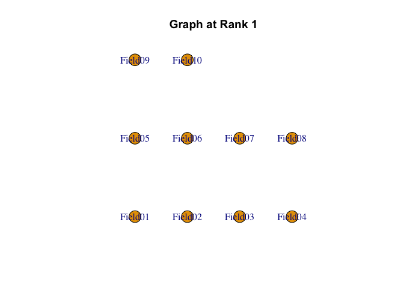<!-- --><!-- -->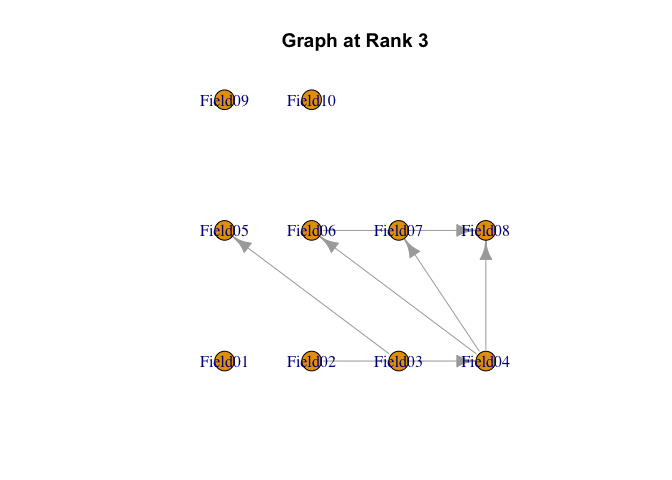<!-- --><!-- -->

    ## 
    ## Parameter Learning
    ## Rank 1 
    ##         PIRP 0 PIRP 1 PIRP 2 PIRP 3 PIRP 4 PIRP 5 PIRP 6 PIRP 7 PIRP 8 PIRP 9
    ## Field01 0.6538                                                               
    ## Field02 0.0756                                                               
    ## Field03 0.1835                                                               
    ## Field04 0.3819                                                               
    ## Field05 0.0500                                                               
    ## Field06 0.0985                                                               
    ## Field07 0.2176                                                               
    ## Field08 0.0608                                                               
    ## Field09 0.0563                                                               
    ## Field10 0.0237                                                               
    ##         PIRP 10 PIRP 11 PIRP 12
    ## Field01                        
    ## Field02                        
    ## Field03                        
    ## Field04                        
    ## Field05                        
    ## Field06                        
    ## Field07                        
    ## Field08                        
    ## Field09                        
    ## Field10                        
    ## Rank 2 
    ##         PIRP 0 PIRP 1 PIRP 2 PIRP 3 PIRP 4 PIRP 5 PIRP 6 PIRP 7 PIRP 8 PIRP 9
    ## Field01 0.8216                                                               
    ## Field02 0.1463 0.3181  0.383  0.597                                          
    ## Field03 0.3320                                                               
    ## Field04 0.4931                                                               
    ## Field05 0.1596 0.2552                                                        
    ## Field06 0.2541                                                               
    ## Field07 0.1232 0.2926  0.217  0.306  0.376                                   
    ## Field08 0.0648 0.0887  0.236  0.443  0.196  0.285  0.624                     
    ## Field09 0.1101                                                               
    ## Field10 0.0359                                                               
    ##         PIRP 10 PIRP 11 PIRP 12
    ## Field01                        
    ## Field02                        
    ## Field03                        
    ## Field04                        
    ## Field05                        
    ## Field06                        
    ## Field07                        
    ## Field08                        
    ## Field09                        
    ## Field10                        
    ## Rank 3 
    ##         PIRP 0 PIRP 1 PIRP 2 PIRP 3 PIRP 4 PIRP 5 PIRP 6 PIRP 7 PIRP 8 PIRP 9
    ## Field01 0.8923                                                               
    ## Field02 0.8736                                                               
    ## Field03 0.8030                                                               
    ## Field04 0.4730  0.492  0.650                                                 
    ## Field05 0.2732  0.319  0.714                                                 
    ## Field06 0.4025  0.486                                                        
    ## Field07 0.3162  0.408                                                        
    ## Field08 0.1028  0.166  0.177  0.439   0.59                                   
    ## Field09 0.1799                                                               
    ## Field10 0.0431                                                               
    ##         PIRP 10 PIRP 11 PIRP 12
    ## Field01                        
    ## Field02                        
    ## Field03                        
    ## Field04                        
    ## Field05                        
    ## Field06                        
    ## Field07                        
    ## Field08                        
    ## Field09                        
    ## Field10                        
    ## Rank 4 
    ##          PIRP 0   PIRP 1 PIRP 2 PIRP 3 PIRP 4 PIRP 5 PIRP 6 PIRP 7 PIRP 8
    ## Field01 0.91975                                                          
    ## Field02 0.97126                                                          
    ## Field03 0.96955                                                          
    ## Field04 0.70098                                                          
    ## Field05 0.28691 0.476702  0.911  0.952                                   
    ## Field06 0.72620                                                          
    ## Field07 0.48152                                                          
    ## Field08 0.00353 0.000122  0.370  0.370  0.401  0.532  0.779              
    ## Field09 0.36220                                                          
    ## Field10 0.08630                                                          
    ##         PIRP 9 PIRP 10 PIRP 11 PIRP 12
    ## Field01                               
    ## Field02                               
    ## Field03                               
    ## Field04                               
    ## Field05                               
    ## Field06                               
    ## Field07                               
    ## Field08                               
    ## Field09                               
    ## Field10                               
    ## Rank 5 
    ##         PIRP 0 PIRP 1 PIRP 2 PIRP 3 PIRP 4 PIRP 5 PIRP 6 PIRP 7 PIRP 8 PIRP 9
    ## Field01 0.9627                                                               
    ## Field02 0.9959                                                               
    ## Field03 0.9947                                                               
    ## Field04 0.8654                                                               
    ## Field05 0.9939                                                               
    ## Field06 0.9178                                                               
    ## Field07 0.7334                                                               
    ## Field08 0.5109 0.4442 0.5939 0.9174                                          
    ## Field09 0.4062 0.5193 0.6496 0.6786  0.851                                   
    ## Field10 0.0874 0.0278 0.0652 0.0429  0.110  0.117  0.118  0.163  0.217  0.275
    ##         PIRP 10 PIRP 11 PIRP 12
    ## Field01                        
    ## Field02                        
    ## Field03                        
    ## Field04                        
    ## Field05                        
    ## Field06                        
    ## Field07                        
    ## Field08                        
    ## Field09                        
    ## Field10   0.262   0.257    0.95
    ## 
    ## Marginal Rankluster Reference Matrix
    ##         Rank 1 Rank 2 Rank 3 Rank 4 Rank 5
    ## Field01 0.6538 0.8216 0.8923 0.9198  0.963
    ## Field02 0.0756 0.5069 0.8736 0.9713  0.996
    ## Field03 0.1835 0.3320 0.8030 0.9696  0.995
    ## Field04 0.3819 0.4931 0.6271 0.7010  0.865
    ## Field05 0.0500 0.2072 0.6182 0.9263  0.994
    ## Field06 0.0985 0.2541 0.4550 0.7262  0.918
    ## Field07 0.2176 0.3119 0.3738 0.4815  0.733
    ## Field08 0.0608 0.1723 0.2718 0.5700  0.863
    ## Field09 0.0563 0.1101 0.1799 0.3622  0.715
    ## Field10 0.0237 0.0359 0.0431 0.0863  0.377
    ## 
    ## IRP Indices
    ##         Alpha         A Beta         B Gamma C
    ## Field01     1 0.1677977    1 0.6538429     0 0
    ## Field02     1 0.4312713    2 0.5068824     0 0
    ## Field03     2 0.4710088    2 0.3320336     0 0
    ## Field04     4 0.1643891    2 0.4930958     0 0
    ## Field05     2 0.4110466    3 0.6182062     0 0
    ## Field06     3 0.2712108    3 0.4549879     0 0
    ## Field07     4 0.2518684    4 0.4815211     0 0
    ## Field08     3 0.2982121    4 0.5699954     0 0
    ## Field09     4 0.3528379    4 0.3621986     0 0
    ## Field10     4 0.2906998    5 0.3769977     0 0
    ##                               Rank 1  Rank 2  Rank 3 Rank 4 Rank 5
    ## Test Reference Profile         4.915   8.744  13.657 18.867 26.488
    ## Latent Rank Ditribution      163.000  91.000 102.000 91.000 68.000
    ## Rank Membership Dsitribution 148.275 103.002 105.606 86.100 72.017
    ## 
    ## Latent Field Distribution
    ##            Field 1 Field 2 Field 3 Field 4 Field 5 Field 6 Field 7 Field 8
    ## N of Items       3       2       2       1       3       3       4       2
    ##            Field 9 Field 10
    ## N of Items       8        7
    ## 
    ## Model Fit Indices
    ##                    value
    ## model_log_like -6804.899
    ## bench_log_like -5891.314
    ## null_log_like  -9862.114
    ## model_Chi_sq    1827.169
    ## null_Chi_sq     7941.601
    ## model_df        1088.000
    ## null_df         1155.000
    ## NFI                0.770
    ## RFI                0.756
    ## IFI                0.892
    ## TLI                0.884
    ## CFI                0.891
    ## RMSEA              0.036
    ## AIC             -348.831
    ## CAIC           -4968.595
    ## BIC            -4966.485

    ## Strongly ordinal alignment condition was satisfied.

<!-- -->

Of course, it also supports various types of plots.

``` r
plot(result.LDB, type = "Array")
```

<!-- -->

``` r
plot(result.LDB, type = "TRP")
```

<!-- -->

``` r
plot(result.LDB, type = "LRD")
```

<!-- -->

``` r
plot(result.LDB, type = "RMP", students = 1:9, nc = 3, nr = 3)
```

<!-- -->

``` r
plot(result.LDB, type = "FRP", nc = 3, nr = 2)
```

<!-- --><!-- -->

In this model, you can draw a Field PIRP Profile that visualizes the
correct answer count for each rank and each field.

``` r
plot(result.LDB, type = "FieldPIRP")
```

<!-- --><!-- --><!-- --><!-- --><!-- -->

## Bicluster Network Model

Bicluster Network Model: BINET is a model that combines the Bayesian
network model and Biclustering. BINET is very similar to LDB and LDR.

The most significant difference is that in LDB, the nodes represent the
fields, whereas in BINET, they represent the class. BINET explores the
local dependency structure among latent classes at each latent field,
where each field is a locus.

To execute this analysis, in addition to the dataset, the same field
correspondence file used during exploratory Biclustering is required, as
well as an adjacency matrix between classes.

``` r
fieldFile <- "develop/mtmk14forVer13/FixFieldBINET.csv"
edgeFile <- "develop/mtmk14forVer13/EdgesBINET.csv"
FieldData <- read.csv(fieldFile)
conf <- FieldData[, 2]
```

``` r
conf <- FieldData[, 2]
conf
```

    ##  [1]  1  5  5  5  9  9  6  6  6  6  2  7  7 11 11  7  7 12 12 12  2  2  3  3  4
    ## [26]  4  4  8  8 12  1  1  6 10 10

The adjacency matrix between classes can be provided in a CSV file like
as follow:

``` r
lines <- readLines(edgeFile)
for (line in lines) {
  cat(line)
  cat("\n")
}
```

    ## From Class (Parent) >>>,>>> To Class (Child),At Field (Locus)
    ## 1,2,1
    ## 2,4,2
    ## 3,5,2
    ## 4,5,3
    ## 5,6,4
    ## 7,11,4
    ## 2,3,5
    ## 4,7,5
    ## 6,9,5
    ## 8,12,5
    ## 10,12,5
    ## 6,10,7
    ## 6,8,8
    ## 11,12,8
    ## 8,12,9
    ## 9,11,9
    ## 12,13,12

For verification purposes, you also need to specify the number of
classes and fields. Once you input these along with the dataset into the
function, the analysis will be executed.

``` r
result.BINET <- BINET(
  U = J35S515,
  ncls = 13, nfld = 12,
  conf = conf, adj_file = edgeFile
)
result.BINET
```

    ## Total Graph
    ##         Class01 Class02 Class03 Class04 Class05 Class06 Class07 Class08 Class09
    ## Class01       0       1       0       0       0       0       0       0       0
    ## Class02       0       0       1       1       0       0       0       0       0
    ## Class03       0       0       0       0       1       0       0       0       0
    ## Class04       0       0       0       0       1       0       1       0       0
    ## Class05       0       0       0       0       0       1       0       0       0
    ## Class06       0       0       0       0       0       0       0       1       1
    ## Class07       0       0       0       0       0       0       0       0       0
    ## Class08       0       0       0       0       0       0       0       0       0
    ## Class09       0       0       0       0       0       0       0       0       0
    ## Class10       0       0       0       0       0       0       0       0       0
    ## Class11       0       0       0       0       0       0       0       0       0
    ## Class12       0       0       0       0       0       0       0       0       0
    ## Class13       0       0       0       0       0       0       0       0       0
    ##         Class10 Class11 Class12 Class13
    ## Class01       0       0       0       0
    ## Class02       0       0       0       0
    ## Class03       0       0       0       0
    ## Class04       0       0       0       0
    ## Class05       0       0       0       0
    ## Class06       1       0       0       0
    ## Class07       0       1       0       0
    ## Class08       0       0       1       0
    ## Class09       0       1       0       0
    ## Class10       0       0       1       0
    ## Class11       0       0       1       0
    ## Class12       0       0       0       1
    ## Class13       0       0       0       0

<!-- -->

    ## Estimation of Parameter set
    ## Field 1 
    ##          PSRP 1 PSRP 2 PSRP 3 PSRP 4
    ## Class 1   0.000                     
    ## Class 2   0.554  0.558  0.649       
    ## Class 3   0.740                     
    ## Class 4   0.859                     
    ## Class 5   0.875                     
    ## Class 6   0.910                     
    ## Class 7   0.868                     
    ## Class 8   0.889                     
    ## Class 9   0.961                     
    ## Class 10  0.932                     
    ## Class 11  0.898                     
    ## Class 12  0.975                     
    ## Class 13  1.000                     
    ## Field 2 
    ##          PSRP 1 PSRP 2 PSRP 3 PSRP 4
    ## Class 1  0.0000                     
    ## Class 2  0.0090                     
    ## Class 3  0.0396                     
    ## Class 4  0.6813  0.785  0.637       
    ## Class 5  0.4040  0.728  0.696       
    ## Class 6  0.6877                     
    ## Class 7  0.8316                     
    ## Class 8  0.8218                     
    ## Class 9  1.0000                     
    ## Class 10 0.9836                     
    ## Class 11 1.0000                     
    ## Class 12 1.0000                     
    ## Class 13 1.0000                     
    ## Field 3 
    ##          PSRP 1 PSRP 2 PSRP 3 PSRP 4
    ## Class 1   0.000                     
    ## Class 2   0.177                     
    ## Class 3   0.219                     
    ## Class 4   0.206                     
    ## Class 5   0.189  0.253              
    ## Class 6   1.000                     
    ## Class 7   1.000                     
    ## Class 8   1.000                     
    ## Class 9   0.986                     
    ## Class 10  1.000                     
    ## Class 11  0.973                     
    ## Class 12  1.000                     
    ## Class 13  1.000                     
    ## Field 4 
    ##          PSRP 1 PSRP 2 PSRP 3 PSRP 4
    ## Class 1  0.0000                     
    ## Class 2  0.0127                     
    ## Class 3  0.1228                     
    ## Class 4  0.0468                     
    ## Class 5  0.1131                     
    ## Class 6  0.6131  0.436  0.179       
    ## Class 7  0.9775                     
    ## Class 8  0.9539                     
    ## Class 9  0.9751                     
    ## Class 10 0.9660                     
    ## Class 11 0.9411  0.925  0.757       
    ## Class 12 1.0000                     
    ## Class 13 1.0000                     
    ## Field 5 
    ##          PSRP 1 PSRP 2  PSRP 3 PSRP 4
    ## Class 1  0.0000                      
    ## Class 2  0.0157                      
    ## Class 3  0.0731  0.330 0.06789       
    ## Class 4  0.9626                      
    ## Class 5  0.1028                      
    ## Class 6  0.2199                      
    ## Class 7  0.1446  0.265 0.00602       
    ## Class 8  0.9403                      
    ## Class 9  0.2936  0.298 0.12080       
    ## Class 10 0.8255                      
    ## Class 11 0.9123                      
    ## Class 12 1.0000  1.000 1.00000       
    ## Class 13 1.0000                      
    ## Field 6 
    ##          PSRP 1 PSRP 2 PSRP 3 PSRP 4
    ## Class 1   0.000                     
    ## Class 2   0.236                     
    ## Class 3   0.275                     
    ## Class 4   0.449                     
    ## Class 5   0.414                     
    ## Class 6   0.302                     
    ## Class 7   0.415                     
    ## Class 8   0.469                     
    ## Class 9   0.560                     
    ## Class 10  0.564                     
    ## Class 11  0.614                     
    ## Class 12  0.764                     
    ## Class 13  1.000                     
    ## Field 7 
    ##          PSRP 1 PSRP 2 PSRP 3 PSRP 4
    ## Class 1  0.0000                     
    ## Class 2  0.0731                     
    ## Class 3  0.0810                     
    ## Class 4  0.1924                     
    ## Class 5  0.1596                     
    ## Class 6  0.1316                     
    ## Class 7  0.1263                     
    ## Class 8  0.1792                     
    ## Class 9  0.7542                     
    ## Class 10 0.9818  0.883  0.933  0.975
    ## Class 11 0.3047                     
    ## Class 12 0.7862                     
    ## Class 13 1.0000                     
    ## Field 8 
    ##            PSRP 1 PSRP 2 PSRP 3 PSRP 4
    ## Class 1  0.00e+00                     
    ## Class 2  9.83e-05                     
    ## Class 3  3.70e-02                     
    ## Class 4  3.91e-02                     
    ## Class 5  4.21e-02                     
    ## Class 6  6.88e-02                     
    ## Class 7  4.56e-01                     
    ## Class 8  1.65e-01  0.192              
    ## Class 9  6.15e-01                     
    ## Class 10 3.88e-01                     
    ## Class 11 3.16e-01                     
    ## Class 12 1.00e+00  1.000              
    ## Class 13 1.00e+00                     
    ## Field 9 
    ##            PSRP 1 PSRP 2 PSRP 3 PSRP 4
    ## Class 1  0.00e+00                     
    ## Class 2  3.13e-16                     
    ## Class 3  1.61e-02                     
    ## Class 4  6.15e-01                     
    ## Class 5  3.46e-02                     
    ## Class 6  5.26e-02                     
    ## Class 7  1.44e-11                     
    ## Class 8  2.09e-01                     
    ## Class 9  1.90e-17                     
    ## Class 10 8.09e-01                     
    ## Class 11 1.00e+00  1.000              
    ## Class 12 7.81e-01  0.703              
    ## Class 13 1.00e+00                     
    ## Field 10 
    ##          PSRP 1 PSRP 2 PSRP 3 PSRP 4
    ## Class 1  0.0000                     
    ## Class 2  0.0952                     
    ## Class 3  0.1798                     
    ## Class 4  0.1741                     
    ## Class 5  0.1594                     
    ## Class 6  0.1789                     
    ## Class 7  0.1208                     
    ## Class 8  0.1550                     
    ## Class 9  0.2228                     
    ## Class 10 0.2602                     
    ## Class 11 0.1724                     
    ## Class 12 0.3109                     
    ## Class 13 1.0000                     
    ## Field 11 
    ##            PSRP 1 PSRP 2 PSRP 3 PSRP 4
    ## Class 1  0.00e+00                     
    ## Class 2  6.13e-14                     
    ## Class 3  8.84e-07                     
    ## Class 4  8.14e-02                     
    ## Class 5  2.46e-02                     
    ## Class 6  2.13e-02                     
    ## Class 7  2.56e-02                     
    ## Class 8  3.84e-16                     
    ## Class 9  2.44e-01                     
    ## Class 10 4.30e-01                     
    ## Class 11 3.84e-02                     
    ## Class 12 5.86e-01                     
    ## Class 13 1.00e+00                     
    ## Field 12 
    ##            PSRP 1 PSRP 2 PSRP 3 PSRP 4
    ## Class 1  0.00e+00                     
    ## Class 2  2.35e-03                     
    ## Class 3  5.57e-02                     
    ## Class 4  1.50e-18                     
    ## Class 5  2.02e-02                     
    ## Class 6  1.67e-02                     
    ## Class 7  1.93e-02                     
    ## Class 8  4.62e-02                     
    ## Class 9  1.85e-02                     
    ## Class 10 2.54e-02                     
    ## Class 11 5.76e-15                     
    ## Class 12 2.26e-01                     
    ## Class 13 1.00e+00      1      1      1
    ## Local Dependence Passing Student Rate
    ##     Field Field Item 1 Field Item 2 Field Item 3 Field Item 4 Parent Class
    ## 1   1.000       Item01       Item31       Item32                     1.000
    ## 2   2.000       Item11       Item21       Item22                     2.000
    ## 3   2.000       Item11       Item21       Item22                     3.000
    ## 4   3.000       Item23       Item24                                  4.000
    ## 5   4.000       Item25       Item26       Item27                     5.000
    ## 6   4.000       Item25       Item26       Item27                     7.000
    ## 7   5.000       Item02       Item03       Item04                     2.000
    ## 8   5.000       Item02       Item03       Item04                     4.000
    ## 9   5.000       Item02       Item03       Item04                     6.000
    ## 10  5.000       Item02       Item03       Item04                     8.000
    ## 11  5.000       Item02       Item03       Item04                    10.000
    ## 12  7.000       Item12       Item13       Item16       Item17        6.000
    ## 13  8.000       Item28       Item29                                  6.000
    ## 14  8.000       Item28       Item29                                 11.000
    ## 15  9.000       Item05       Item06                                  8.000
    ## 16  9.000       Item05       Item06                                  9.000
    ## 17 12.000       Item18       Item19       Item20       Item30       12.000
    ##    Parent CCR 1 Parent CCR 2 Parent CCR 3 Parent CCR 4 Child Class Child CCR 1
    ## 1         0.000        0.000        0.000                    2.000       0.554
    ## 2         0.005        0.018        0.003                    4.000       0.681
    ## 3         0.034        0.068        0.016                    5.000       0.404
    ## 4         0.221        0.190                                 5.000       0.189
    ## 5         0.147        0.050        0.142                    6.000       0.613
    ## 6         0.999        0.991        0.943                   11.000       0.941
    ## 7         0.005        0.040        0.002                    3.000       0.073
    ## 8         0.996        0.998        0.893                    7.000       0.145
    ## 9         0.263        0.334        0.063                    9.000       0.294
    ## 10        0.980        0.958        0.882                   12.000       1.000
    ## 11        0.943        0.800        0.733                   12.000       1.000
    ## 12        0.181        0.146        0.037        0.162      10.000       0.982
    ## 13        0.009        0.129                                 8.000       0.165
    ## 14        0.359        0.273                                12.000       1.000
    ## 15        0.266        0.152                                12.000       0.781
    ## 16        0.000        0.000                                11.000       1.000
    ## 17        0.158        0.178        0.217        0.352      13.000       1.000
    ##    Child CCR 2 Child CCR 3 Child CCR 4
    ## 1        0.558       0.649            
    ## 2        0.785       0.637            
    ## 3        0.728       0.696            
    ## 4        0.253                        
    ## 5        0.436       0.179            
    ## 6        0.925       0.757            
    ## 7        0.330       0.068            
    ## 8        0.265       0.006            
    ## 9        0.298       0.121            
    ## 10       1.000       1.000            
    ## 11       1.000       1.000            
    ## 12       0.883       0.933       0.975
    ## 13       0.192                        
    ## 14       1.000                        
    ## 15       0.703                        
    ## 16       1.000                        
    ## 17       1.000       1.000       1.000
    ## Marginal Bicluster Reference Matrix
    ##         Class1 Class2 Class3 Class4 Class5 Class6 Class7 Class8 Class9 Class10
    ## Field1       0  0.587  0.740  0.859  0.875  0.910  0.868  0.889  0.961   0.932
    ## Field2       0  0.009  0.040  0.701  0.609  0.688  0.832  0.822  1.000   0.984
    ## Field3       0  0.177  0.219  0.206  0.221  1.000  1.000  1.000  0.986   1.000
    ## Field4       0  0.013  0.123  0.047  0.113  0.410  0.978  0.954  0.975   0.966
    ## Field5       0  0.016  0.157  0.963  0.103  0.220  0.138  0.940  0.237   0.825
    ## Field6       0  0.236  0.275  0.449  0.414  0.302  0.415  0.469  0.560   0.564
    ## Field7       0  0.073  0.081  0.192  0.160  0.132  0.126  0.179  0.754   0.943
    ## Field8       0  0.000  0.037  0.039  0.042  0.069  0.456  0.179  0.615   0.388
    ## Field9       0  0.000  0.016  0.615  0.035  0.053  0.000  0.209  0.000   0.809
    ## Field10      0  0.095  0.180  0.174  0.159  0.179  0.121  0.155  0.223   0.260
    ## Field11      0  0.000  0.000  0.081  0.025  0.021  0.026  0.000  0.244   0.430
    ## Field12      0  0.002  0.056  0.000  0.020  0.017  0.019  0.046  0.019   0.025
    ##         Class11 Class12 Class13
    ## Field1    0.898   0.975       1
    ## Field2    1.000   1.000       1
    ## Field3    0.973   1.000       1
    ## Field4    0.874   1.000       1
    ## Field5    0.912   1.000       1
    ## Field6    0.614   0.764       1
    ## Field7    0.305   0.786       1
    ## Field8    0.316   1.000       1
    ## Field9    1.000   0.742       1
    ## Field10   0.172   0.311       1
    ## Field11   0.038   0.586       1
    ## Field12   0.000   0.226       1
    ##                               Class 1 Class 2 Class 3 Class 4 Class 5 Class 6
    ## Test Reference Profile          0.000   3.900   6.001  12.951   8.853  11.428
    ## Latent Class Ditribution        2.000  95.000  73.000  37.000  60.000  44.000
    ## Class Membership Dsitribution   1.987  82.567  86.281  37.258  60.781  43.222
    ##                               Class 7 Class 8 Class 9 Class 10 Class 11
    ## Test Reference Profile         14.305  17.148  19.544   23.589   20.343
    ## Latent Class Ditribution       43.000  30.000  34.000   18.000   37.000
    ## Class Membership Dsitribution  43.062  30.087  34.435   20.063   34.811
    ##                               Class 12 Class 13
    ## Test Reference Profile          27.076       35
    ## Latent Class Ditribution        27.000       15
    ## Class Membership Dsitribution   25.445       15
    ## 
    ## Model Fit Indices
    ##                Multigroup Model Saturated Moodel
    ## model_log_like -5786.942        -5786.942       
    ## bench_log_like -5891.314        0               
    ## null_log_like  -9862.114        -9862.114       
    ## model_Chi_sq   -208.744         11573.88        
    ## null_Chi_sq    7941.601         19724.23        
    ## model_df       1005             16895           
    ## null_df        1155             17045           
    ## NFI            1                0.4132149       
    ## RFI            1                0.4080052       
    ## IFI            1                1               
    ## TLI            1                1               
    ## CFI            1                1               
    ## RMSEA          0                0               
    ## AIC            -2218.744        -22216.12       
    ## CAIC           -6486.081        -93954.09       
    ## BIC            -6484.132        -93921.32

Of course, it also supports various types of plots.

``` r
plot(result.BINET, type = "Array")
```

<!-- -->

``` r
plot(result.BINET, type = "TRP")
```

<!-- -->

``` r
plot(result.BINET, type = "LCD")
```

<!-- -->

``` r
plot(result.BINET, type = "CMP", students = 1:9, nc = 3, nr = 3)
```

<!-- -->

``` r
plot(result.BINET, type = "FRP", nc = 3, nr = 2)
```

<!-- --><!-- -->

LDPSR plot shows all Passing Student Rates for all locallyu dependent
classes compared with their respective parents.

``` r
plot(result.BINET, type = "LDPSR", nc = 3, nr = 2)
```

<!-- --><!-- --><!-- -->

## Reference

Shojima, Kojiro (2022) Test Data Engineering: Latent Rank Analysis,
Biclustering, and Bayesian Network (Behaviormetrics: Quantitative
Approaches to Human Behavior, 13),Springer, <https://amzn.to/42eNArd>
